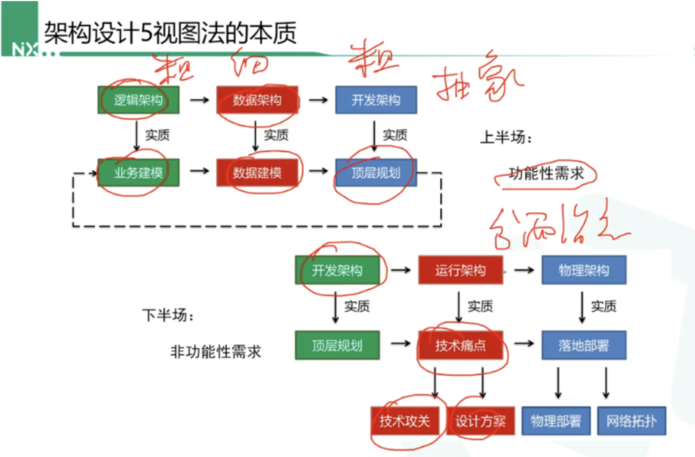
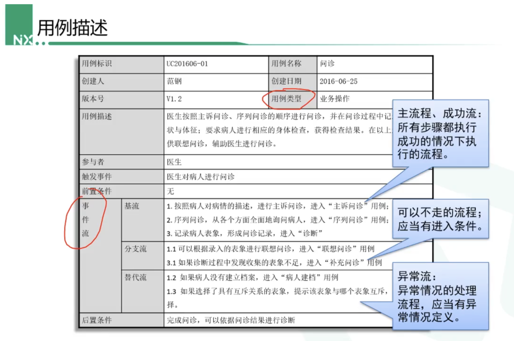
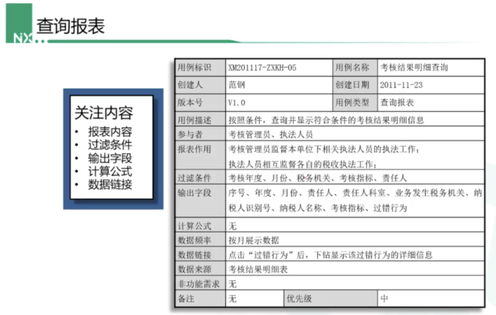
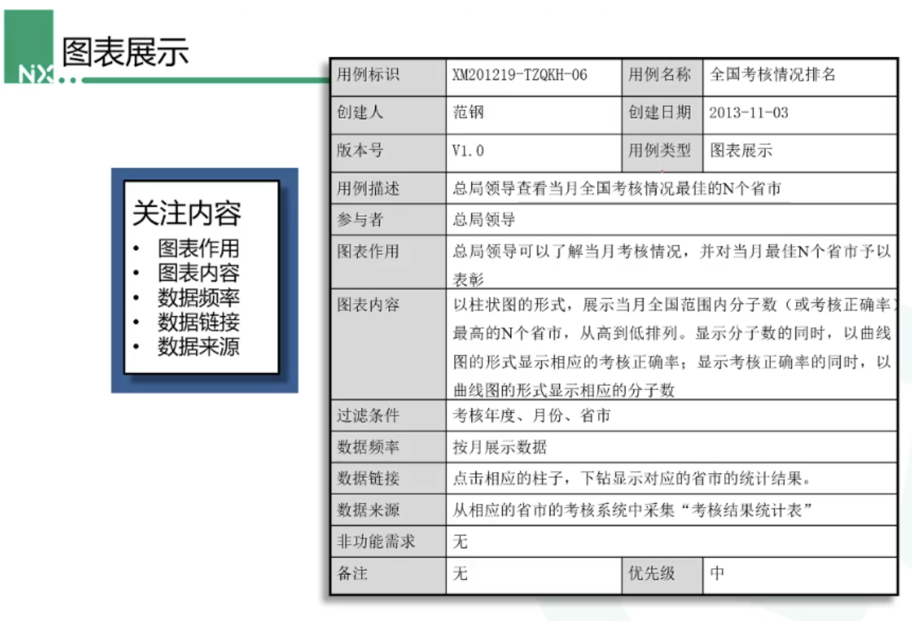
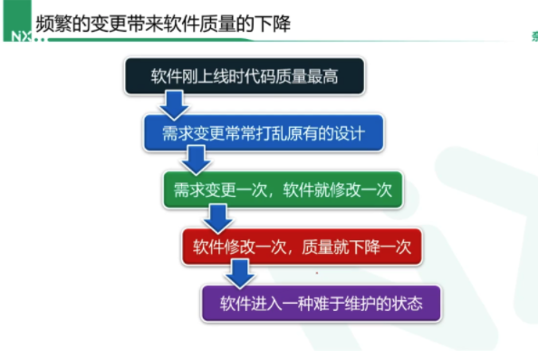

## 架构设计

* 架构设计5视图法
  * 逻辑架构：针对具体的业务进行分析
    * 用例分析
    * 原型分析
    * 领域分析
  * 数据架构：根据分析的结果设计出对应的模型
    * 领域模型
    * 数据库模型设计
    * 业务层设计
  * 开发架构：对开发项目进行对应的操作
    * 分层架构
    * 技术选型
    * 模块划分
  * 运行架构
  * 物理架构

* 5视图的本质

  

## 逻辑架构

### 用例分析

* 针对不同的业务类型，分析出主流程，可以不走的流程，还有异常流程

* 不同类型的用例，格式可以设置不同，但是同一类型要保持一致

* 业务操作--针对的是业务

  

* 查询报表--针对的是报表查询

  

* 图标展示--针对的是数据展示

  

## 数据架构

* 其中领域模型的重要性
  * 领域模型模型，驱动数据库模型的设计，驱动着业务代码开发

* 下面会针对订单系统进行分析，后面会有订单系统的源码分析

### 领域模型抽象

### Why：为何要进行领域模型设计

* 背景

  * 在老系统上不断变更，不断的写业务代码，controller-service-dao-数据库，结果，一开始代码还是有结构的，但是随着需求的变更，慢慢的，越来越难以维护

    

* 如何解决呢？

  * 进行领域模型设计

* 为何可以解决呢？

  * 问题点在于：为何每次改变需求，我们就得动很多内容，包括

    * 业务需求：真实环境中存在的，并不是不存在的，为何要频繁改变代码
    * 技术需求：本来是用mysql，现在要改成es，然后一顿乱改，从service到dao，全部修改一遍，想想都恶心。。。。

  * 解决办法：

    * 业务需求：领域模型设计
    * 技术需求：封装，降低耦合，共性的东西封装起来，形成技术中台，开发人员全部使用统一的开发规范，代码编写量降低，质量提高。如何进行呢？？？

    

### What：如何进行领域模型抽象？？？

* 软件本质：
  * 是对真实事件的模拟
  * 把软件设计和真实世界对应起来，这样每次变更，先还原到真实环境，然后，以后不管只是环境如何变化，软件就怎么变化，这个对应过程就是进行领域模型抽象，有点扯淡，一堆废话。。。。。
* 如何解决
  * 进行领域模型抽象
* 如何进行
  * 根据真实环境中的对象，先第一版生成关联对象
  * 然后根据单一职责原则，增加对象，还是在原有的对象中包含

### What：数据库模型设计

### 以往设计的痛点

## 开发架构

## 运行架构（待补充）

## 物理架构（待补充）

