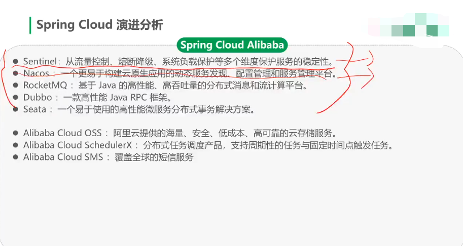
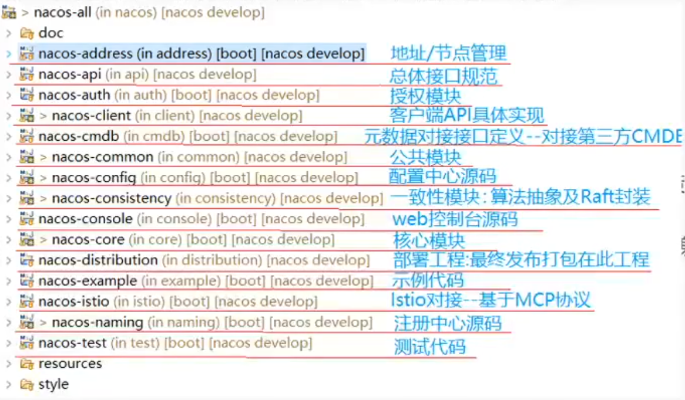
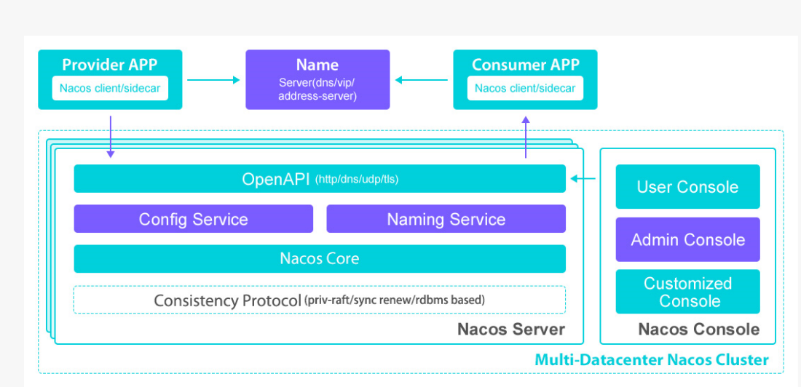
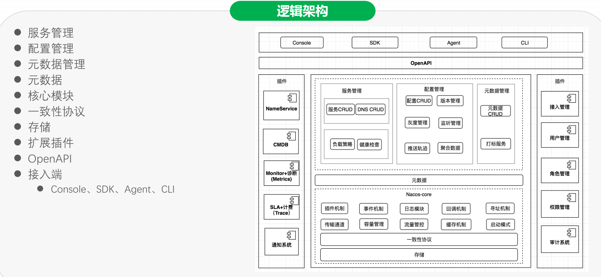
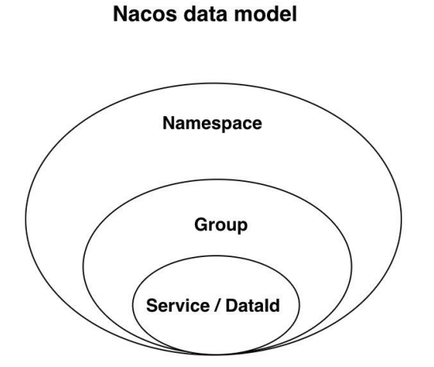
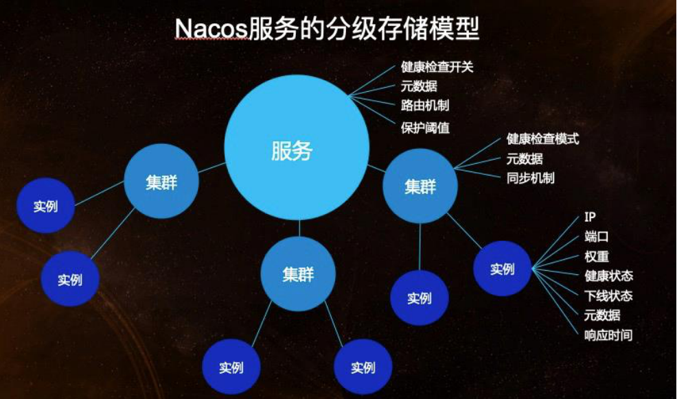
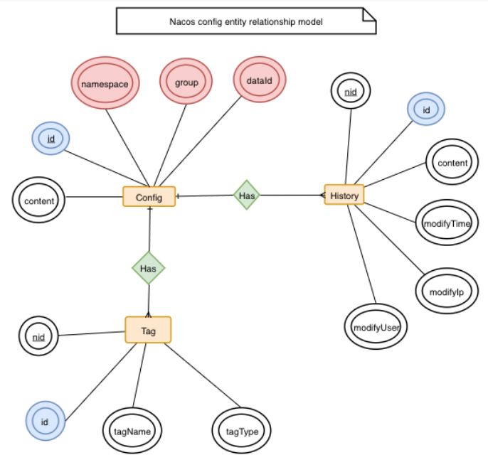
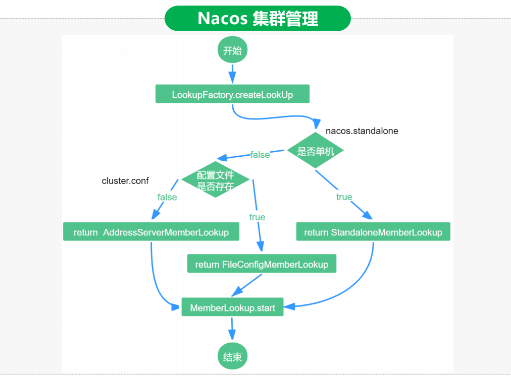

## Spring Cloud认识

* 分布式事务解决方案
  * serviceComb的saga，一整套的微服务方法，saga无法独立出来进行使用

## 基本知识

* 定义

  * 一个更易于构建云原生应用的动态服务发现、配置管理和服务管理平台
    * 注册中心
    * 配置中心 

* 概念

  * 注册中心
    * RPC服务的性能瓶颈，在注册中心上
  * 服务元数据
    * 包括服务短点，服务标签、服务版本号、服务实例权重、路由规则、安全策略等描述服务的数据
  * 名字服务
    * 提供分布式系统中所有对象，实例的名字到关联的元数据之间的映射管理服务

* Nacos项目结构

  
  * address：nacos节点之间的相互通信
  * api：接口隔离原则，接口规范
  * auth：服务，配置信息管理，授权模块
  * client：客户端API具体实现，配置中心的拉取，元数据的拉取同步，服务的注册发现
  * cmdb：对接第三方的CMDB
  * common：公共模块
  * config：配置中心部分源码
  * consistency：一致性模块，为了提高弹性伸缩，内存的数据dump到存储上。存储数据的落地，是使用CP还是AP落地方案。
  * console：后台代码
  * core：核心代码
  * distribution：打包目录

* 整体组件图

  

* 逻辑架构

  

  * 插件机制：
    * 使用SPI的方式
  * 事件机制
    * 是使用领域模型使用整体设计，领域模型，就会涉及到异步通知，就引入了事件机制
    * 缺点：领域模型加入之后，增加了nacos的可读性
  * 寻址模块
    * 多实例的节点发现，就是使用寻址模块来进行查找的

#### 领域模型

* 领域模型

  * 包括三个部分
    * 数据模型
    * 服务模型
    * 配置模型

* 数据模型

  

  * Key由三元组唯一确定，Namespace默认是空串，公共命名空间(public)，分组默认是DEFAULT_GROUP

* 服务模型

  

  * 第一层是服务级别，包含了服务的一些配置信息
  * 第二层是集群级别，包括数据同步，健康检查模式
  * 最外层是实例模块，包括IP，端口等信息

* 配置模型

  

  * 一个是配置变更历史模型
  * 一个是服务标签模型（用于打标分类，方便索引）

## 核心设计

### 寻址机制

* 作用：节点之间相互发现

* 节点发现，Raft协议可以支持，节点之间相互发现，为何还要有寻址机制，来提供节点之间的发现呢？？？

  * 简言之，nacos节点相互发现，不需要太重的逻辑，虽然nacos也需要节点的动态伸缩，上下线，但是大部分的情况都是人工的去设置好，自动伸缩的可能性不大，并不需要raft这样重的流程来控制动态伸缩，所以，就有了寻址机制这么一个逻辑来实现节点间相互发现。

* 配置：下面三种方式

  * 本地配置：cluster.conf
  * 启动参数：-Dnacos.member.list
  * 远程拉取：nacos.core.member.lookup.type=[file,address-server]

* 模式下，不同的处理类

  * 单机模式：StandaloneMemberLookup
  * 文件模式：FileConfigMemberLookup
  * 服务器模式：AddressServerMemberLookup

* 管理这些的工具类是

  * ServerMemberManager

* Nacos集群管理流程

  
  * FileConfigMemberLookup在获取本地文件的同时，会开启一个线程，定时的去查看文件是否发生变化，如果发生变化就去更新内存中的配置信息。
  * 为什么要在启动的过程中做这么麻烦的处理呢？？？
    * 其实就是约定大于配置的实现。保证任何分支下都有默认的实现。约定三种方式都有配置
