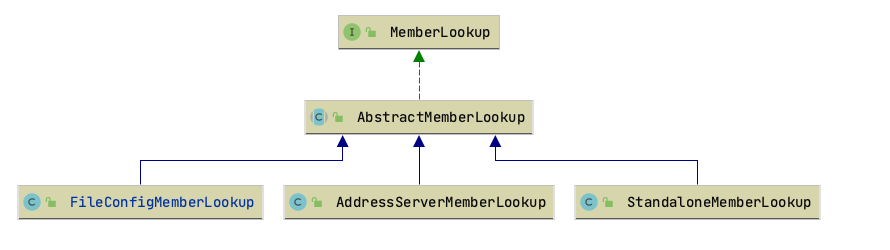
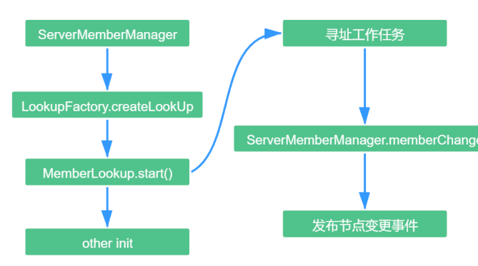
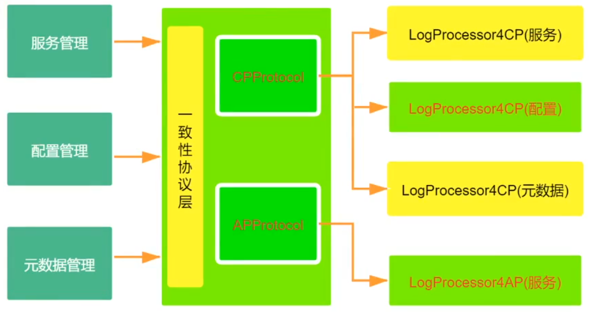
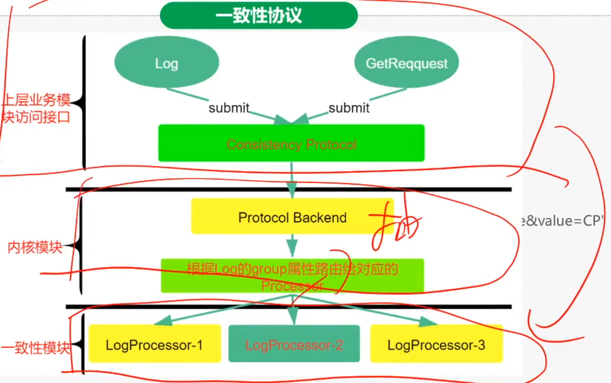
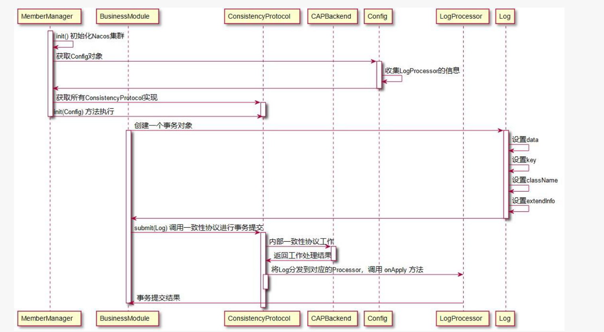
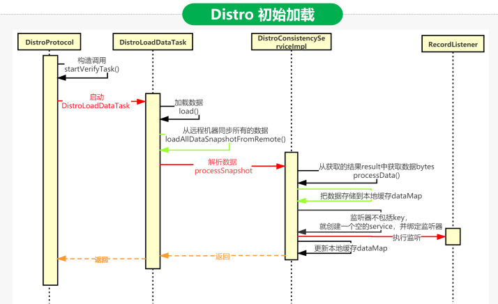
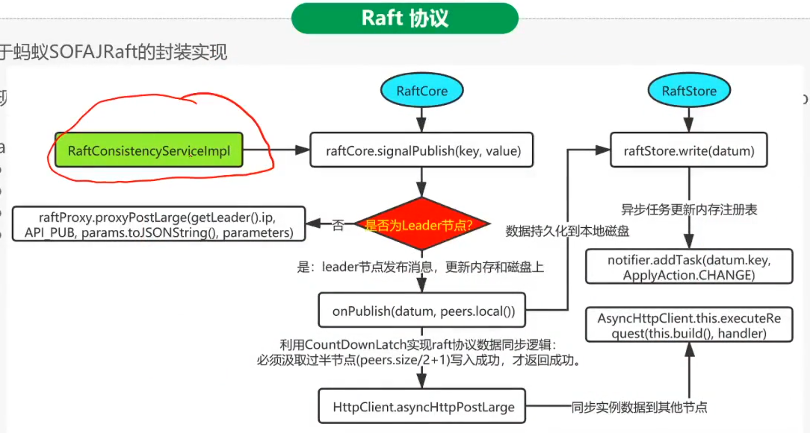
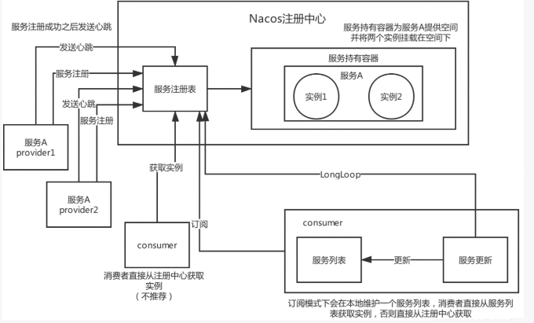
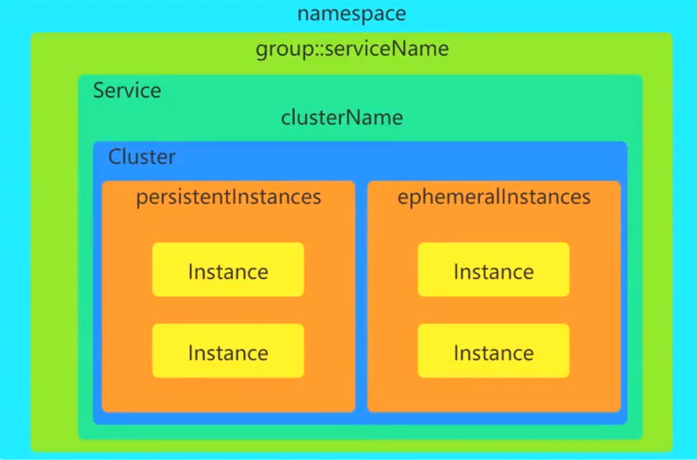
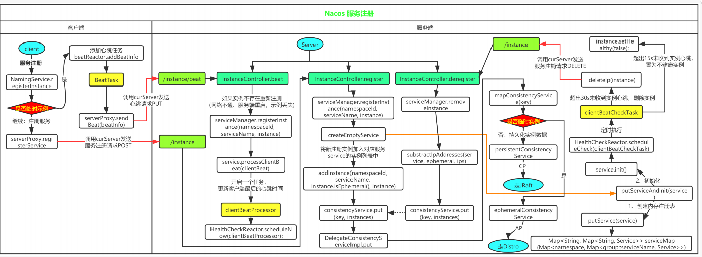

## Spring Cloud认识


* 分布式事务解决方案
  * serviceComb的saga，一整套的微服务方法，saga无法独立出来进行使用


## 基本知识

* 定义

  * 一个更易于构建云原生应用的动态服务发现、配置管理和服务管理平台
    * 注册中心
    * 配置中心 

* 概念

  * 注册中心
    * RPC服务的性能瓶颈，在注册中心上
  * 服务元数据
    * 包括服务短点，服务标签、服务版本号、服务实例权重、路由规则、安全策略等描述服务的数据
  * 名字服务
    * 提供分布式系统中所有对象，实例的名字到关联的元数据之间的映射管理服务

* Nacos项目结构

  
  * address：nacos节点之间的相互通信
  * api：接口隔离原则，接口规范
  * auth：服务，配置信息管理，授权模块
  * client：客户端API具体实现，配置中心的拉取，元数据的拉取同步，服务的注册发现
  * cmdb：对接第三方的CMDB
  * common：公共模块
  * config：配置中心部分源码
  * consistency：一致性模块，为了提高弹性伸缩，内存的数据dump到存储上。存储数据的落地，是使用CP还是AP落地方案。
  * console：后台代码
  * core：核心代码
  * distribution：打包目录

* 整体组件图

  

* 逻辑架构

  

  * 插件机制：
    * 使用SPI的方式
  * 事件机制
    * 是使用领域模型使用整体设计，领域模型，就会涉及到异步通知，就引入了事件机制
    * 缺点：领域模型加入之后，增加了nacos的可读性
  * 寻址模块
    * 多实例的节点发现，就是使用寻址模块来进行查找的

#### 领域模型

* 领域模型

  * 包括三个部分
    * 数据模型
    * 服务模型
    * 配置模型

* 数据模型

  

  * Key由三元组唯一确定，Namespace默认是空串，公共命名空间(public)，分组默认是DEFAULT_GROUP

* 服务模型

  

  * 第一层是服务级别，包含了服务的一些配置信息
  * 第二层是集群级别，包括数据同步，健康检查模式
  * 最外层是实例模块，包括IP，端口等信息

* 配置模型

  

  * 一个是配置变更历史模型
  * 一个是服务标签模型（用于打标分类，方便索引）


## 核心设计

### 寻址机制

* 作用：节点之间相互发现

* 节点发现，Raft协议可以支持，节点之间相互发现，为何还要有寻址机制，来提供节点之间的发现呢？？？

  * 简言之，nacos节点相互发现，不需要太重的逻辑，虽然nacos也需要节点的动态伸缩，上下线，但是大部分的情况都是人工的去设置好，自动伸缩的可能性不大，并不需要raft这样重的流程来控制动态伸缩，所以，就有了寻址机制这么一个逻辑来实现节点间相互发现。

* 配置：下面三种方式

  * 本地配置：cluster.conf
  * 启动参数：-Dnacos.member.list
  * 远程拉取：nacos.core.member.lookup.type=[file,address-server]

* 模式下，不同的处理类

  * 单机模式：StandaloneMemberLookup

  * 文件模式：FileConfigMemberLookup

  * 服务器模式：AddressServerMemberLookup

    

* 管理这些的工具类是

  * ServerMemberManager

* Nacos集群管理流程

  
  * FileConfigMemberLookup在获取本地文件的同时，会开启一个线程，定时的去查看文件是否发生变化，如果发生变化就去更新内存中的配置信息。
  * 为什么要在启动的过程中做这么麻烦的处理呢？？？
    * 其实就是约定大于配置的实现。保证任何分支下都有默认的实现。约定三种方式都有配置

* 整体流程

  

  * 源码分析

    * ServerMemberManager

    ```java
    protected void init() throws NacosException {
      ...
    
      // 初始化Lookup并且启动
      initAndStartLookup();
    
      ...
    }
    ```

    ```java
    private void initAndStartLookup() throws NacosException {
      this.lookup = LookupFactory.createLookUp(this);
      isUseAddressServer = this.lookup.useAddressServer();
      
      //启动lookup
      this.lookup.start();
    }
    ```

    * LookupFactory

    ```java
    public static MemberLookup createLookUp(ServerMemberManager memberManager) throws NacosException {
      if (!EnvUtil.getStandaloneMode()) {
        String lookupType = EnvUtil.getProperty(LOOKUP_MODE_TYPE);
        LookupType type = chooseLookup(lookupType);
        //根据类型获取
        LOOK_UP = find(type);
        currentLookupType = type;
      } else {
        LOOK_UP = new StandaloneMemberLookup();
      }
      LOOK_UP.injectMemberManager(memberManager);
      Loggers.CLUSTER.info("Current addressing mode selection : {}", LOOK_UP.getClass().getSimpleName());
      return LOOK_UP;
    }
    
    
    private static MemberLookup find(LookupType type) {
      if (LookupType.FILE_CONFIG.equals(type)) {
        LOOK_UP = new FileConfigMemberLookup();
        return LOOK_UP;
      }
      if (LookupType.ADDRESS_SERVER.equals(type)) {
        LOOK_UP = new AddressServerMemberLookup();
        return LOOK_UP;
      }
      // unpossible to run here
      throw new IllegalArgumentException();
    }
    ```

    

### 一致性协议

* 目的
  * 为了保证nacos节点之间数据的一致性同步
    * 写一致，只有达到写一致就认识是强一致
      * 过半写入成功，就认为是写入成功，其他节点可以慢慢写入
    * 读一致
* 类型
  * CP-Raft协议
    * 支持服务注册的永久实例，满足配置文件的一致性
    * 适用于配置中心，不变的容器地址，持久化实例
  * AP-Distro协议
    * 支持服务注册的临时实例，不支持数据一致
    * 适用于云容器，临时实例
  * 配置-默认使用AP
    * curl -x PUT '$NACOS_SERVER:8848/nacos/v1/ns/operator/switches?entry=serverMode&value=CP'

* 应用场景

  * naming模块（注册中心模块）：对于服务实例的数据管理分别使用了CP以及AP
    * 持久化实例使用的是CP，临时实例使用的是AP
    * 实例配置：spring.cloud.nacos.discovery.ephemeral=false
  * config模块（配置中心模块）：使用CP

* 整体逻辑图

  

  * 中间进行测量分发，针对不同的业务类型，还有分布式的要求是AP还是CP走不同的链路

  

  * 解释
    * 上层业务的无论是日志还是请求，先提交，然后到一致性协议层
    * 在内核模块中，提供出抽象接口，用于针对不同的协议进行路由转发处理
    * 根据不同的协议，转发到一致性模块，实现CP还是AP的方式
    * 通过中间的内核模块提供的抽象接口，隔离了业务接口模块和一致性模块之间的耦合

* 流程图

  

  * 解释
    * 初始化
      * init在启动的时候，使用寻址机制，获取到其他节点的信息，然后建立连接
      * 获取节点的配置内容，到底使用CP还是AP
      * 把CP或者AP加载进来，完成初始化
    * 读取或者写入
      * 都先去创建一个事务对象，反馈的就是log，返回事务对象log对象
      * 调用submit调用一致性协议进行事务提交，提交到一致性层
      * 更具协议，获取具体策略，processor，然后将具体的log分发到具体的processor中，执行完成后，返回操作成功

* Distro协议，AP协议

  * 定义

    * 阿里巴巴的私有协议，临时数据的一致性协议
      * 该类型协议，不需要把数据存储到磁盘或者数据库，保存在内存中
      * 临时数据通常和服务器保持一个session会话，只要该会话只要存在，数据就不会丢失

  * 特点

    * 专门为了注册中心而创造出的协议
    * 写必须永远是成功的，即使可能会发生网络分区。当网络恢复后，把各数据分片的数据进行合并（为何合并就可以保证一致性呢？服务注册与发现，对应的操作只有写操作，没有改的请求，所以只要进行合并就可以，没有版本的概念。通过倒计时器来维护数据的过期，实现服务探活的最小保证）
    * 服务端节点都存储所有数据，但是每个节点只负责其中的一部分服务，在接收到客户端的写（注册，心跳、下线等）请求后，服务端节点判断请求的服务是否为自己负责，如果是，则处理，否则交由负责的节点处理
    * 每个服务端节点主动发送健康检查到其他服务端节点，响应的节点被该节点视为健康节点。

  * 初始加载

    

    * 启动一个定时任务线程DistroLoadDataTask加载数据，调用load()方法加载数据

    * 调用loadAllDataSnapshotFromRemote()方法从远程机器同步所有数据

    * 从namingProxy代理获取所有的数据data

      * 构造http请求，调用httpGet方法从指定的Server获取数据
      * 从获取的结果result中获取数据bytes

    * 处理数据processData

      * 从data反序列化datumMap
      * 把数据存储到dataStore，也就是本地缓存dataMap
      * 监听器不包括key，就创建一个空的service，并且绑定监听器

    * 监听器listener执行成功后，就更新data store

      ```java
      private boolean processData(byte[] data) throws Exception {
        if (data.length > 0) {
      
          //反序列化成 datumMap
          Map<String, Datum<Instances>> datumMap = serializer.deserializeMap(data, Instances.class);
      
          for (Map.Entry<String, Datum<Instances>> entry : datumMap.entrySet()) {
            dataStore.put(entry.getKey(), entry.getValue());
      
      
            //不存在监听，则创建监听
            if (!listeners.containsKey(entry.getKey())) {
              // pretty sure the service not exist:
              if (switchDomain.isDefaultInstanceEphemeral()) {
                // create empty service
                Loggers.DISTRO.info("creating service {}", entry.getKey());
                //创建一个空的service
                Service service = new Service();
                String serviceName = KeyBuilder.getServiceName(entry.getKey());
                String namespaceId = KeyBuilder.getNamespace(entry.getKey());
                service.setName(serviceName);
                service.setNamespaceId(namespaceId);
                service.setGroupName(Constants.DEFAULT_GROUP);
                // now validate the service. if failed, exception will be thrown
                service.setLastModifiedMillis(System.currentTimeMillis());
                service.recalculateChecksum();
      
                // The Listener corresponding to the key value must not be empty
                RecordListener listener = listeners.get(KeyBuilder.SERVICE_META_KEY_PREFIX).peek();
                if (Objects.isNull(listener)) {
                  return false;
                }
      
                //监听倒计时器，从计时的数据的通知
                listener.onChange(KeyBuilder.buildServiceMetaKey(namespaceId, serviceName), service);
              }
            }
          }
      
          for (Map.Entry<String, Datum<Instances>> entry : datumMap.entrySet()) {
      
            if (!listeners.containsKey(entry.getKey())) {
              // Should not happen:
              Loggers.DISTRO.warn("listener of {} not found.", entry.getKey());
              continue;
            }
      
            try {
              for (RecordListener listener : listeners.get(entry.getKey())) {
                listener.onChange(entry.getKey(), entry.getValue().value);
              }
            } catch (Exception e) {
              Loggers.DISTRO.error("[NACOS-DISTRO] error while execute listener of key: {}", entry.getKey(), e);
              continue;
            }
      
            // Update data store if listener executed successfully:
            dataStore.put(entry.getKey(), entry.getValue());
          }
        }
        return true;
      }
      ```

  * Distro增量同步，新增一条数据之后，需要进行增量同步

    * 过程

      1. DistroProtocol使用sync()方法接收增量数据
      2. 向其他节点广播任务
         1. 调用 distroTaskEngineHolder 发布<font color='red'>延迟任务</font>
            1. 等待等待时间足够了，就将<font color='blue'>延迟任务转变为异步任务</font>
      3. 执行变更任务DistroSyncChangeTask.run方法：想指定节点发送消息
         1. 调用 DistroHttpAgent.syncData()方法发送数据
            1. 调用 NamingProxy.syncData()方法发送数据
      4. <font color='red'>异常任务</font>调用 handleFailedTask()方法进行处理
         1. 调用 DistroFailedTaskHandler 处理失败任务
            1. 调用 DistroHttpCombinedKeyTaskFailedHandler <font color='purper'>将失败任务重新投递成延迟任务</font>

    * 源码

      * DistroProtocol#sync方法

        ```java
        public void sync(DistroKey distroKey, DataOperation action, long delay) {
          //1. 向除了自身外的所有节点进行广播
          for (Member each : memberManager.allMembersWithoutSelf()) {
            DistroKey distroKeyWithTarget = new DistroKey(distroKey.getResourceKey(), distroKey.getResourceType(),
                                                          each.getAddress());
            DistroDelayTask distroDelayTask = new DistroDelayTask(distroKeyWithTarget, action, delay);
        
            //2. 发送延迟任务
            distroTaskEngineHolder.getDelayTaskExecuteEngine().addTask(distroKeyWithTarget, distroDelayTask);
            if (Loggers.DISTRO.isDebugEnabled()) {
              Loggers.DISTRO.debug("[DISTRO-SCHEDULE] {} to {}", distroKey, each.getAddress());
            }
          }
        }
        ```

      * 延迟任务执行的时间，延迟任务每个会有一个延迟间隔和最后的执行时间，用于判断是否可以执行延迟任务

        ```java
        @Override
        public AbstractDelayTask removeTask(Object key) {
          lock.lock();
          try {
            AbstractDelayTask task = tasks.get(key);
        
            //延迟时间到了，可以执行了
            if (null != task && task.shouldProcess()) {
              return tasks.remove(key);
            } else {
              return null;
            }
          } finally {
            lock.unlock();
          }
        }
        ```

        ```java
        public abstract class AbstractDelayTask implements NacosTask {
            
            /**
             * Task time interval between twice processing, unit is millisecond.
             */
            private long taskInterval;
            
            /**
             * The time which was processed at last time, unit is millisecond.
             */
            private long lastProcessTime;
            
            /**
             * merge task.
             *
             * @param task task
             */
            public abstract void merge(AbstractDelayTask task);
            
            public void setTaskInterval(long interval) {
                this.taskInterval = interval;
            }
            
            public long getTaskInterval() {
                return this.taskInterval;
            }
            
            public void setLastProcessTime(long lastProcessTime) {
                this.lastProcessTime = lastProcessTime;
            }
            
            public long getLastProcessTime() {
                return this.lastProcessTime;
            }
            
            @Override
            public boolean shouldProcess() {
                //判断当前时间是否已经满足执行的时间
                return (System.currentTimeMillis() - this.lastProcessTime >= this.taskInterval);
            }
            
        }
        ```

      * DistroDelayTaskProcessor#process 任务到期可以执行，此处转换为异步任务，加入到InnerWorker的负责的队列中，获取到任务，就异步执行

        ```java
        @Override
        public boolean process(NacosTask task) {
          if (!(task instanceof DistroDelayTask)) {
            return true;
          }
          DistroDelayTask distroDelayTask = (DistroDelayTask) task;
          DistroKey distroKey = distroDelayTask.getDistroKey();
          if (DataOperation.CHANGE.equals(distroDelayTask.getAction())) {
        
            //执行延迟任务，转换为异步任务
            DistroSyncChangeTask syncChangeTask = new DistroSyncChangeTask(distroKey, distroComponentHolder);
            distroTaskEngineHolder.getExecuteWorkersManager().addTask(distroKey, syncChangeTask);
            return true;
          }
          return false;
        }
        ```

      * DistroSyncChangeTask#run 

        ```java
        @Override
        public void run() {
          Loggers.DISTRO.info("[DISTRO-START] {}", toString());
          try {
            String type = getDistroKey().getResourceType();
            DistroData distroData = distroComponentHolder.findDataStorage(type).getDistroData(getDistroKey());
            distroData.setType(DataOperation.CHANGE);
            //执行变更任务，向指定节点发送数据
            boolean result = distroComponentHolder.findTransportAgent(type).syncData(distroData, getDistroKey().getTargetServer());
            if (!result) {
              handleFailedTask();
            }
            Loggers.DISTRO.info("[DISTRO-END] {} result: {}", toString(), result);
          } catch (Exception e) {
            Loggers.DISTRO.warn("[DISTRO] Sync data change failed.", e);
            handleFailedTask();
          }
        }
        ```

      * 如果处理失败，则进行重试

        ```java
        private void handleFailedTask() {
          String type = getDistroKey().getResourceType();
          DistroFailedTaskHandler failedTaskHandler = distroComponentHolder.findFailedTaskHandler(type);
          if (null == failedTaskHandler) {
            Loggers.DISTRO.warn("[DISTRO] Can't find failed task for type {}, so discarded", type);
            return;
          }
        
          //重试失败任务
          failedTaskHandler.retry(getDistroKey(), DataOperation.CHANGE);
        }
        ```

        * DistroFailedTaskHandler # retry

        ```java
        @Override
        public void retry(DistroKey distroKey, DataOperation action) {
          DistroHttpCombinedKey combinedKey = (DistroHttpCombinedKey) distroKey;
          for (String each : combinedKey.getActualResourceTypes()) {
        
            //失败任务转换为一个延迟任务
            DistroKey newKey = new DistroKey(each, KeyBuilder.INSTANCE_LIST_KEY_PREFIX, distroKey.getTargetServer());
            DistroDelayTask newTask = new DistroDelayTask(newKey, action, globalConfig.getSyncRetryDelay());
        
            //将失败任务转换成的延迟任务重新加入到任务池中
            distroTaskEngineHolder.getDelayTaskExecuteEngine().addTask(newKey, newTask);
          }
        }
        ```

        

* Raft协议

  * 基于蚂蚁SOFAJRaft的封装实现

  * 为了提供不同业务的并发性，不同业务不受影响，将Raft在主节点概念的基础上，进一步提供了raft group的概念，利用raft group的设计，为每个功能模块单独创建一个raft group，这样不同业务就不会受到影响

  * 具体的实现：JRaftServer类

    * 数据提交：commit() 
      * 如果当前节点是主节点，执行applyOperation()
      * 如果当前是从节点，则调用invokeToLeader()
    * 数据查询
      * 不管是否是主节点，都执行get方法
      * 如果当前节点是从节点，或者当前节点异常，就去主节点查询 readFromLeader()
    * 成员变更
      * peerChange()
      * refreshRouteTable()这里维护的是不同的raft group的路由表，和之前的寻址机制是两个维度，不矛盾的
    * Leader节点查询
      * instance.selectLeader(groupName)

  * 代码流程

    


### Nacos服务管理原理剖析（注册中心）

* 主要包括
  * 服务注册
  * 服务发现
    * 主动发现，拉取方式
    * 被动发现，通知方式
  * 服务探活
* 主要流程
  1. 客户端和服务端有两个重要的交互
     1. 服务注册
     2. 心跳发送
  2. 客户端以服务为维度想服务端注册，注册后每隔一段时间向服务端发送一次心跳
     1. 心跳包需要带上注册服务的所有信息，为啥呢，如果客户端先和nacos的A节点建立了心跳连接，但是A节点分区或者宕机了，那么客户端就会访问其他的nacos节点B，如果B发现不是注册到自己上的节点，就把该请求发给A，但是发现A节点不同，那么就将此次的心跳请求转换为注册请求，然后在自己节点上注册该客户端，这样的好处，就是在客户端看来，服务端节点的地位都是对等的，向任何一个节点发送信息都是可以被接收的。而且这样的好处，客户端的信息因为每次都发送，所以不会丢失
  3. 客户端请求失败则换一个节点重新发送请求
  4. 服务端在接收到客户端的服务心跳后，如果该服务不村子奥，则将该心跳请求当做注册请求来处理
  5. 服务端如果长时间未收到客户端心跳，则下线该服务
  6. 负责的节点在接收到服务注册、服务心跳等写请求后将数据写入后即返回，后台异步的将数据同步给其他节点
  7. 节点在收到读请求后直接从本机获取后返回，无论数据是否是最新的

* 可以看出，在客户端和服务端交互的流程中，还是最大程度的AP，但是数据的落盘，是分为AP和CP的，但是广义上而言，nacos是符合AP模型的。


#### 服务注册

* 流程图

  

* 主要类

  * NacosNamingService

    * 注册服务实例：registerInstance
    * 下线实例：deregisterInstance
    * 服务订阅：subscribe，有消息改变时，客户端被动获取到改变的信息
    * 获取所有实例（客户端主动拉取）：getAllInstances
    * 根据条件获取服务注册实例：selectInstances

  * 服务注册表

    ```java
    Map<namespace,Map<group::serviceName,Service>> 
    ```

    * 数据结构

      

      

* 代码流程

  1. 提供者将注册中心写入到Nacos的服务注册表中
  2. Nacos将提供者的实例信息交给Service Holder(服务持有容器)处理，服务实例将会挂载在Service Holder的空间下
  3. 服务注册成功后，提供者与注册中心维持心跳，未能及时发送心跳的服务将会被剔除

  


#### 服务发现

* 支持场景
  * 主动发现：消费者想注册中心<font color='red'>**发起**</font>获取某服务的请求，注册中心返回<font color='red'>**所有可用**</font>的服务示例给消费者
  * 被动发现：消费者向注册中心<font color='red'>**订阅**</font>某服务并<font color='red'>**提交一个监听器**</font>，当注册中心服务变更时，<font color='red'>**监听器接收通知，更新本地的服务实例缓存**</font>


