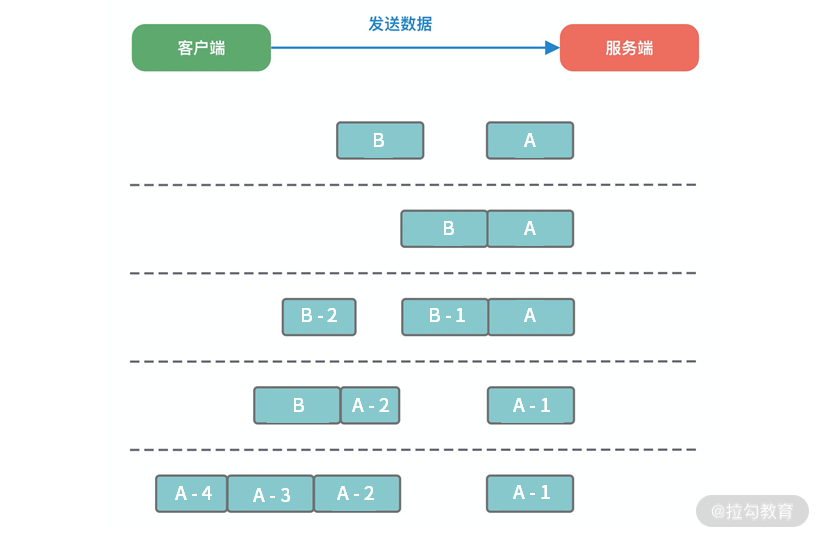

Netty的经典实用：蚂蚁的SoFABolt 

网址：https://github.com/sofastack/sofa-bolt


## 事件传播机制

* 事件类型
  1. Inbound事件
  2. Outbound事件

* 传播方向

  

  * Inbound事件的传播方向为 Head->Tail
  * Outbound事件的传播方式是 Tail -> Head


### 异常传播机制

* ChannelPipeline事件传播的实现采用了经典的责任链模式

* 如果用户没有对异常进行拦截，处理，则会在Tail节点进行统一处理，这个Tail节点是Netty自动加入的节点

  ```java
  protected void onUnhandledInboundException(Throwable cause) {
      try {
          logger.warn(
                  "An exceptionCaught() event was fired, and it reached at the tail of the pipeline. " +
                          "It usually means the last handler in the pipeline did not handle the exception.",
                  cause);
      } finally {
          ReferenceCountUtil.release(cause);
      }
  }
  ```

  * 虽然 Netty 中 TailContext 提供了兜底的异常处理逻辑，但是在很多场景下，并不能满足我们的需求.假如你需要拦截指定的异常类型，并做出相应的异常处理，应该如何实现呢？我们接着往下看。


#### 异常处理的最佳实践

* 最佳实践：

  * 推荐用户对异常进行统一拦截，然后根据实际业务场景实现更加完善的异常处理机制。

    

* 代码

  ```java
  public class ExceptionHandler extends ChannelDuplexHandler {
      @Override
      public void exceptionCaught(ChannelHandlerContext ctx, Throwable cause) {
          if (cause instanceof RuntimeException) {
              System.out.println("Handle Business Exception Success.");
          }
      }
  }
  ```

  


##  编解码技术

* 为什么有拆包和粘包

  * 在网络通信的过程中，每次可以发送的数据包大小是受多种因素限制的，如 MTU 传输单元大小、MSS 最大分段大小、滑动窗口等。如果一次传输的网络包数据大小超过传输单元大小，那么我们的数据可能会拆分为多个数据包发送出去

* MTU和MSS

  * MTU（Maxitum Transmission Unit） 是链路层一次最大传输数据的大小。MTU 一般来说大小为 1500 byte
  * MSS（Maximum Segement Size） 是指 TCP 最大报文段长度，它是传输层一次发送最大数据的大小

  

  * MTU 和 MSS 一般的计算关系为：MSS = MTU - IP 首部 - TCP首部，如果 MSS + TCP 首部 + IP 首部 > MTU，那么数据包将会被拆分为多个发送。这就是拆包现象。

* 滑动窗口
  * 滑动窗口是 TCP 传输层用于流量控制的一种有效措施，也被称为通告窗口。滑动窗口是数据接收方设置的窗口大小，随后接收方会把窗口大小告诉发送方，以此限制发送方每次发送数据的大小，从而达到流量控制的目的

* Nagle算法
  * 用于解决频繁发送小数据包而带来的网络拥塞问题
  * 可以理解为批量发送


### 拆包和粘包

* 情况

  
  * 服务端恰巧读到了两个完整的数据包 A 和 B，没有出现拆包/粘包问题；
  * 服务端接收到 A 和 B 粘在一起的数据包，服务端需要解析出 A 和 B；
  * 服务端收到完整的 A 和 B 的一部分数据包 B-1，服务端需要解析出完整的 A，并等待读取完整的 B 数据包；
  * 服务端接收到 A 的一部分数据包 A-1，此时需要等待接收到完整的 A 数据包；
  * 数据包 A 较大，服务端需要多次才可以接收完数据包 A。

* 问题
  * 由于拆包/粘包问题的存在，数据接收方很难界定数据包的边界在哪里，很难识别出一个完整的数据包
* 解决方法
  * 定义应用层的通信协议


#### 方案一：消息长度固定

* 原理：
  * 每个数据报文都需要一个固定的长度。当接收方累计读取到固定长度的报文后，就认为已经获得一个完整的消息。当发送方的数据小于固定长度时，则需要空位补齐。
* 优点
  * 使用简单，因为特定好，几个字段表示一个完整的报文
* 缺点
  * 无法很好设定固定长度的值，如果长度太大会造成字节浪费，长度太小会影响消息传输，一般此方案不采用


#### 方案二：特殊分割符

* 既然接收方无法区分消息的边界，那么我们可以在每次发送报文的尾部加上特定分隔符，接收方就可以根据特殊分隔符进行消息拆分。以下报文根据特定分隔符 \n 按行解析，即可得到 AB、CDEF、GHIJ、K、LM 五条原始报文。

  ```
  +-------------------------+
  | AB\nCDEF\nGHIJ\nK\nLM\n |
  +-------------------------+
  ```

* 好处
  * 使用简单，高效，特定分隔符法在消息协议足够简单的场景下比较高效，例如大名鼎鼎的 Redis 在通信过程中采用的就是换行分隔符
* 最好的做法
  * 由于在发送报文时尾部需要添加特定分隔符，所以对于分隔符的选择一定要避免和消息体中字符相同，以免冲突。否则可能出现错误的消息拆分。比较推荐的做法是将消息进行编码，例如 base64 编码，然后可以选择 64 个编码字符之外的字符作为特定分隔符


#### 方案三：消息长度+消息内容

```
消息头     消息体
+--------+----------+
| Length |  Content |
+--------+----------+
```

* **消息长度 + 消息内容**是项目开发中最常用的一种协议，如上展示了该协议的基本格式。消息头中存放消息的总长度，例如使用 4 字节的 int 值记录消息的长度，消息体实际的二进制的字节数据。接收方在解析数据时，首先读取消息头的长度字段 Len，然后紧接着读取长度为 Len 的字节数据，该数据即判定为一个完整的数据报文。依然以上述提到的原始字节数据为例，使用该协议进行编码后的结果如下所示：

  ```
  +-----+-------+-------+----+-----+
  | 2AB | 4CDEF | 4GHIJ | 1K | 2LM |
  +-----+-------+-------+----+-----+
  ```

  * 消息长度 + 消息内容的使用方式非常灵活，且不会存在消息定长法和特定分隔符法的明显缺陷。当然在消息头中不仅只限于存放消息的长度，而且可以自定义其他必要的扩展字段，例如消息版本、算法类型等


