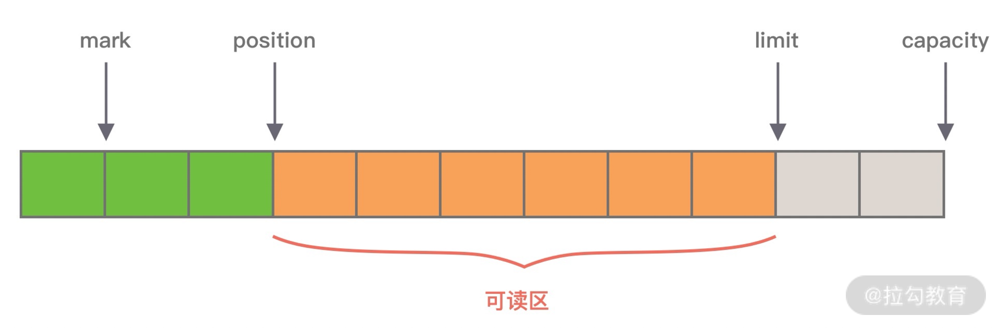
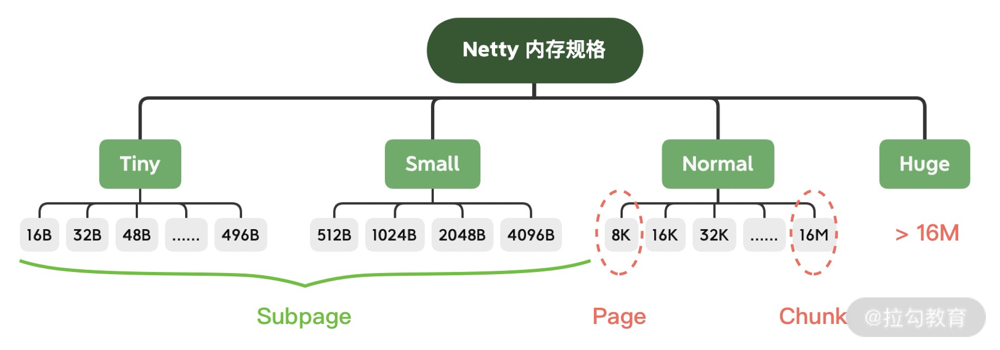
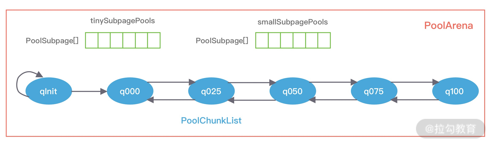
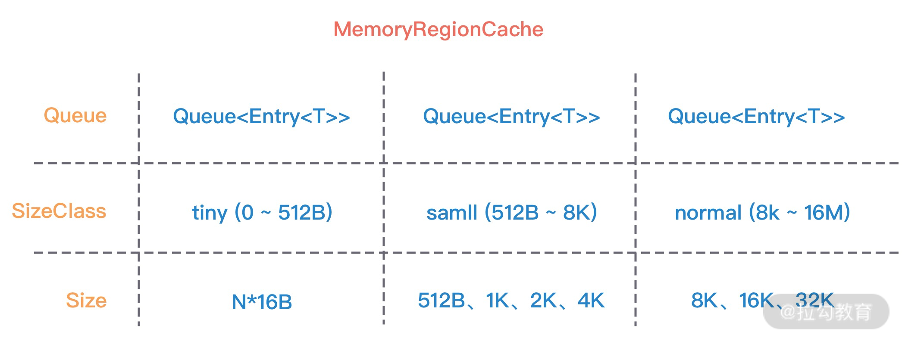
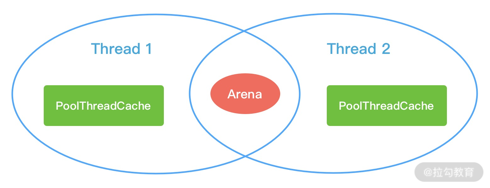
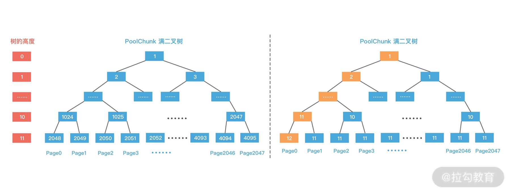
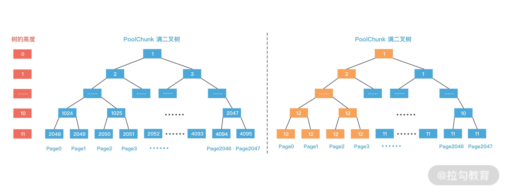

Netty的经典实用：蚂蚁的SoFABolt 

网址：https://github.com/sofastack/sofa-bolt


# 堆外内存


## Netty堆外内存


### 为什么需要堆外内存

* 和JVM的堆内内存而言，堆外内存不受JVM虚拟机管理，直接由操作系统管理

  

* 堆外和堆内的差异
  * 堆内内存由 JVM GC 自动回收内存，降低了 Java 用户的使用心智，但是 GC 是需要时间开销成本的，堆外内存由于不受 JVM 管理，所以在一定程度上可以降低 GC 对应用运行时带来的影响。
  * 堆外内存需要手动释放，这一点跟 C/C++ 很像，稍有不慎就会造成应用程序内存泄漏，当出现内存泄漏问题时排查起来会相对困难。
  * 当进行网络 I/O 操作、文件读写时，堆内内存都需要转换为堆外内存，然后再与底层设备进行交互，这一点在介绍 writeAndFlush 的工作原理中也有提到，所以直接使用堆外内存可以减少一次内存拷贝。
  * 堆外内存可以实现进程之间、JVM 多实例之间的数据共享。
* 想实现高效的 I/O 操作、缓存常用的对象、降低 JVM GC 压力，堆外内存是一个非常不错的选择。


### 堆外内存的分配

* Java 中堆外内存的分配方式有两种：**ByteBuffer#allocateDirect**和**Unsafe#allocateMemory**

* Java NIO的ByteBuffer分配方式

  ```java
  // 分配 10M 堆外内存
  ByteBuffer buffer = ByteBuffer.allocateDirect(10 * 1024 * 1024); 
  ```

  * 直接到DirectByteBuffer的构造方法

  ```java
  DirectByteBuffer(int cap) {                   // package-private
  
    super(-1, 0, cap, cap);
    boolean pa = VM.isDirectMemoryPageAligned();
    int ps = Bits.pageSize();
    long size = Math.max(1L, (long)cap + (pa ? ps : 0));
    Bits.reserveMemory(size, cap);
  
    long base = 0;
    try {
      
      //真正分配堆外内存的逻辑，还是通过unsafe来进行分配的
      base = unsafe.allocateMemory(size);
    } catch (OutOfMemoryError x) {
      Bits.unreserveMemory(size, cap);
      throw x;
    }
    unsafe.setMemory(base, size, (byte) 0);
    if (pa && (base % ps != 0)) {
      // Round up to page boundary
      address = base + ps - (base & (ps - 1));
    } else {
      address = base;
    }
    cleaner = Cleaner.create(this, new Deallocator(base, size, cap));
    att = null;
  
  }
  ```

  * 在堆内存放的 DirectByteBuffer 对象并不大，仅仅包含堆外内存的地址、大小等属性，同时还会创建对应的 Cleaner 对象，**通过 ByteBuffer 分配的堆外内存不需要手动回收，它可以被 JVM 自动回收**。当堆内的 DirectByteBuffer 对象被 GC 回收时，Cleaner 就会用于回收对应的堆外内存。

    

  * Unsafe类的作用

    * 它用于执行内存访问、分配、修改等**敏感操作**，可以越过 JVM 限制的枷锁。

  * Unsafe的获取，在Java中不能直接使用Unsafe类，但是可以通过反射来获取Unsafe实例

    ```java
    private static Unsafe unsafe = null;
    static {
        try {
            Field getUnsafe = Unsafe.class.getDeclaredField("theUnsafe");
            getUnsafe.setAccessible(true);
            unsafe = (Unsafe) getUnsafe.get(null);
        } catch (NoSuchFieldException | IllegalAccessException e) {
            e.printStackTrace();
        }
    }
    ```

    * 获取到Unsafe实例后，就可以通过allocateMemroy方法分配堆外内存了，allocateMemory方法返回的是内存地址

    ```java
    // 分配 10M 堆外内存
    long address = unsafe.allocateMemory(10 * 1024 * 1024);
    ```

    * 与Netty中的DirectByteBUffer不同的是，Unsafe#allocateMemory所分配的内存必须自己手动释放。否则会造成内存泄漏问题。这也是Unsafe不安全的地方。Unsafe内存释放的操作

    ```java
    unsafe.freeMemory(address);
    ```

    

### 堆外内存的回收

* 堆外内存分配方式的介绍，我们知道 DirectByteBuffer 在初始化时会创建一个 Cleaner 对象，它会负责堆外内存的回收工作，那么 Cleaner 是如何与 GC 关联起来的呢？

* Cleaner对象是虚引用

  ```java
  public class Cleaner extends java.lang.ref.PhantomReference<java.lang.Object> {
      private static final java.lang.ref.ReferenceQueue<java.lang.Object> dummyQueue;
      private static sun.misc.Cleaner first;
      private sun.misc.Cleaner next;
      private sun.misc.Cleaner prev;
      private final java.lang.Runnable thunk;
      public void clean() {}
  }
  ```


#### 回收过程

* 当初始化堆外内存时，内存中的对象引用情况如下图所示，first 是 Cleaner 类中的静态变量，Cleaner 对象在初始化时会加入 Cleaner 链表中。DirectByteBuffer 对象包含堆外内存的地址、大小以及 Cleaner 对象的引用，ReferenceQueue 用于保存需要回收的 Cleaner 对象。

  

* 当发生 GC 时，DirectByteBuffer 对象被回收，内存中的对象引用情况发生了如下变化：

  

* 此时 Cleaner 对象不再有任何引用关系，在下一次 GC 时，该 Cleaner 对象将被添加到 ReferenceQueue 中，并执行 clean() 方法。clean() 方法主要做两件事情：

  1. 将 Cleaner 对象从 Cleaner 链表中移除；
  2. 调用 unsafe.freeMemory 方法清理堆外内存。


## Netty数据传输载体ByteBuf详解

### 为何要ByteBuf

* Java NIO已经存在了ByteBuffer，为何Netty还要重复实现？？？

* NIO的ByteBuffer的结构

  

* ByteBuffer具有四种属性

  * mark：为某个读取过的关键位置做标记，方便回退到该位置；
  * position：当前读取的位置；
  * limit：buffer 中有效的数据长度大小；
  * capacity：初始化时的空间容量。

* 四个属性的关系

  * **mark <= position <= limit <= capacity**

* ByteBuffer的缺点

  * 第一，**ByteBuffer 分配的长度是固定的，无法动态扩缩容**，所以很难控制需要分配多大的容量。如果分配太大容量，容易造成内存浪费；如果分配太小，存放太大的数据会抛出 BufferOverflowException 异常。在使用 ByteBuffer 时，为了避免容量不足问题，你必须每次在存放数据的时候对容量大小做校验，如果超出 ByteBuffer 最大容量，那么需要重新开辟一个更大容量的 ByteBuffer，将已有的数据迁移过去。整个过程相对烦琐，对开发者而言是非常不友好的
  * **ByteBuffer 只能通过 position 获取当前可操作的位置**，因为读写共用的 position 指针，所以需要频繁调用 flip、rewind 方法切换读写状态，开发者必须很小心处理 ByteBuffer 的数据读写，稍不留意就会出错。

* Netty基于上面的问题，实现了自己的数据载体ByteBuf，特性

  * 容量可以按需动态扩展，类似于 StringBuffer；
  * 读写采用了不同的指针，读写模式可以随意切换，不需要调用 flip 方法；
  * 通过内置的复合缓冲类型可以实现零拷贝；
  * 支持引用计数；
  * 支持缓存池。


### ByteBuf内部结构


* 包含三个指针
  * 读指针 readerIndex
  * 写指针 writerIndex
  * 最大容量 maxCapacity
* 四个区域
  * 第一部分是**废弃字节**，表示已经丢弃的无效字节数据。
  * 第二部分是**可读字节**，表示 ByteBuf 中可以被读取的字节内容，可以通过 writeIndex - readerIndex 计算得出。从 ByteBuf 读取 N 个字节，readerIndex 就会自增 N，readerIndex 不会大于 writeIndex，当 readerIndex == writeIndex 时，表示 ByteBuf 已经不可读
  * 第三部分是**可写字节**，向 ByteBuf 中写入数据都会存储到可写字节区域。向 ByteBuf 写入 N 字节数据，writeIndex 就会自增 N，当 writeIndex 超过 capacity，表示 ByteBuf 容量不足，需要扩容。
  * 第四部分是**可扩容字节**，表示 ByteBuf 最多还可以扩容多少字节，当 writeIndex 超过 capacity 时，会触发 ByteBuf 扩容，最多扩容到 maxCapacity 为止，超过 maxCapacity 再写入就会出错。


#### ByteBuf的生命周期

* ByteBuf 是基于**引用计数**设计的，它实现了 ReferenceCounted 接口，ByteBuf 的生命周期是由引用计数所管理。只要引用计数大于 0，表示 ByteBuf 还在被使用；当 ByteBuf 不再被其他对象所引用时，引用计数为 0，那么代表该对象可以被释放。
* 当新创建一个 ByteBuf 对象时，它的初始引用计数为 1，当 ByteBuf 调用 release() 后，引用计数减 1，所以不要误以为调用了 release() 就会保证 ByteBuf 对象一定会被回收。只有引用计数为0时，才表示ByteBuf不可用


#### ByteBuf分类


* **Heap/Direct 就是堆内和堆外内存**。Heap 指的是在 JVM 堆内分配，底层依赖的是字节数据；Direct 则是堆外内存，不受 JVM 限制，分配方式依赖 JDK 底层的 ByteBuffer。
* **Pooled/Unpooled 表示池化还是非池化内存**。Pooled 是从预先分配好的内存中取出，使用完可以放回 ByteBuf 内存池，等待下一次分配。而 Unpooled 是直接调用系统 API 去申请内存，确保能够被 JVM GC 管理回收。
* **Unsafe/非 Unsafe 的区别在于操作方式是否安全。** Unsafe 表示每次调用 JDK 的 Unsafe 对象操作物理内存，依赖 offset + index 的方式操作数据。非 Unsafe 则不需要依赖 JDK 的 Unsafe 对象，直接通过数组下标的方式操作数据。


#### ByteBuf核心API


##### 指针操作

- **readerIndex() & writeIndex()**
  - readerIndex() 返回的是当前的读指针的 readerIndex 位置，writeIndex() 返回的当前写指针 writeIndex 位置。

- **markReaderIndex() & resetReaderIndex()**
  - markReaderIndex() 用于保存 readerIndex 的位置，resetReaderIndex() 则将当前 readerIndex 重置为之前保存的位置。
  - 这对 API 在实现协议解码时最为常用，例如在上述自定义解码器的源码中，在读取协议内容长度字段之前，先使用 markReaderIndex() 保存了 readerIndex 的位置，如果 ByteBuf 中可读字节数小于长度字段的值，则表示 ByteBuf 还没有一个完整的数据包，此时直接使用 resetReaderIndex() 重置 readerIndex 的位置。


##### 数据读写 API

- **isReadable()**
  - isReadable() 用于判断 ByteBuf 是否可读，如果 writerIndex 大于 readerIndex，那么 ByteBuf 是可读的，否则是不可读状态。

- **readableBytes()**
  - readableBytes() 可以获取 ByteBuf 当前可读取的字节数，可以通过 writerIndex - readerIndex 计算得到。

- **readBytes(byte[] dst) & writeBytes(byte[] src)**
  - readBytes() 和 writeBytes() 是两个最为常用的方法。readBytes() 是将 ByteBuf 的数据读取相应的字节到字节数组 dst 中，readBytes() 经常结合 readableBytes() 一起使用，dst 字节数组的大小通常等于 readableBytes() 的大小。
- **readByte() & writeByte(int value)**
  - readByte() 是从 ByteBuf 中读取一个字节，相应的 readerIndex + 1；同理 writeByte 是向 ByteBuf 写入一个字节，相应的 writerIndex + 1。类似的 Netty 提供了 8 种基础数据类型的读取和写入，例如 readChar()、readShort()、readInt()、readLong()、writeChar()、writeShort()、writeInt()、writeLong() 等，在这里就不详细展开了。

- **getByte(int index) & setByte(int index, int value)**

  - 与 readByte() 和 writeByte() 相对应的还有 getByte() 和 setByte()，get/set 系列方法也提供了 8 种基础类型的读写，那么这两个系列的方法有什么区别呢？read/write 方法在读写时会改变readerIndex 和 writerIndex 指针，而 get/set 方法则不会改变指针位置。

  

##### 内存管理 API

- **release() & retain()**
  - 之前已经介绍了引用计数的基本概念，每调用一次 release() 引用计数减 1，每调用一次 retain() 引用计数加 1。

- **slice() & duplicate()**
  - slice() 等同于 slice(buffer.readerIndex(), buffer.readableBytes())，默认截取 readerIndex 到 writerIndex 之间的数据，最大容量 maxCapacity 为原始 ByteBuf 的可读取字节数，底层分配的内存、引用计数都与原始的 ByteBuf 共享。
  - duplicate() 与 slice() 不同的是，duplicate()截取的是整个原始 ByteBuf 信息，底层分配的内存、引用计数也是共享的。如果向 duplicate() 分配出来的 ByteBuf 写入数据，那么都会影响到原始的 ByteBuf 底层数据。

- **copy()**
  - copy() 会从原始的 ByteBuf 中拷贝所有信息，所有数据都是独立的，向 copy() 分配的 ByteBuf 中写数据不会影响原始的 ByteBuf。


## Netty内存管理

* 针对ByteBuf的分配和管理


### jemalloc内存分配器

* Netty的内存管理，是针对jemalloc进行研究，研究出自身的内存管理方式，所以jemalloc算是他的前辈，Netty算是对jemalloc的优化和改进


### Netty高性能内存管理设计

* 解决两个经典核心问题
  * 在单线程或者多线程的场景下，如何高效的进行内存分配和回收？
  * 如何减少内存碎片，提高内存的有效使用率？


#### 内存规格介绍



* Netty 在每个区域内又定义了更细粒度的内存分配单位，分别为 Chunk、Page、Subpage，我们将逐一对其进行介绍。
* **Chunk 是 Netty 向操作系统申请内存的单位，所有的内存分配操作也是基于 Chunk 完成的**，Chunk 可以理解为 Page 的集合，每个 Chunk 默认大小为 16M。
* **Page 是 Chunk 用于管理内存的单位，Netty 中的 Page 的大小为 8K，**不要与 Linux 中的内存页 Page 相混淆了。假如我们需要分配 64K 的内存，需要在 Chunk 中选取 8 个 Page 进行分配。
* **Subpage 负责 Page 内的内存分配，假如我们分配的内存大小远小于 Page，直接分配一个 Page 会造成严重的内存浪费，所以需要将 Page 划分为多个相同的子块进行分配，这里的子块就相当于 Subpage**。按照 Tiny 和 Small 两种内存规格，SubPage 的大小也会分为两种情况。在 Tiny 场景下，最小的划分单位为 16B，按 16B 依次递增，16B、32B、48B ...... 496B；在 Small 场景下，总共可以划分为 512B、1024B、2048B、4096B 四种情况。Subpage 没有固定的大小，需要根据用户分配的缓冲区大小决定，例如分配 1K 的内存时，Netty 会把一个 Page 等分为 8 个 1K 的 Subpage。


* 不同的内存，由page管理，如果page太大，那么就会将page拆分成更小的单位subPage进行管理。subpage负责Page内的内存分配。


#### Netty内存池架构设计

* 内存池模型

  


##### PoolArena

* Netty 借鉴了 jemalloc 中 Arena 的设计思想，采用固定数量的多个 Arena 进行内存分配，**Arena 的默认数量与 CPU 核数有关**，通过创建多个 Arena 来缓解资源竞争问题，从而提高内存分配效率

* 线程在首次申请分配内存时，**会通过 round-robin 的方式轮询 Arena 数组，选择一个固定的 Arena**，在线程的生命周期内只与该 Arena 打交道，所以每个线程都保存了 Arena 信息，从而提高访问效率。Arena不会变，在一个线程生命周期内

* ByteBuf可分为Heap和Direct，那么PoolArena抽象类提供了HeapArena和DirectArena两个子类。

* PoolArena数据结构

  

  * PoolArena 的数据结构包含两个 PoolSubpage 数组和六个 PoolChunkList，两个 PoolSubpage 数组分别存放 Tiny 和 Small 类型的内存块，**六个 PoolChunkList 分别存储不同利用率的 Chunk**，构成一个双向循环链表。上图中的qinit，q000。。。都是PoolChunkList
  * PoolSubpage 也是按照 Tiny 和 Small 两种内存规格，设计了tinySubpagePools 和 smallSubpagePools 两个数组
  * PoolChunkList 用于 Chunk 场景下的内存分配，PoolArena 中初始化了六个 PoolChunkList，分别为 qInit、q000、q025、q050、q075、q100。他们分别代表了不同的内存使用率
    * qInit，内存使用率为 0 ~ 25% 的 Chunk。
    * q000，内存使用率为 1 ~ 50% 的 Chunk。
    * q025，内存使用率为 25% ~ 75% 的 Chunk。
    * q050，内存使用率为 50% ~ 100% 的 Chunk。
    * q075，内存使用率为 75% ~ 100% 的 Chunk。
    * q100，内存使用率为 100% 的 Chunk。

* 六种类型的 PoolChunkList 除了 qInit，它们之间都形成了双向链表

  

  * qInit 和 q000 为什么需要设计成两个，是否可以合并成一个？
    * qInit 用于存储初始分配的 PoolChunk，因为在第一次内存分配时，PoolChunkList 中并没有可用的 PoolChunk，所以需要新创建一个 PoolChunk 并添加到 qInit 列表中。qInit 中的 PoolChunk 即使内存被完全释放也不会被回收，避免 PoolChunk 的重复初始化工作。
    * q000 则用于存放内存使用率为 1 ~ 50% 的 PoolChunk，q000 中的 PoolChunk 内存被完全释放后，PoolChunk 从链表中移除，对应分配的内存也会被回收。


##### PoolChunkList

* PoolChunkList 负责管理多个 PoolChunk 的生命周期，同一个 PoolChunkList 中存放内存使用率相近的 PoolChunk，这些 PoolChunk 同样以双向链表的形式连接在一起，

* PoolChunkList 的结构如下图所示.因为 PoolChunk 经常要从 PoolChunkList 中删除，并且需要在不同的 PoolChunkList 中移动，所以双向链表是管理 PoolChunk 时间复杂度较低的数据结构。

  

  * 每个 PoolChunkList 都有内存使用率的上下限：minUsage 和 maxUsage
  * 当 PoolChunk 进行内存分配后，如果使用率超过 maxUsage，那么 PoolChunk 会从当前 PoolChunkList 移除，并移动到下一个 PoolChunkList。
  * PoolChunk 中的内存发生释放后，如果使用率小于 minUsage，那么 PoolChunk 会从当前 PoolChunkList 移除，并移动到前一个 PoolChunkList。


##### PoolChunk

* Netty 内存的分配和回收都是基于 PoolChunk 完成的，PoolChunk 是真正存储内存数据的地方，每个 PoolChunk 的默认大小为 16M

* PoolChunk 可以理解为 Page 的集合，Page 只是一种抽象的概念，实际在 Netty 中 Page 所指的是 PoolChunk 所管理的子内存块，每个子内存块采用 PoolSubpage 表示

* Netty 会使用伙伴算法将 PoolChunk 分配成 2048 个 Page，最终形成一颗满二叉树，二叉树中所有子节点的内存都属于其父节点管理

  

  * subpages 对应上图中 PoolChunk 内部的 Page0、Page1、Page2 ...... Page2047，**Netty 中并没有 Page 的定义，直接使用 PoolSubpage 表示**，page是概念上的，具体管理是poolSubpage来进行管理
  * 当分配的内存小于 8K 时，PoolChunk 中的每个 Page 节点会被划分成为更小粒度的内存块进行管理，小内存块同样以 **PoolSubpage** 管理


##### PoolSubPage

* 在小内存分配的场景下，即分配的内存大小小于一个 Page 8K，会使用 PoolSubpage 进行管理

* PoolSubpage定义

  ```java
  final class PoolSubpage<T> implements PoolSubpageMetric {
      final PoolChunk<T> chunk;
      private final int memoryMapIdx; // 对应满二叉树节点的下标
      private final int runOffset; // PoolSubpage 在 PoolChunk 中 memory 的偏移量
      private final long[] bitmap; // 记录每个小内存块的状态
      // 与 PoolArena 中 tinySubpagePools 或 smallSubpagePools 中元素连接成双向链表
      PoolSubpage<T> prev;
      PoolSubpage<T> next;
      int elemSize; // 每个小内存块的大小
      private int maxNumElems; // 最多可以存放多少小内存块：8K/elemSize
      private int numAvail; // 可用于分配的内存块个数
  
      // 省略其他代码
  }
  ```

* PoolSubpage如何记录内存快的使用状态？？？

  * 通过位图bitmap记录内存是否已经被使用

    

* PoolSubpage和PoolArena之间是如何关联起来的？？？

  * PoolArena 在创建是会初始化 tinySubpagePools 和 smallSubpagePools 两个 PoolSubpage 数组，数组的大小分别为 32 和 4。

  * 假如我们现在需要分配 20B 大小的内存，会向上取整为 32B，**从满二叉树的第 11 层找到一个 PoolSubpage 节点**，并把它等分为 8KB/32B = 256B 个小内存块，然后找到这个 PoolSubpage 节点对应的 PoolArena，将 PoolSubpage 节点与 tinySubpagePools[1] 对应的 head 节点连接成双向链表，形成下图所示的结构。

    

  * 下次再有 32B 规格的内存分配时，会直接查找 PoolArena 中 tinySubpagePools[1] 元素的 next 节点是否存在可用的 PoolSubpage，如果存在将直接使用该 PoolSubpage 执行内存分配，从而提高了内存分配效率，其他内存规格的分配原理类似。


##### PoolThreadCache & MemoryRegionCache

* 当内存释放时，与 jemalloc 一样，**Netty 并没有将缓存归还给 PoolChunk**，而是使用 PoolThreadCache 缓存起来，当下次有同样规格的内存分配时，直接从 PoolThreadCache 取出使用即可。

* PoolThreadCache 缓存 Tiny、Small、Normal 三种类型的数据，而且根据堆内和堆外内存的类型进行了区分，如 PoolThreadCache 的源码定义所示：

  ```java
  final class PoolThreadCache {
      final PoolArena<byte[]> heapArena;
      final PoolArena<ByteBuffer> directArena;
      private final MemoryRegionCache<byte[]>[] tinySubPageHeapCaches;
      private final MemoryRegionCache<byte[]>[] smallSubPageHeapCaches;
      private final MemoryRegionCache<ByteBuffer>[] tinySubPageDirectCaches;
      private final MemoryRegionCache<ByteBuffer>[] smallSubPageDirectCaches;
      private final MemoryRegionCache<byte[]>[] normalHeapCaches;
      private final MemoryRegionCache<ByteBuffer>[] normalDirectCaches;
  
      // 省略其他代码
  }
  ```

  * PoolThreadCache 中有一个重要的数据结构：MemoryRegionCache。MemoryRegionCache 有三个重要的属性，分别为 queue，sizeClass 和 size，下图是不同内存规格所对应的 MemoryRegionCache 属性取值范围。

    

  * **MemoryRegionCache 实际就是一个队列**，当内存释放时，将内存块加入队列当中，下次再分配同样规格的内存时，直接从队列中取出空闲的内存块。

* PoolThreadCache 将不同规格大小的内存都使用单独的 MemoryRegionCache 维护，如下图所示，

  * 图中的每个节点都对应一个 MemoryRegionCache，例如 Tiny 场景下对应的 32 种内存规格会使用 32 个 MemoryRegionCache 维护，所以 PoolThreadCache 源码中 Tiny、Small、Normal 类型的 MemoryRegionCache 数组长度分别为 32、4、3。

    


### 不同场景，Netty内存分配和回收

#### 内存分配实现原理

* Netty 中负责线程分配的组件有两个：**PoolArena**和**PoolThreadCache**。PoolArena 是多个线程共享的，每个线程会固定绑定一个 PoolArena，PoolThreadCache 是每个线程私有的缓存空间

  

  *  PoolChunk、PoolSubpage、PoolChunkList，它们都是 PoolArena 中所用到的概念。PoolArena 中管理的内存单位为 PoolChunk，每个 PoolChunk 会被划分为 2048 个 8K 的 Page。在申请的内存大于 8K 时，PoolChunk 会以 Page 为单位进行内存分配。当申请的内存大小小于 8K 时，会由 PoolSubpage 管理更小粒度的内存分配。
  * PoolArena 分配的内存被释放后，不会立即会还给 PoolChunk，而且会缓存在本地私有缓存 PoolThreadCache 中，在下一次进行内存分配时，会优先从 PoolThreadCache 中查找匹配的内存块。

* Netty 中不同的内存规格采用的分配策略是不同的，我们主要分为以下三个场景逐一进行分析。

  * 分配内存大于 8K 时，PoolChunk 中采用的 Page 级别的内存分配策略。
  * 分配内存小于 8K 时，由 PoolSubpage 负责管理的内存分配策略。
  * 分配内存小于 8K 时，为了提高内存分配效率，由 PoolThreadCache 本地线程缓存提供的内存分配。


##### 场景一：PoolChunk中采用的Page级别的内存分配策略

* 每个 PoolChunk 默认大小为 16M，PoolChunk 是通过伙伴算法管理多个 Page，每个 PoolChunk 被划分为 2048 个 Page，最终通过一颗满二叉树实现

  

* 依次分配 8K，16K，8K的内存，来理解PoolChunk对Page级别的内存的分配

* 查看源码

  ```java
  private long allocateRun(int normCapacity) {
      // 根据分配内存大小计算二叉树对应的节点高度
      int d = maxOrder - (log2(normCapacity) - pageShifts);
      // 查找对应高度中是否存在可用节点
      int id = allocateNode(d);
      if (id < 0) {
          return id;
      }
      // 减去已分配的内存大小
      freeBytes -= runLength(id);
      return id;
  }
  ```

  * PoolChunk 分配 Page 主要分为三步：
    * 首先根据分配内存大小计算二叉树所在节点的高度，
    * 然后查找对应高度中是否存在可用节点，
    * 如果分配成功则减去已分配的内存大小得到剩余可用空间。


###### 首次分配8K

* 第一次分配 8K 大小的内存时，通过 d = maxOrder - (log2(normCapacity) - pageShifts) 计算得到二叉树所在节点高度为 11，其中 maxOrder 为二叉树的最大高度，normCapacity 为 8K，pageShifts 默认值为 13，d=11

* 因为只有当申请内存大小大于 2^13 = 8K 时才会使用 allocateRun 分配内存。然后从第 11 层查找可用的 Page

* 下标为 2048 的节点可以被用于分配内存，即 Page[0] 被分配使用，**此时赋值 memoryMap[2048] = 12，表示该节点已经不可用，12用于标记此节点的内存已经被分配**

* 然后递归更新父节点的值，父节点的值取两个子节点的最小值，memoryMap[1024] = 11，memoryMap[512] = 10，以此类推直至 memoryMap[1] = 1，更新后的二叉树分配结果如下图所示。

  

###### 申请16K大小内存

* 和上面一样，先找到高度，为10，但是此时1024节点已经分配了一个8K的内存，不在满足条件，继续寻找1025节点

* 1025 节点并未使用过，满足分配条件，于是将 1025 节点的两个子节点 2050 和 2051 全部分配出去，并赋值 memoryMap[2050] = 12，memoryMap[2051] = 12，再次递归更新父节点的值，更新后的二叉树分配结果如下图所示

  

###### 再次申请8K内存

* 再次分配 8K 大小的内存时，依然从二叉树第 11 层开始查找，2048 已经被使用，2049 可以被分配，赋值 memoryMap[2049] = 12，并递归更新父节点值，memoryMap[1024] = 12，memoryMap[512] = 12，以此类推直至 memoryMap[1] = 1，最终的二叉树分配结果如下图所示

  


##### 场景二：Subpage 级别的内存分配

* 为了提高内存分配的利用率，在分配小于 8K 的内存时，PoolChunk 不在分配单独的 Page，而是将 Page 划分为更小的内存块，由 PoolSubpage 进行管理。

* PoolSubpage的创建过程，当分配的内存小于8k，所以走到了allocateSubpage源码

  ```java
  private long allocateSubpage(int normCapacity) {
      // 根据内存大小找到 PoolArena 中 subpage 数组对应的头结点
      PoolSubpage<T> head = arena.findSubpagePoolHead(normCapacity);
      int d = maxOrder; // 因为分配内存小于 8K，所以从满二叉树最底层开始查找
      synchronized (head) {
          int id = allocateNode(d); // 在满二叉树中找到一个可用的节点
          if (id < 0) {
              return id;
          }
          final PoolSubpage<T>[] subpages = this.subpages; // 记录哪些 Page 被转化为 Subpage
          final int pageSize = this.pageSize; 
          freeBytes -= pageSize;
          int subpageIdx = subpageIdx(id); // pageId 到 subpageId 的转化，例如 pageId=2048 对应的 subpageId=0
          PoolSubpage<T> subpage = subpages[subpageIdx];
          if (subpage == null) {
              // 创建 PoolSubpage，并切分为相同大小的子内存块，然后加入 PoolArena 对应的双向链表中
              subpage = new PoolSubpage<T>(head, this, id, runOffset(id), pageSize, normCapacity);
              subpages[subpageIdx] = subpage;
          } else {
              subpage.init(head, normCapacity);
          }
          return subpage.allocate(); // 执行内存分配并返回内存地址
      }
  }
  ```

  * 假如我们需要分配 20B 大小的内存，一起分析下上述源码的执行过程：
    1. 因为 20B 小于 512B，属于 Tiny 场景，按照内存规格的分类 20B 需要向上取整到 32B。
    2. 根据内存规格的大小找到 PoolArena 中 tinySubpagePools 数组对应的头结点，32B 对应的 tinySubpagePools[1]。
    3. 在满二叉树中寻找可用的节点用于内存分配，因为我们分配的内存小于 8K，所以直接从二叉树的最底层开始查找。假如 2049 节点是可用的，那么返回的 id = 2049。
    4. 找到可用节点后，因为 pageIdx 是从叶子节点 2048 开始记录索引，而 subpageIdx 需要从 0 开始的，所以需要将 pageIdx 转化为 subpageIdx，例如 2048 对应的 subpageIdx = 0，2049 对应的 subpageIdx = 1，以此类推。
    5. **如果 PoolChunk 中 subpages 数组的 subpageIdx 下标对应的 PoolSubpage 不存在，那么将创建一个新的 PoolSubpage，并将 PoolSubpage 切分为相同大小的子内存块**，示例对应的子内存块大小为 32B，最后将新创建的 PoolSubpage 节点与 tinySubpagePools[1] 对应的 **head 节点连接成双向链表**。
    6. 最后 PoolSubpage 执行内存分配并返回内存地址。

* Subpage.allocate()源码，看看PoolSubpage是如何执行内存分配的

  ```java
  long allocate() {
      if (elemSize == 0) {
          return toHandle(0);
      }
      if (numAvail == 0 || !doNotDestroy) {
          return -1;
      }
      final int bitmapIdx = getNextAvail(); // 在 bitmap 中找到第一个索引段，然后将该 bit 置为 1
      int q = bitmapIdx >>> 6; // 定位到 bitmap 的数组下标
      int r = bitmapIdx & 63; // 取到节点对应一个 long 类型中的二进制位
      assert (bitmap[q] >>> r & 1) == 0;
      bitmap[q] |= 1L << r;
      if (-- numAvail == 0) {
          removeFromPool(); // 如果 PoolSubpage 没有可分配的内存块，从 PoolArena 双向链表中删除
      }
      return toHandle(bitmapIdx);
  }
  ```

  * PoolSubpage 通过位图 bitmap 记录每个内存块是否已经被使用。

  * 在上述的示例中，8K/32B = 256，因为每个 long 有 64 位，所以需要 256/64 = 4 个 long 类型的即可描述全部的内存块分配状态，因此 bitmap 数组的长度为 4，

  * 从 bitmap[0] 开始记录，每分配一个内存块，就会移动到 bitmap[0] 中的下一个二进制位，直至 bitmap[0] 的所有二进制位都赋值为 1，然后继续分配 bitmap[1]，以此类推。当我们使用 2049 节点进行内存分配时，bitmap[0] 中的二进制位如下图所示：

    

  * 当 bitmap 分成成功后，PoolSubpage 会将可用节点的个数 numAvail 减 1，**当 numAvail 降为 0 时，表示 PoolSubpage 已经没有可分配的内存块**，此时需要从 PoolArena 中 tinySubpagePools[1] 的双向链表中删除。


##### 场景三：PoolThreadCache的内存分配

* PoolArena 分配的内存被释放时，Netty 并没有将缓存归还给 PoolChunk，而是使用 PoolThreadCache 缓存起来，当下次有同样规格的内存分配时，直接从 PoolThreadCache 取出使用即可。

* PoolArena#allocate()源码，看看PoolThreadCache是如何使用的

  ```java
  private void allocate(PoolThreadCache cache, PooledByteBuf<T> buf, final int reqCapacity) {
      final int normCapacity = normalizeCapacity(reqCapacity);
      if (isTinyOrSmall(normCapacity)) { // capacity < pageSize
          int tableIdx;
          PoolSubpage<T>[] table;
          boolean tiny = isTiny(normCapacity);
          if (tiny) { // < 512
              if (cache.allocateTiny(this, buf, reqCapacity, normCapacity)) {
                  return;
              }
              tableIdx = tinyIdx(normCapacity);
              table = tinySubpagePools;
          } else {
              if (cache.allocateSmall(this, buf, reqCapacity, normCapacity)) {
                  return;
              }
              tableIdx = smallIdx(normCapacity);
              table = smallSubpagePools;
          }
  
          // 省略其他代码
      }
      if (normCapacity <= chunkSize) {
        
          //先从PoolThreadCache中进行分配内存
          if (cache.allocateNormal(this, buf, reqCapacity, normCapacity)) {
              return;
          }
          synchronized (this) {
              allocateNormal(buf, reqCapacity, normCapacity);
              ++allocationsNormal;
          }
      } else {//大于16M的情况，从Chunk中申请内存
          allocateHuge(buf, reqCapacity);
      }
  }
  ```

  * 步骤
    * 对申请的内存大小做向上取整，例如 20B 的内存大小会取整为 32B。
    * 当申请的内存大小小于 8K 时，分为 Tiny 和 Small 两种情况，分别都会优先尝试从 PoolThreadCache 分配内存，如果 PoolThreadCache 分配失败，才会走 PoolArena 的分配流程。
    * 当申请的内存大小大于 8K，但是小于 Chunk 的默认大小 16M，属于 Normal 的内存分配，也会优先尝试从 PoolThreadCache 分配内存，如果 PoolThreadCache 分配失败，才会走 PoolArena 的分配流程。
    * 当申请的内存大小大于 Chunk 的 16M，则不会经过 PoolThreadCache，直接进行分配。


#### 内存回收实现原理

* 当用户线程释放内存时会将内存块缓存到本地线程的私有缓存 PoolThreadCache 中，这样在下次分配内存时会提高分配效率，但是当内存块被用完一次后，再没有分配需求，那么一直驻留在内存中又会造成浪费

* 跟进源码，因为最后释放的先会放入PoolThreadCache对象池中，重复使用，那么直接看PoolThreadCache源码，如果太久，会发生什么情况？？？

* PoolThreadCache # allocate

  ```java
  private boolean allocate(MemoryRegionCache<?> cache, PooledByteBuf buf, int reqCapacity) {
      if (cache == null) {
          return false;
      }
      // 默认每执行 8192 次 allocate()，就会调用一次 trim() 进行内存整理
      boolean allocated = cache.allocate(buf, reqCapacity);
      if (++ allocations >= freeSweepAllocationThreshold) {
          allocations = 0;
          trim();
      }
      return allocated;
  }
  void trim() {
      trim(tinySubPageDirectCaches);
      trim(smallSubPageDirectCaches);
      trim(normalDirectCaches);
      trim(tinySubPageHeapCaches);
      trim(smallSubPageHeapCaches);
      trim(normalHeapCaches);
  }
  ```

  * Netty 记录了 allocate() 的执行次数，默认每执行 8192 次，就会触发 PoolThreadCache 调用一次 trim() 进行内存整理，会对 PoolThreadCache 中维护的六个 MemoryRegionCache 数组分别进行整理

* PoolThreadCache # trim 方法

  ```java
  public final void trim() {
      int free = size - allocations;
      allocations = 0;
      // We not even allocated all the number that are
      if (free > 0) {
          free(free, false);
      }
  }
  private int free(int max, boolean finalizer) {
      int numFreed = 0;
      for (; numFreed < max; numFreed++) {
          Entry<T> entry = queue.poll();
          if (entry != null) {
              freeEntry(entry, finalizer);
          } else {
              // all cleared
              return numFreed;
          }
      }
      return numFreed;
  }
  ```

  * 通过 size - allocations 衡量内存分配执行的频繁程度，其中 size 为该 MemoryRegionCache 对应的内存规格大小，size 为固定值，例如 Tiny 类型默认为 512。allocations 表示 MemoryRegionCache 距离上一次内存整理已经发生了多少次 allocate 调用，当调用次数小于 size 时，表示 MemoryRegionCache 中缓存的内存块并不常用，从队列中取出内存块依次释放。

* PoolThreadCache # finalize()方法

  ```java
  @Override
  protected void finalize() throws Throwable {
      try {
          super.finalize();
      } finally {
          free(true);
      }
  }
  void free(boolean finalizer) {
      if (freed.compareAndSet(false, true)) {
          int numFreed = free(tinySubPageDirectCaches, finalizer) +
                  free(smallSubPageDirectCaches, finalizer) +
                  free(normalDirectCaches, finalizer) +
                  free(tinySubPageHeapCaches, finalizer) +
                  free(smallSubPageHeapCaches, finalizer) +
                  free(normalHeapCaches, finalizer);
          if (numFreed > 0 && logger.isDebugEnabled()) {
              logger.debug("Freed {} thread-local buffer(s) from thread: {}", numFreed,
                      Thread.currentThread().getName());
          }
          if (directArena != null) {
              directArena.numThreadCaches.getAndDecrement();
          }
          if (heapArena != null) {
              heapArena.numThreadCaches.getAndDecrement();
          }
      }
  }
  ```

  * 线程销毁时 PoolThreadCache 会依次释放所有 MemoryRegionCache 中的内存数据，其中 free 方法的核心逻辑与之前内存整理 trim 中释放内存的过程是一致的

### 总结

- 分四种内存规格管理内存，分别为 Tiny、Samll、Normal、Huge，PoolChunk 负责管理 8K 以上的内存分配，PoolSubpage 用于管理 8K 以下的内存分配。当申请内存大于 16M 时，不会经过内存池，直接分配。
- 设计了本地线程缓存机制 PoolThreadCache，用于提升内存分配时的并发性能。用于申请 Tiny、Samll、Normal 三种类型的内存时，会优先尝试从 PoolThreadCache 中分配。
- PoolChunk 使用伙伴算法管理 Page，以二叉树的数据结构实现，是整个内存池分配的核心所在。
- 每调用 PoolThreadCache 的 allocate() 方法到一定次数，会触发检查 PoolThreadCache 中缓存的使用频率，使用频率较低的内存块会被释放。
- 线程退出时，Netty 会回收该线程对应的所有内存。

