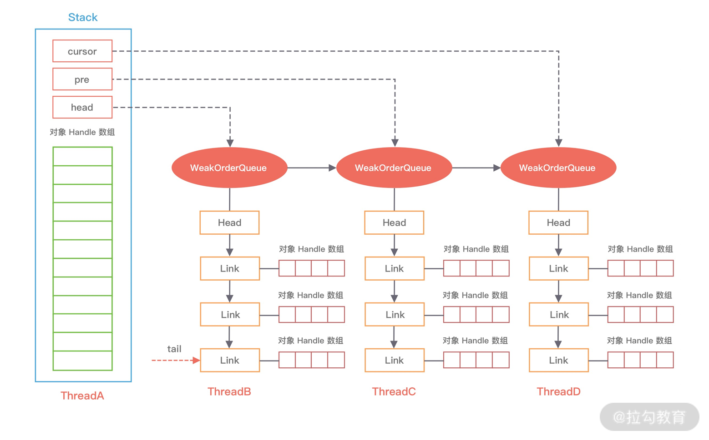

Netty的经典实用：蚂蚁的SoFABolt 

网址：https://github.com/sofastack/sofa-bolt


* 问题
  * 对象池和内存池有什么区别，有什么联系？
  * 实现对象池的方法由很多，Netty是如何实现的？
  * 对象池在实践中我们应该怎么使用？


## 入门案例

* 代码

  ```java
  public class UserCache {
      private static final Recycler<User> userRecycler = new Recycler<User>() {
          @Override
          protected User newObject(Handle<User> handle) {
              return new User(handle);
          }
      };
      static final class User {
          private String name;
          private Recycler.Handle<User> handle;
          public void setName(String name) {
              this.name = name;
          }
          public String getName() {
              return name;
          }
          public User(Recycler.Handle<User> handle) {
              this.handle = handle;
          }
          public void recycle() {
              handle.recycle(this);
          }
      }
      public static void main(String[] args) {
          User user1 = userRecycler.get(); // 1、从对象池获取 User 对象
          user1.setName("hello"); // 2、设置 User 对象的属性
          user1.recycle(); // 3、回收对象到对象池
          User user2 = userRecycler.get(); // 4、从对象池获取对象
          System.out.println(user2.getName());
          System.out.println(user1 == user2);
      }
  }
  ```

  * 输出结果

    ```java
    user
    true
    ```

    


## Recycler设计理念

* 对象池与内存池的都是为了提高 Netty 的并发处理能力，我们知道 Java 中频繁地创建和销毁对象的开销是很大的，所以很多人会将一些通用对象缓存起来，当需要某个对象时，优先从对象池中获取对象实例。通过重用对象，不仅避免频繁地创建和销毁所带来的性能损耗，而且对 JVM GC 是友好的，这就是对象池的作用。

* Recycler 是 Netty 提供的自定义实现的轻量级对象回收站，借助 Recycler 可以完成对象的获取和回收。既然 Recycler 是 Netty 自己实现的对象池。

* Recycler的内部结构

  

  * 四个核心组件
    * Stack
    * WeakOrderQueue
    * Link
    * DefaultHandler

* 组件图

  

### Stack

* Stack 是整个对象池的顶层数据结构，描述了整个对象池的构造，用于**存储当前本线程回收的对象**

* 在多线程的场景下，Netty 为了避免锁竞争问题，每个线程都会持有各自的对象池，内部通过 FastThreadLocal 来实现每个线程的私有化。对象池，每个线程都有，岂不会很浪费内存呀？？？

* 源码

  ```java
  static final class Stack<T> {
      final Recycler<T> parent; // 所属的 Recycler
      final WeakReference<Thread> threadRef; // 所属线程的弱引用
  
      final AtomicInteger availableSharedCapacity; // 异线程回收对象时，其他线程能保存的被回收对象的最大个数
      final int maxDelayedQueues; // WeakOrderQueue最大个数
      private final int maxCapacity; // 对象池的最大大小，默认最大为 4k
      private final int ratioMask; // 控制对象的回收比率，默认只回收 1/8 的对象
      private DefaultHandle<?>[] elements; // 存储缓存数据的数组
      private int size; // 缓存的 DefaultHandle 对象个数
      private int handleRecycleCount = -1; 
  
      // WeakOrderQueue 链表的三个重要节点
      private WeakOrderQueue cursor, prev;
      private volatile WeakOrderQueue head;
  
      // 省略其他代码
  }
  ```

* Stack包用于**存储缓存数据的DefaultHandler数组，维护了WeakOrderQueue链表中的三个重要节点**
* 每个 Stack 会维护一个 WeakOrderQueue 的链表，每个 WeakOrderQueue 节点会保存**非当前线程的其他线程所释放的对象**，
  * 例如上图中 ThreadA 表示当前线程，WeakOrderQueue 的链表存储着 ThreadB、ThreadC 等其他线程释放的对象
* availableSharedCapacity 的初始化方式为 new AtomicInteger(max(maxCapacity / maxSharedCapacityFactor, LINK_CAPACITY))，默认大小为 16K，其他线程在回收对象时，最多可以回收 ThreadA 创建的对象个数不能超过 availableSharedCapacity。
  * **还有一个疑问就是既然 Stack 是每个线程私有的，为什么 availableSharedCapacity 还需要用 AtomicInteger 呢**？因为 ThreadB、ThreadC 等多个线程可能都会创建 ThreadA 的 WeakOrderQueue，存在同时操作 availableSharedCapacity 的情况。


