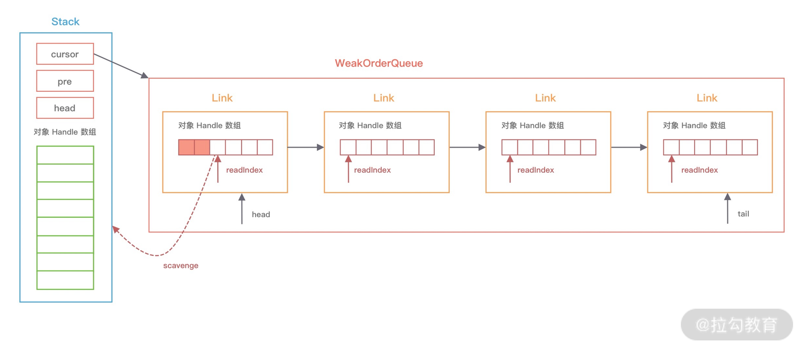

Netty的经典实用：蚂蚁的SoFABolt 

网址：https://github.com/sofastack/sofa-bolt


* 问题
  * 对象池和内存池有什么区别，有什么联系？
  * 实现对象池的方法由很多，Netty是如何实现的？
  * 对象池在实践中我们应该怎么使用？


## 入门案例

* 代码

  ```java
  public class UserCache {
      private static final Recycler<User> userRecycler = new Recycler<User>() {
          @Override
          protected User newObject(Handle<User> handle) {
              return new User(handle);
          }
      };
      static final class User {
          private String name;
          private Recycler.Handle<User> handle;
          public void setName(String name) {
              this.name = name;
          }
          public String getName() {
              return name;
          }
          public User(Recycler.Handle<User> handle) {
              this.handle = handle;
          }
          public void recycle() {
              handle.recycle(this);
          }
      }
      public static void main(String[] args) {
          User user1 = userRecycler.get(); // 1、从对象池获取 User 对象
          user1.setName("hello"); // 2、设置 User 对象的属性
          user1.recycle(); // 3、回收对象到对象池
          User user2 = userRecycler.get(); // 4、从对象池获取对象
          System.out.println(user2.getName());
          System.out.println(user1 == user2);
      }
  }
  ```

  * 输出结果

    ```java
    user
    true
    ```

    


## Recycler设计理念

* 对象池与内存池的都是为了提高 Netty 的并发处理能力，我们知道 Java 中频繁地创建和销毁对象的开销是很大的，所以很多人会将一些通用对象缓存起来，当需要某个对象时，优先从对象池中获取对象实例。通过重用对象，不仅避免频繁地创建和销毁所带来的性能损耗，而且对 JVM GC 是友好的，这就是对象池的作用。

* Recycler 是 Netty 提供的自定义实现的轻量级对象回收站，借助 Recycler 可以完成对象的获取和回收。既然 Recycler 是 Netty 自己实现的对象池。

* Recycler的内部结构

  

  * 四个核心组件
    * Stack
    * WeakOrderQueue
    * Link
    * DefaultHandler

* 组件图

  

### Stack

* Stack 是整个对象池的顶层数据结构，描述了整个对象池的构造，用于**存储当前本线程回收的对象**

* 在多线程的场景下，Netty 为了避免锁竞争问题，每个线程都会持有各自的对象池，内部通过 FastThreadLocal 来实现每个线程的私有化。对象池，每个线程都有，岂不会很浪费内存呀？？？

* 源码

  ```java
  static final class Stack<T> {
      final Recycler<T> parent; // 所属的 Recycler
      final WeakReference<Thread> threadRef; // 所属线程的弱引用
  
      final AtomicInteger availableSharedCapacity; // 异线程回收对象时，其他线程能保存的被回收对象的最大个数
      final int maxDelayedQueues; // WeakOrderQueue最大个数
      private final int maxCapacity; // 对象池的最大大小，默认最大为 4k
      private final int ratioMask; // 控制对象的回收比率，默认只回收 1/8 的对象
      private DefaultHandle<?>[] elements; // 存储缓存数据的数组
      private int size; // 缓存的 DefaultHandle 对象个数
      private int handleRecycleCount = -1; 
  
      // WeakOrderQueue 链表的三个重要节点
      private WeakOrderQueue cursor, prev;
      private volatile WeakOrderQueue head;
  
      // 省略其他代码
  }
  ```

* Stack包用于**存储缓存数据的DefaultHandler数组，维护了WeakOrderQueue链表中的三个重要节点**

* <font color='red'>每个 Stack 会维护一个 WeakOrderQueue 的链表</font>，每个 WeakOrderQueue 节点会保存**非当前线程的其他线程所释放的对象**，

  * 例如上图中 ThreadA 表示当前线程，WeakOrderQueue 的链表存储着 ThreadB、ThreadC 等其他线程释放的对象

  

##### availableSharedCapacity

* availableSharedCapacity 的初始化方式为 new AtomicInteger(max(maxCapacity / maxSharedCapacityFactor, LINK_CAPACITY))，默认大小为 16K，其他线程在回收对象时，最多可以回收 ThreadA 创建的对象个数不能超过 availableSharedCapacity。
  * **还有一个疑问就是既然 Stack 是每个线程私有的，为什么 availableSharedCapacity 还需要用 AtomicInteger 呢**？因为 ThreadB、ThreadC 等多个线程可能都会创建 ThreadA 的 WeakOrderQueue，存在同时操作 availableSharedCapacity 的情况。


##### WeakOrderQueue

* WeakOrderQueue，WeakOrderQueue 用于存储其他线程回收到当前线程所分配的对象，并且在合适的时机，Stack 会从异线程的 WeakOrderQueue 中收割对象。如上图所示，ThreadB 回收到 ThreadA 所分配的内存时，就会被放到 ThreadA 的 WeakOrderQueue 当中。


##### Link

* 每个 WeakOrderQueue 中都包含一个 Link 链表，回收对象都会被存在 Link 链表中的节点上，每个 Link 节点默认存储 16 个对象，当每个 Link 节点存储满了会创建新的 Link 节点放入链表尾部。


##### DefaultHandle

* 此对象很重要，在写缓存对象的时候，需要通过此对象来进行缓存对象生命周期的转换

* DefaultHandle 实例中保存了实际回收的对象，Stack 和 WeakOrderQueue 都使用 DefaultHandle 存储回收的对象。在 Stack 中包含一个 elements 数组，该数组保存的是 DefaultHandle 实例。DefaultHandle 中每个 Link 节点所存储的 16 个对象也是使用 DefaultHandle 表示的。


## 重要方法

### 获取对象

* Recycler # get()

  ```java
  public final T get() {
      if (maxCapacityPerThread == 0) {
          return newObject((Handle<T>) NOOP_HANDLE);
      }
      Stack<T> stack = threadLocal.get(); // 获取当前线程缓存的 Stack
      DefaultHandle<T> handle = stack.pop(); // 从 Stack 中弹出一个 DefaultHandle 对象
      if (handle == null) {
          handle = stack.newHandle();
          handle.value = newObject(handle); // 创建的对象并保存到 DefaultHandle
      }
      return (T) handle.value;
  }
  ```

  1. 首先从FastThreadLocal获取当前线程的唯一栈缓存Stack。所有都是从Stack中获取
  2. 然后获取一个DefaultHandle对象，处理缓存、获取真正的缓存数据都是通过这个对象进行获取
  3. 如果Stack中没有可用的DefaultHandle对象实例，就会调用newObject生成一个新的对象，是不是很熟悉，就是我们实现的创建对象的方法，底层实现类自己的对象。

* Recycler # Stack # pop()

  ```java
  DefaultHandle<T> pop() {
      int size = this.size;
      if (size == 0) {
          // 就尝试从其他线程回收的对象中转移一些到 elements 数组当中
          if (!scavenge()) {
              return null;
          }
          size = this.size;
      }
      size --;
      DefaultHandle ret = elements[size]; // 将实例从栈顶弹出
      elements[size] = null;
      if (ret.lastRecycledId != ret.recycleId) {
          throw new IllegalStateException("recycled multiple times");
      }
      ret.recycleId = 0;
      ret.lastRecycledId = 0;
      this.size = size;
      return ret;
  }
  ```

  * 如果Stack的elements数组中有可用的对象实例，直接将对象实例弹出
  * 如果elements数组中没有可用的对象实例，会调用scavenge方法
    * scavenge的作用是从其他线程回收的对象实例中转移一些到elements数组中，也就是说，它会想办法从WeakOrderQueue链表中迁移部分对象实例。
      * 每个 Stack 会有一个 WeakOrderQueue 链表，每个 WeakOrderQueue 节点都维持了相应异线程回收的对象
    * scavenge是如何从WeakOrderQueue链表中迁移对象实例呢？？？

* Recycler # Stack # scavenge()

  ```java
  boolean scavenge() {
      // 尝试从 WeakOrderQueue 中转移对象实例到 Stack 中
      if (scavengeSome()) {
          return true;
      }
      // 如果迁移失败，就会重置 cursor 指针到 head 节点
      prev = null;
      cursor = head;
      return false;
  }
  boolean scavengeSome() {
      WeakOrderQueue prev;
      WeakOrderQueue cursor = this.cursor; // cursor 指针指向当前 WeakorderQueueu 链表的读取位置
      // 如果 cursor 指针为 null, 则是第一次从 WeakorderQueueu 链表中获取对象
      if (cursor == null) {
          prev = null;
          cursor = head;
          if (cursor == null) {
              return false;
          }
      } else {
          prev = this.prev;
      }
      boolean success = false;
      // 不断循环从 WeakOrderQueue 链表中找到一个可用的对象实例
      do {
          // 尝试迁移 WeakOrderQueue 中部分对象实例到 Stack 中
          if (cursor.transfer(this)) {
              success = true;
              break;
          }
          WeakOrderQueue next = cursor.next;
          if (cursor.owner.get() == null) {
              // 如果已退出的线程还有数据
              if (cursor.hasFinalData()) {
                  for (;;) {
                      if (cursor.transfer(this)) {
                          success = true;
                      } else {
                          break;
                      }
                  }
              }
              // 将已退出的线程从 WeakOrderQueue 链表中移除
              if (prev != null) {
                  prev.setNext(next);
              }
          } else {
              prev = cursor;
          }
          // 将 cursor 指针指向下一个 WeakOrderQueue
          cursor = next;
      } while (cursor != null && !success);
      this.prev = prev;
      this.cursor = cursor;
      return success;
  }
  ```

  * scavenge 的源码中首先会从 cursor 指针指向的 WeakOrderQueue 节点回收部分对象到 Stack 的 elements 数组中，如果没有回收到数据就会将 cursor 指针移到下一个 WeakOrderQueue，重复执行以上过程直至回到到对象实例为止。具体的流程可以结合下图来理解

  

  * 每次移动 cursor 时，都会检查 WeakOrderQueue 对应的线程是否已经退出了，**如果线程已经退出，那么线程中的对象实例都会被回收，迁移给当前线程的Stack中，然后将 WeakOrderQueue 节点从链表中移除**。

  * <font color='blue'>每次 Stack 从 WeakOrderQueue 链表会回收多少数据呢？</font>

    * 我们依然结合上图讲解，每个 WeakOrderQueue 中都包含一个 Link 链表，Netty 每次会回收其中的一个 Link 节点所存储的对象。从图中可以看出，Link 内部会包含一个读指针 readIndex，每个 Link 节点默认存储 16 个对象，<font color='red'>读指针到链表尾部就是可以用于回收的对象实例，每次回收对象时，readIndex 都会从上一次记录的位置开始回收。</font>

  * 那如何回收太多，放不下怎么办？？？

    * 在回收对象实例之前，Netty会计算出可回收对象的数量，加上Stack中已有的对象数量后

      * 如果超过Stack当前容量且小于Stack的最大容量，会对Stack进行扩容
      * 为了防止回收对象太多导致Stack的容量激增，在每次回收时Netty会调用dropHandle方法控制回收频率

      ```java
      boolean dropHandle(DefaultHandle<?> handle) {
          if (!handle.hasBeenRecycled) {
            
              //ratioMask默认是8.只有8次才返回false，否则都是true
              if ((++handleRecycleCount & ratioMask) != 0) {
                  // Drop the object.
                  return true;
              }
              handle.hasBeenRecycled = true;
          }
          return false;
      }
      ```

      * dropHandle 方法中主要靠 hasBeenRecycled 和 handleRecycleCount 两个变量控制回收的频率，会从每 8 个未被收回的对象中选取一个进行回收，其他的都被丢弃掉。

  * 从Recycler中获取对象的主流程，总结

    * 当 Stack 中 elements 有数据时，直接从栈顶弹出。
    * 当 Stack 中 elements 没有数据时，尝试从 WeakOrderQueue 中回收一个 Link 包含的对象实例到 Stack 中，然后从栈顶弹出。


### 回收对象

* DefaultHandle # recycle()

  ```java
  // DefaultHandle#recycle
  public void recycle(Object object) {
      if (object != value) {
          throw new IllegalArgumentException("object does not belong to handle");
      }
      Stack<?> stack = this.stack;
      if (lastRecycledId != recycleId || stack == null) {
          throw new IllegalStateException("recycled already");
      }
      stack.push(this);
  }
  // Stack#push
  void push(DefaultHandle<?> item) {
      Thread currentThread = Thread.currentThread();
      if (threadRef.get() == currentThread) {
          pushNow(item);
      } else {
          pushLater(item, currentThread);
      }
  }
  ```

  

#### 同线程对象回收

* 如果是当前线程回收自己分配的对象时，会调用pushNow方法

  ```java
  private void pushNow(DefaultHandle<?> item) {
      if ((item.recycleId | item.lastRecycledId) != 0) { // 防止被多次回收
          throw new IllegalStateException("recycled already");
      }
      item.recycleId = item.lastRecycledId = OWN_THREAD_ID;
      int size = this.size;
      // 1. 超出最大容量 2. 控制回收速率，控制速率，8次
      if (size >= maxCapacity || dropHandle(item)) {
          return;
      }
      if (size == elements.length) {
          elements = Arrays.copyOf(elements, min(size << 1, maxCapacity));
      }
    
      //回收到自己的elements中
      elements[size] = item;
      this.size = size + 1;
  }
  ```

  * 同线程回收对象的逻辑非常简单，就是直接向 Stack 的 elements 数组中添加数据，对象会被存放在栈顶指针指向的位置。如果超过了 Stack 的最大容量，那么对象会被直接丢弃，同样这里使用了 dropHandle 方法控制对象的回收速率，每 8 个对象会有一个被回收到 Stack 中。


### 异线程对象回收

* 异线程，就是非当前线程

* 异线程回收对象时，并不会添加到 Stack 中，而是会与 WeakOrderQueue 直接打交道，先看下 pushLater 的源码

  ```java
  private void pushLater(DefaultHandle<?> item, Thread thread) {
    
      //1. 通过FastThreadLocal取出当前对象的  DELAYED_RECYCLED  缓冲
      Map<Stack<?>, WeakOrderQueue> delayedRecycled = DELAYED_RECYCLED.get(); // 当前线程帮助其他线程回收对象的缓存
    
    
      //2. 开始
      WeakOrderQueue queue = delayedRecycled.get(this); // 取出对象绑定的 Stack 对应的 WeakOrderQueue
      if (queue == null) {
          // 最多帮助 2*CPU 核数的线程回收线程
          if (delayedRecycled.size() >= maxDelayedQueues) {
              delayedRecycled.put(this, WeakOrderQueue.DUMMY); // WeakOrderQueue.DUMMY 表示当前线程无法再帮助该 Stack 回收对象
              return;
          }
          // 新建 WeakOrderQueue
          if ((queue = WeakOrderQueue.allocate(this, thread)) == null) {
              // drop object
              return;
          }
          delayedRecycled.put(this, queue);
      } else if (queue == WeakOrderQueue.DUMMY) {
          // drop object
          return;
      }
      queue.add(item); // 添加对象到 WeakOrderQueue 的 Link 链表中
  }
  ```

  1. 通过 FastThreadLocal 取出当前对象的 DELAYED_RECYCLED 缓存
     1. DELAYED_RECYCLED 存放着当前线程帮助其他线程回收对象的映射关系
        1. 假如 item 是 ThreadA 分配的对象，当前线程是 ThreadB，此时 ThreadB 帮助 ThreadA 回收 item，那么 DELAYED_RECYCLED 放入的 key 是 StackA
  2. 从 delayedRecycled 中取出 StackA 对应的 WeakOrderQueue，如果 WeakOrderQueue 不存在，那么为 StackA 新创建一个 WeakOrderQueue，并将其加入 DELAYED_RECYCLED 缓存
     1. WeakOrderQueue.allocate() 会检查帮助 StackA 回收的对象总数是否超过 2K 个，如果没有超过 2K，会将 StackA 的 head 指针指向新创建的 WeakOrderQueue，否则不再为 StackA 回收对象。
  3. 当然 ThreadB 不会只帮助 ThreadA 回收对象，它可以帮助其他多个线程回收，所以 DELAYED_RECYCLED 使用的 Map 结构，为了防止 DELAYED_RECYCLED 内存膨胀，Netty 也采取了保护措施，从 delayedRecycled.size() >= maxDelayedQueues 可以看出，每个线程最多帮助 2 倍 CPU 核数的线程回收线程，如果超过了该阈值，假设当前对象绑定的为 StackX，那么将在 Map 中为 StackX 放入一种特殊的 WeakOrderQueue.DUMMY，表示当前线程无法帮助 StackX 回收对象

* 如何添加到WeakOrderQueue的，直接跟进queue.add方法

  ```java
  void add(DefaultHandle<?> handle) {
      handle.lastRecycledId = id;
      Link tail = this.tail;
      int writeIndex;
      // 如果链表尾部的 Link 已经写满，那么再新建一个 Link 追加到链表尾部
      if ((writeIndex = tail.get()) == LINK_CAPACITY) {
          // 检查是否超过对应 Stack 可以存放的其他线程帮助回收的最大对象数
          if (!head.reserveSpace(LINK_CAPACITY)) {
              // Drop it.
              return;
          }
          this.tail = tail = tail.next = new Link();
          writeIndex = tail.get();
      }
      tail.elements[writeIndex] = handle; // 添加对象到 Link 尾部
      handle.stack = null; // handle 的 stack 属性赋值为 null
      tail.lazySet(writeIndex + 1);
  }
  ```

  * 在向 WeakOrderQueue 写入对象之前，会先判断 Link 链表的 tail 节点是否还有空间存放对象。
    * 如果还有空间，直接向 tail Link 尾部写入数据，
    * 否则直接丢弃对象。
  * 如果 tail Link 已经没有空间，会新建一个 Link 之后再存放对象，新建 Link 之前会检查异线程帮助回收的对象总数超过了 Stack 设置的阈值，
    * 如果超过了阈值，那么对象也会被丢弃掉。
  * <font color='red'>**对象被添加到 Link 之后，handle 的 stack 属性被赋值为 null，而在取出对象的时候，handle 的 stack 属性又再次被赋值回来，为什么这么做呢，岂不是很麻烦**？</font>
    * 如果 Stack 不再使用，期望被 GC 回收，发现 handle 中还持有 Stack 的引用，那么就无法被 GC 回收，从而造成内存泄漏。

* 总结

  * 在多线程的场景下，Netty 考虑的还是非常细致的，Recycler 回收对象时向 WeakOrderQueue 中存放对象，从 Recycler 获取对象时，WeakOrderQueue 中的对象会作为 Stack 的储备，而且有效地解决了跨线程回收的问题，是一个挺新颖别致的设计。


## 总结

* 对象池有两个重要的组成部分：Stack 和 WeakOrderQueue。
* 从 Recycler 获取对象时，优先从 Stack 中查找，如果 Stack 没有可用对象，会尝试从 WeakOrderQueue 迁移部分对象到 Stack 中。
* Recycler 回收对象时，分为同线程对象回收和异线程对象回收两种情况，同线程回收直接向 Stack 中添加对象，异线程回收向 WeakOrderQueue 中的 Link 添加对象。
* 对象回收都会控制回收速率，每 8 个对象会回收一个，其他的全部丢弃。

