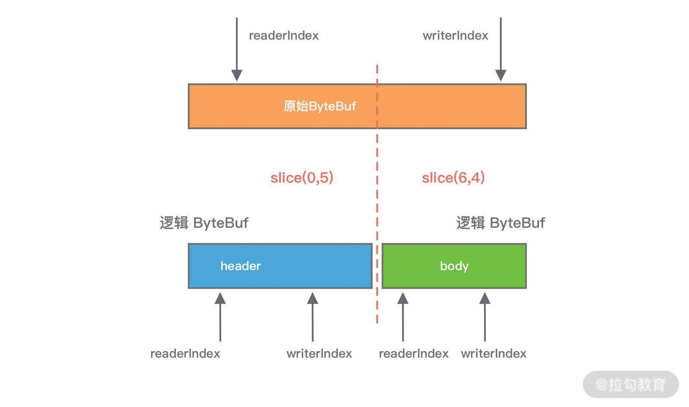

Netty的经典实用：蚂蚁的SoFABolt 

网址：https://github.com/sofastack/sofa-bolt


## 传统的零拷贝技术

* 零拷贝，就是在数据操作时，不需要将数据从一个内存位置拷贝到另外一个内存位置，这样可以减少一次内存拷贝的损耗，从而节省了 CPU 时钟周期和内存带宽。

* 从文件中读取数据，然后将数据传输到网络上，传统数据拷贝过程，会经历四次数据拷贝

  

  1. 当用户进程发起 read() 调用后，上下文从用户态切换至内核态。<font color='red'>DMA 引擎从文件中读取数据，并存储到内核态缓冲区</font>，这里是第一次数据拷贝
  2. 请求的数据从<font color='red'>内核态缓冲区拷贝到用户态缓冲区，然后返回给用户进程</font>。第二次数据拷贝的过程同时，会导致上下文从内核态再次切换到用户态。
  3. 用户进程调用 send() 方法期望将数据发送到网络中，此时会触发第三次线程切换，用户态会再次切换到内核态，<font color='red'>请求的数据从用户态缓冲区被拷贝到 Socket 缓冲区。</font>
  4. 用户进程调用 send() 方法期望将数据发送到网络中，此时会触发第三次线程切换，用户态会再次切换到内核态，<font color='red'>请求的数据从用户态缓冲区被拷贝到 Socket 缓冲区。</font>

* 问题

  * 传统的数据拷贝过程为什么不是将数据直接传输到用户缓冲区呢？
    * 其实引入内核缓冲区可以充当缓存的作用，这样就可以实现文件数据的预读，提升 I/O 的性能。
    * 但是当请求数据量大于内核缓冲区大小时，在完成一次数据的读取到发送可能要经历数倍次数的数据拷贝，这就造成严重的性能损耗

* 上面传统拷贝中，第二次拷贝和第三次拷贝是不是可以去掉。让内核态缓存区直接到Socket缓存区，省去用户态缓存区的执行，减少内存拷贝的次数。

* 在 Linux 中系统调用 <font color='blue'>sendfile() </font>可以实现将数据从一个文件描述符传输到另一个文件描述符，从而实现了零拷贝技术。在 Java 中也使用了零拷贝技术，它就是 NIO FileChannel 类中的 <font color='blue'>transferTo() 方法</font>，transferTo() 底层就依赖了操作系统零拷贝的机制，它可以将数据从 FileChannel 直接传输到另外一个 Channel

* FileChannel # transferTo()

  * 通过transferTo()将from.data传输到to.data()。等于实现了文件拷贝的功能。

  ```java
  public void testTransferTo() throws IOException {
      RandomAccessFile fromFile = new RandomAccessFile("from.data", "rw");
      FileChannel fromChannel = fromFile.getChannel();
      RandomAccessFile toFile = new RandomAccessFile("to.data", "rw");
      FileChannel toChannel = toFile.getChannel();
      long position = 0;
      long count = fromChannel.size();
      fromChannel.transferTo(position, count, toChannel);
  }
  ```

* transferTo传输数据，数据拷贝流程如下

  

  * 和传统拷贝相比
    * DMA 引擎从文件中读取数据拷贝到内核态缓冲区之后，由<font color='blue'>操作系统直接拷贝到 Socket 缓冲区，不再拷贝到用户态缓冲区</font>，所以数据拷贝的次数从之前的<font color='blue'> 4 次减少到 3 次。</font>
  * 次拷贝仍然是还有三个拷贝，CPU拷贝还有1次

* Linux 2.4 版本之后，开发者对<font color='red'> Socket Buffer 追加一些 Descriptor 信息</font>来进一步减少内核数据的复制。如下图所示，

  

  * DMA 引擎读取文件内容并拷贝到内核缓冲区，然后并没有再拷贝到 Socket 缓冲区，只是将<font color='red'>数据的长度以及位置信息</font>被追加到 Socket 缓冲区，然后 DMA 引擎根据这些描述信息，直接从<font color='blue'>内核缓冲区读取数据并传输到协议引擎中</font>，从而消除最后一次 CPU 拷贝

* 零拷贝：就是没有CPU拷贝，DMA拷贝是必不可少的。只是DMA拷贝都是依赖硬件完成，不需要CPU参与


## Netty零拷贝

* Netty和传统的还是有区别的，Netty 中的零拷贝技术除了操作系统级别的功能封装，更多的是<font color='red'>面向用户态的数据操作优化</font>，主要体现在以下 5 个方面：
  * <font color='purple'>**堆外内存**</font>，避免 JVM 堆内存到堆外内存的数据拷贝。
  * CompositeByteBuf 类，可以组合多个 Buffer 对象合并成一个逻辑上的对象，避免<font color='purple'>**通过传统内存拷贝的方式将几个 Buffer 合并成一个大的 Buffer**</font>。
  * 通过 Unpooled.wrappedBuffer 可以将<font color='purple'> **byte 数组包装成 ByteBuf 对象**</font>，包装过程中不会产生内存拷贝。
  * ByteBuf.slice 操作与 Unpooled.wrappedBuffer 相反，slice 操作可以将一个 ByteBuf 对象切分成多个 ByteBuf 对象，<font color='purple'>**切分过程中不会产生内存拷贝**</font>，底层共享一个 byte 数组的存储空间。
  * Netty 使用 <font color='purple'>**FileRegion**</font> 实现文件传输，FileRegion 底层封装了 FileChannel#transferTo() 方法，可以将文件缓冲区的数据直接传输到目标 Channel，避免内核缓冲区和用户态缓冲区之间的数据拷贝，这属于操作系统级别的零拷贝。


### 堆外内存

* VM语言存在的问题：
  * 如果在 JVM 内部执行 I/O 操作时，必须将数据拷贝到堆外内存，才能执行系统调用
* 为何不能直接使用JVM堆内存进行IO读写呢？
  * 第一，操作系统并不感知 JVM 的堆内存，而且 JVM 的内存布局与操作系统所分配的是不一样的，操作系统并不会按照 JVM 的行为来读写数据
  * 同一个对象的内存地址随着 JVM GC 的执行可能会随时发生变化，例如 JVM GC 的过程中会通过压缩来减少内存碎片，这就涉及对象移动的问题了。
* <font color='red'>Netty 在进行 I/O 操作时都是使用的堆外内存，可以避免数据从 JVM 堆内存到堆外内存的拷贝。</font>


### CompositeByteBuf

* CompositeByteBuf 是 Netty 中实现零拷贝机制非常重要的一个数据结构

* CompositeByteBuf 可以理解为一个虚拟的 Buffer 对象，它是由多个 ByteBuf 组合而成，但是在 CompositeByteBuf 内部保存着每个 ByteBuf 的引用关系，从逻辑上构成一个整体

* 两个不同的ByteBuf，如果合并成一个完整的协议数据进行发送，可以使用

  ```java
  ByteBuf httpBuf = Unpooled.buffer(header.readableBytes() + body.readableBytes());
  httpBuf.writeBytes(header);
  httpBuf.writeBytes(body);
  ```

  * 可以看出需要先初始化一个新的httpBuf，然后再将header和body分别拷贝到新的httpBuf。合并过程中涉及两次CPU拷贝。非常浪费性能。，但是可以使用CompositeByteBuf来进行优化

* 优化的方式

  ```java
  CompositeByteBuf httpBuf = Unpooled.compositeBuffer();
  httpBuf.addComponents(true, header, body);
  ```

* 原理

  * CompositeByteBuf 通过调用 addComponents() 方法来添加多个 ByteBuf，但是底层的 byte 数组是复用的，不会发生内存拷贝。但对于用户来说，它可以当作一个整体进行操作

* CompositeByteBuf的内部结构

  

  * CompositeByteBuf 内部维护了一个 Components 数组。在每个 Component 中存放着不同的 ByteBuf，各个 ByteBuf 独立维护自己的读写索引，而 CompositeByteBuf 自身也会单独维护一个读写索引。

* Component结构

  ```java
  private static final class Component {
      final ByteBuf srcBuf; // 原始的 ByteBuf
      final ByteBuf buf; // srcBuf 去除包装之后的 ByteBuf
      int srcAdjustment; // CompositeByteBuf 的起始索引相对于 srcBuf 读索引的偏移
      int adjustment; // CompositeByteBuf 的起始索引相对于 buf 的读索引的偏移
      int offset; // Component 相对于 CompositeByteBuf 的起始索引位置
      int endOffset; // Component 相对于 CompositeByteBuf 的结束索引位置
      // 省略其他代码
  }
  ```

  * offset和endOffset可以表示当前ByteBuf可以读取的范围，通过offset和endOffset可以将每一个Component所对应的ByteBuf连接起来，形成一个逻辑整体。


### Unpooled.wrapperdBuffer操作

* Unpooled.wrappedBuffer 同时也是创建 CompositeByteBuf 对象的另一种推荐做法
* Unpooled.wrappedBuffer 方法可以将不同的数据源的一个或者多个数据包装成一个大的 ByteBuf 对象，其中数据源的类型包括 byte[]、ByteBuf、ByteBuffer。<font color='red'>包装的过程中不会发生数据拷贝操作</font>，包装后生成的 ByteBuf 对象和原始 ByteBuf 对象是共享底层的 byte 数组。


### ByteBuf.slice操作

* ByteBuf.slice 和 Unpooled.wrappedBuffer 的逻辑正好相反，ByteBuf.slice 是将<font color='red'>一个 ByteBuf 对象切分成多个共享同一个底层存储的 ByteBuf 对象</font>。

* 通过slice切分后，都会返回一个新的ByteBuf对象，而且新的对象有自己的readIndex、writeIndex索引。由于新的ByteBuf对象与原始的ByteBuf对象数据是共享的，所以通过新的ByteBuf对象进行数据操作也会对原始ByteBuf对象生效。

  


### 文件传输FileRegion

* FileRegion 其实就是对 FileChannel 的包装，并没有什么特殊操作，底层使用的是 JDK NIO 中的 <font color='red'>FileChannel#transferTo() 方法</font>实现文件传输，所以 FileRegion 是操作系统级别的零拷贝，对于传输大文件会很有帮助


* 零拷贝的文章：
  * https://www.cnblogs.com/z-qinfeng/p/11964551.html
