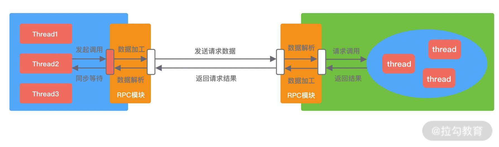

Netty的经典实用：蚂蚁的SoFABolt 

网址：https://github.com/sofastack/sofa-bolt

## RPC框架架构设计

* RPC 又称远程过程调用（Remote Procedure Call），用于解决分布式系统中服务之间的调用问题。通俗地讲，就是开发者能够像调用本地方法一样调用远程的服务

* RPC基本架构图

  

  * Rpc框架包含三个重要的组件
    * 客户端
    * 服务端
    * 注册中心
  * 三个组件的交互方式
    * 服务端在启动后，会将它提供的服务列表发布到注册中心，客户端向注册中心订阅服务地址
    * 客户端会通过本地代理模块 Proxy 调用服务端，Proxy 模块收到负责将方法、参数等数据转化成网络字节流
    * 客户端从服务列表中选取其中一个的服务地址，并将数据通过网络发送给服务端；
    * 服务端接收到数据后进行解码，得到请求信息
    * 服务端根据解码后的请求信息调用对应的服务，然后将调用结果返回给客户端。

### 服务注册和发现

* 背景
  * 在分布式系统中，不同服务之间应该如何通信呢？传统的方式可以通过 HTTP 请求调用、保存服务端的服务列表等，这样做需要开发者主动感知到服务端暴露的信息，系统之间耦合严重。为了更好地将客户端和服务端解耦，以及实现服务优雅上线和下线，于是注册中心就出现了
* 注册中心来实现服务注册和发现的功能。
  * 服务端节点上线后自行向注册中心注册服务列表
  * 节点下线后需要从注册中心将节点元数据信息移除
  * 客户端向服务端发起调用时，自己负责从注册中心获取服务端的服务列表，然后在通过负载均衡算法选择其中一个服务节点进行调用。以上是最简单直接的服务端和客户端的发布和订阅模式，不需要再借助任何中间服务器，性能损耗也是最小的。
* 服务优雅下线的好方式
  * 主动通知
    * 当节点需要下线时，向注册中心发送下线请求，让注册中心移除自己的元数据信息
  * 心跳检测
    * 应对异常下线的情况
    * 节点与注册中心的心跳检测功能，这个过程也叫作探活。心跳检测可以由节点或者注册中心负责，例如注册中心可以向服务节点每 60s 发送一次心跳包，如果 3 次心跳包都没有收到请求结果，可以任务该服务节点已经下线。
* 总结
  * 采用注册中心的好处是可以解耦客户端和服务端之间错综复杂的关系，并且能够实现对服务的动态管理。服务配置可以支持动态修改，然后将更新后的配置推送到客户端和服务端，无须重启任何服务。

### 通信协议与序列化

* 要求
  * 越简单越好，可以减少编解码的性能损耗
* 通信过程
  * 如果采用 TCP 协议，你需要将调用的接口、方法、请求参数、调用属性等信息序列化成二进制字节流传递给服务提供方
  * 服务端接收到数据后，再把二进制字节流反序列化得到调用信息
  * 然后利用反射的原理调用对应方法，最后将返回结果、返回码、异常信息等返回给客户端
* 序列化和反序列化
  * 序列化：对象转换成二进制流
  * 反序列化：二进制流转换成对象
* 网络通信依赖于字节流，而且这些请求信息都是不确定的，所以一般会选用通用且高效的序列化算法

### RPC调用方式

* 四类
  * 同步Sync
  * 异步Future
  * 回调 Callback
  * 单向Oneway

#### 同步Sync

* 定义：客户端线程发起 RPC 调用后，当前线程会一直阻塞，直至服务端返回结果或者处理超时异常

* 虽说Sync是同步调用，但是客户端线程和服务端线程并不是同一个线程，实际在RPC框架内部还是异步处理的。

* Sync同步调用的过程

  

#### Future异步调用

* 定义：客户端发起调用后不会再阻塞等待，而是拿到 RPC 框架返回的 Future 对象，调用结果会被服务端缓存，客户端自行决定后续何时获取返回结果。

* 当客户端主动获取结果时，该过程是阻塞等待的。

* Future异步调用过程

  

#### Callback回调调用

* 定义：

  * 客户端发起调用时，将 Callback 对象传递给 RPC 框架，无须同步等待返回结果，直接返回
  * 当获取到服务端响应结果或者超时异常后，再执行用户注册的 Callback 回调

* Callback接口一般包含onResponse和onException两个方法，分别对应成功返回和异常返回两种情况。

  

#### Oneway单向调用

* 定义：客户端发起请求之后直接返回，忽略返回结果

  

### 线程模型

* IO线程
  * 主要负责处理网络数据，例如事件轮询，编解码，数据传输等
* 业务线程
  * 主要负责处理业务流程，好比数据库执行，复杂规则计算等耗时逻辑

### 负载均衡策略

* 背景
  * 在分布式系统中，服务提供者和服务消费者都会有多台节点，如何保证服务提供者所有节点的负载均衡呢？客户端在发起调用之前，需要感知有多少服务端节点可用，然后从中选取一个进行调用。客户端需要拿到服务端节点的状态信息，并根据不同的策略实现负载均衡算法。负载均衡策略是影响 RPC 框架吞吐量很重要的一个因素
* 算法
  * Round-Robin 轮询
  * Weighted Round-Robin 权重轮询
  * Least Connections 最少连接数
  * Consistent Hash 一致性 Hash
    * 目前主流推荐的负载均衡策略，Consistent Hash 是一种特殊的 Hash 算法，在服务端节点扩容或者下线时，尽可能保证客户端请求还是固定分配到同一台服务器节点。Consistent Hash 算法是采用哈希环来实现的，通过 Hash 函数将对象和服务器节点放置在哈希环上，一般来说服务器可以选择 IP + Port 进行 Hash，然后为对象选择对应的服务器节点，在哈希环中顺时针查找距离对象 Hash 值最近的服务器节点。

### 动态代理

* RPC 框架怎么做到像调用本地接口一样调用远端服务呢？
  * 这必须依赖动态代理来实现。需要创建一个代理对象，在代理对象中完成数据报文编码，然后发起调用发送数据给服务提供方，以此屏蔽 RPC 框架的调用细节。因为代理类是在运行时生成的，所以代理类的生成速度、生成的字节码大小都会影响 RPC 框架整体的性能和资源消耗，所以需要慎重选择动态代理的实现方案
* 动态代理方式
  * JDK动态代理
    * 在运行时可以动态创建代理类
    *  JDK 动态代理的功能比较局限
      * 代理对象必须实现一个接口，否则抛出异常。
        * 因为代理类会继承 Proxy 类，然而 Java 是不支持多重继承的，只能通过接口实现多态。
      * JDK 动态代理所生成的代理类是接口的实现类，不能代理接口中不存在的方法。
      * JDK 动态代理是通过反射调用的形式代理类中的方法，比直接调用肯定是性能要慢的。
  * Cglib动态代理
    * Cglib 是基于 ASM 字节码生成框架实现的，通过字节码技术生成的代理类，所以代理类的类型是不受限制的
    * Cglib 生成的代理类是继承于被代理类，所以可以提供更加灵活的功能
    * 在代理方法方面，Cglib 是有优势的，它采用了 FastClass 机制，为代理类和被代理类各自创建一个 Class，这个 Class 会为代理类和被代理类的方法分配 index 索引，FastClass 就可以通过 index 直接定位要调用的方法，并直接调用，这是一种空间换时间的优化思路
  * Javassist和ASM
    * 二者都是 Java 字节码操作框架，使用起来难度较大，需要开发者对 Class 文件结构以及 JVM 都有所了解，但是它们都比反射的性能要高
    * Byte Buddy 也是一个字节码生成和操作的类库，Byte Buddy 功能强大，相比于 Javassist 和 ASM，Byte Buddy 提供了更加便捷的 API，用于创建和修改 Java 类，无须理解字节码的格式，而且 Byte Buddy 更加轻量，性能更好。

