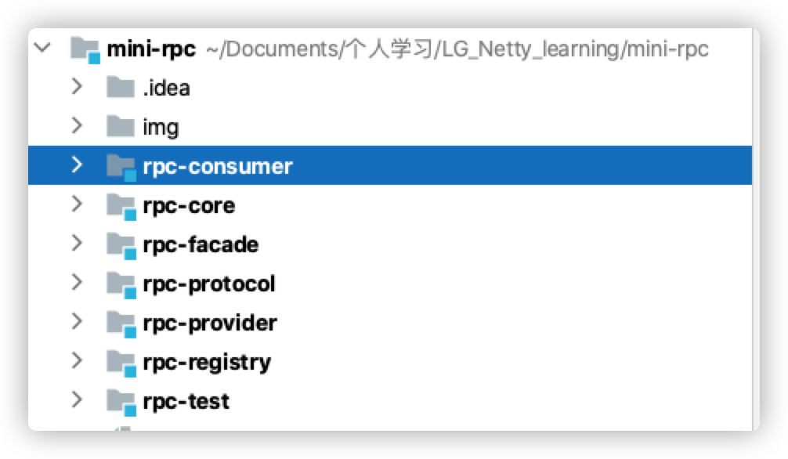
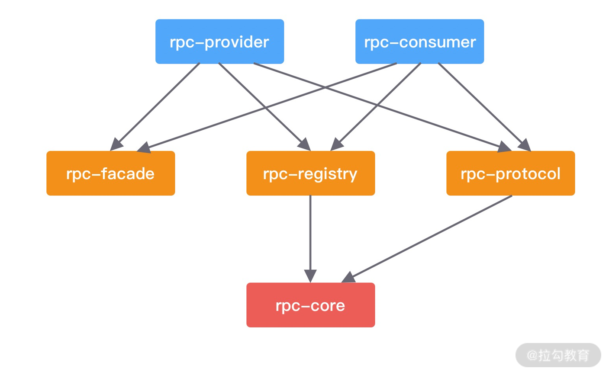

Netty的经典实用：蚂蚁的SoFABolt 

网址：https://github.com/sofastack/sofa-bolt


## RPC框架架构设计

* RPC 又称远程过程调用（Remote Procedure Call），用于解决分布式系统中服务之间的调用问题。通俗地讲，就是开发者能够像调用本地方法一样调用远程的服务

* RPC基本架构图

  

  * Rpc框架包含三个重要的组件
    * 客户端
    * 服务端
    * 注册中心
  * 三个组件的交互方式
    * 服务端在启动后，会将它提供的服务列表发布到注册中心，客户端向注册中心订阅服务地址
    * 客户端会通过本地代理模块 Proxy 调用服务端，Proxy 模块收到负责将方法、参数等数据转化成网络字节流
    * 客户端从服务列表中选取其中一个的服务地址，并将数据通过网络发送给服务端；
    * 服务端接收到数据后进行解码，得到请求信息
    * 服务端根据解码后的请求信息调用对应的服务，然后将调用结果返回给客户端。


### 服务注册和发现

* 背景
  * 在分布式系统中，不同服务之间应该如何通信呢？传统的方式可以通过 HTTP 请求调用、保存服务端的服务列表等，这样做需要开发者主动感知到服务端暴露的信息，<font color='red'>系统之间耦合严重</font>。为了更好地将客户端和服务端解耦，以及实现服务优雅上线和下线，于是注册中心就出现了
* 注册中心来实现服务注册和发现的功能。
  * 服务端节点上线后自行向注册中心注册服务列表
  * 节点下线后需要从注册中心将节点元数据信息移除
  * 客户端向服务端发起调用时，自己负责从注册中心获取服务端的服务列表，然后在通过负载均衡算法选择其中一个服务节点进行调用。以上是最简单直接的服务端和客户端的发布和订阅模式，不需要再借助任何中间服务器，性能损耗也是最小的。
* 服务优雅下线的好方式
  * 主动通知
    * 当节点需要下线时，向注册中心发送下线请求，让注册中心移除自己的元数据信息
  * 心跳检测
    * 应对异常下线的情况
    * 节点与注册中心的心跳检测功能，这个过程也叫作探活。心跳检测可以由节点或者注册中心负责，例如注册中心可以向服务节点每 60s 发送一次心跳包，如果 3 次心跳包都没有收到请求结果，可以任务该服务节点已经下线。
* 总结
  * 采用注册中心的好处是可以解耦客户端和服务端之间错综复杂的关系，并且能够实现对服务的动态管理。服务配置可以支持动态修改，然后将更新后的配置推送到客户端和服务端，无须重启任何服务。


### 通信协议与序列化

* 要求
  * 越简单越好，可以减少编解码的性能损耗
* 通信过程
  * 如果采用 TCP 协议，你需要将调用的接口、方法、请求参数、调用属性等信息序列化成二进制字节流传递给服务提供方
  * 服务端接收到数据后，再把二进制字节流反序列化得到调用信息
  * 然后利用反射的原理调用对应方法，最后将返回结果、返回码、异常信息等返回给客户端
* 序列化和反序列化
  * 序列化：对象转换成二进制流
  * 反序列化：二进制流转换成对象
* 网络通信依赖于字节流，而且这些请求信息都是不确定的，所以一般会选用通用且高效的序列化算法


### RPC调用方式

* 四类
  * 同步Sync
  * 异步Future
  * 回调 Callback
  * 单向Oneway


#### 同步Sync

* 定义：客户端线程发起 RPC 调用后，当前线程会一直阻塞，直至服务端返回结果或者处理超时异常

* 虽说Sync是同步调用，但是客户端线程和服务端线程并不是同一个线程，实际在RPC框架内部还是异步处理的。

* Sync同步调用的过程

  

#### Future异步调用

* 定义：客户端发起调用后不会再阻塞等待，而是拿到 RPC 框架返回的 Future 对象，调用结果会被服务端缓存，客户端自行决定后续何时获取返回结果。

* <font color='red'>当客户端主动获取结果时，该过程是阻塞等待的。</font>

* Future异步调用过程

  


#### Callback回调调用

* 定义：

  * 客户端发起调用时，将 Callback 对象传递给 RPC 框架，无须同步等待返回结果，直接返回
  * 当获取到服务端响应结果或者超时异常后，再执行用户注册的 Callback 回调

* Callback接口一般包含onResponse和onException两个方法，分别对应成功返回和异常返回两种情况。

  


#### Oneway单向调用

* 定义：客户端发起请求之后直接返回，忽略返回结果

  

### 线程模型

* IO线程
  * 主要负责处理网络数据，例如事件轮询，编解码，数据传输等
* 业务线程
  * 主要负责处理业务流程，好比数据库执行，复杂规则计算等耗时逻辑


### 负载均衡策略

* 背景
  * 在分布式系统中，服务提供者和服务消费者都会有多台节点，如何保证服务提供者所有节点的负载均衡呢？客户端在发起调用之前，需要感知有多少服务端节点可用，然后从中选取一个进行调用。客户端需要拿到服务端节点的状态信息，并根据不同的策略实现负载均衡算法。负载均衡策略是影响 RPC 框架吞吐量很重要的一个因素
* 算法
  * Round-Robin 轮询
  * Weighted Round-Robin 权重轮询
  * Least Connections 最少连接数
  * Consistent Hash 一致性 Hash
    * 目前主流推荐的负载均衡策略，Consistent Hash 是一种特殊的 Hash 算法，在服务端节点扩容或者下线时，尽可能保证客户端请求还是固定分配到同一台服务器节点。Consistent Hash 算法是采用哈希环来实现的，通过 Hash 函数将对象和服务器节点放置在哈希环上，一般来说服务器可以选择 IP + Port 进行 Hash，然后为对象选择对应的服务器节点，在哈希环中顺时针查找距离对象 Hash 值最近的服务器节点。


### 动态代理

* RPC 框架怎么做到像调用本地接口一样调用远端服务呢？

  * 这必须依赖动态代理来实现。需要创建一个代理对象，在代理对象中完成数据报文编码，然后发起调用发送数据给服务提供方，以此屏蔽 RPC 框架的调用细节。因为代理类是在运行时生成的，所以代理类的生成速度、生成的字节码大小都会影响 RPC 框架整体的性能和资源消耗，所以需要慎重选择动态代理的实现方案

* 动态代理方式

  * JDK动态代理
    * 在<font color='red'>运行时</font>可以动态创建代理类
    *  JDK 动态代理的功能比较局限
      * 代理对象必须实现一个接口，否则抛出异常。
        * 因为代理类会继承 Proxy 类，然而 Java 是不支持多重继承的，只能通过接口实现多态。
      * JDK 动态代理所生成的代理类是接口的实现类，不能代理接口中不存在的方法。
      * JDK 动态代理是通过反射调用的形式代理类中的方法，比直接调用肯定是性能要慢的。
  * Cglib动态代理
    * Cglib 是基于 ASM 字节码生成框架实现的，通过字节码技术生成的代理类，所以代理类的类型是不受限制的
    * Cglib 生成的代理类是继承于被代理类，所以可以提供更加灵活的功能
    * 在代理方法方面，Cglib 是有优势的，它采用了 <font color='red'>FastClass 机制</font>，为代理类和被代理类各自创建一个 Class，这个 Class 会为代理类和被代理类的方法分配 index 索引，FastClass 就可以通过 index 直接定位要调用的方法，并直接调用，这是一种空间换时间的优化思路
  * Javassist和ASM
    * 二者都是 Java 字节码操作框架，使用起来难度较大，需要开发者对 Class 文件结构以及 JVM 都有所了解，但是它们都比反射的性能要高
    * <font color='blue'>Byte Buddy</font> 也是一个字节码生成和操作的类库，Byte Buddy 功能强大，相比于 Javassist 和 ASM，Byte Buddy 提供了更加便捷的 API，用于创建和修改 Java 类，无须理解字节码的格式，而且 Byte Buddy 更加轻量，性能更好。

  

## 整体架构

* 项目结构图



1. ​	rpc-provider，服务提供者。负责发布 RPC 服务，接收和处理 RPC 请求。
2. rpc-consumer，服务消费者。使用动态代理发起 RPC 远程调用，帮助使用者来屏蔽底层网络通信的细节。
3. rpc-registry，注册中心模块。提供服务注册、服务发现、负载均衡的基本功能。
4. rpc-protocol，网络通信模块。包含 RPC 协议的编解码器、序列化和反序列化工具等。
5. rpc-core，基础类库。提供通用的工具类以及模型定义，例如 RPC 请求和响应类、RPC 服务元数据类等。
6. rpc-facade，RPC 服务接口。包含服务提供者需要对外暴露的接口，本模块主要用于模拟真实 RPC 调用的测试。

* 各个组件之间的依赖关系

  

## 服务提供者 rpc-provider

* 四个核心流程
  * 服务提供者启动服务，并暴露服务端口；
  * 启动时扫描需要对外发布的服务，并将服务元数据信息发布到注册中心；
  * 接收 RPC 请求，解码后得到请求消息；
  * 提交请求至自定义线程池进行处理，并将处理结果写回客户端。


### 服务提供者启动

* 先来波源码

  ```java
  private void startRpcServer() throws Exception {
    this.serverAddress = InetAddress.getLocalHost().getHostAddress();
  
    EventLoopGroup boss = new NioEventLoopGroup();
    EventLoopGroup worker = new NioEventLoopGroup();
    try {
      ServerBootstrap bootstrap = new ServerBootstrap();
      bootstrap.group(boss, worker)
        .channel(NioServerSocketChannel.class)
        .childHandler(new ChannelInitializer<SocketChannel>() {
          @Override
          protected void initChannel(SocketChannel socketChannel) throws Exception {
            socketChannel.pipeline()
              .addLast(new MiniRpcEncoder())
              .addLast(new MiniRpcDecoder())
              .addLast(new RpcRequestHandler(rpcServiceMap));
          }
        })
        .childOption(ChannelOption.SO_KEEPALIVE, true);
  
      ChannelFuture channelFuture = bootstrap.bind(this.serverAddress, this.serverPort).sync();
      log.info("server addr {} started on port {}", this.serverAddress, this.serverPort);
      channelFuture.channel().closeFuture().sync();
    } finally {
      boss.shutdownGracefully();
      worker.shutdownGracefully();
    }
  }
  ```

  * 服务提供者采用的是主从 Reactor 线程模型，启动过程包括
    * 配置线程池
    * Channel 初始化
    * 端口绑定三个步骤

* 借助Spring boot的能力，将服务提供者启动锁依赖的参数做成可配置化


#### 参数配置

* 使用 Spring Boot 的 @ConfigurationProperties 注解很轻松地实现配置项的加载，并且可以把相同前缀类型的配置项自动封装成实体类

  ```java
  @Data
  @ConfigurationProperties(prefix = "rpc")
  public class RpcProperties {
      private int servicePort;
      private String registryAddr;
      private String registryType;
  }
  ```

* 加载配置文件中的参数

  ```java
  rpc.servicePort=2781
  rpc.registryType=ZOOKEEPER
  rpc.registryAddr=127.0.0.1:2181
  ```

* @EnableConfigurationProperties 注解的作用就是将声明 @ConfigurationProperties 注解的类注入为 Spring 容器中的 Bean

  ```java
  @Configuration
  @EnableConfigurationProperties(RpcProperties.class)
  public class RpcProviderAutoConfiguration {
      @Resource
      private RpcProperties rpcProperties;
      @Bean
      public RpcProvider init() throws Exception {
          RegistryType type = RegistryType.valueOf(rpcProperties.getRegistryType());
          RegistryService serviceRegistry = RegistryFactory.getInstance(rpcProperties.getRegistryAddr(), type);
          return new RpcProvider(rpcProperties.getServicePort(), serviceRegistry);* 
      }
  }
  ```

  

### 发布服务

* 服务提供者启动时，有个问题，服务提供者需要将服务发布到注册中心，怎么知道哪些服务需要发布呢？？？

  * 服务提供者需要定义发布服务类型、服务版本等属性。
  * 此设计中主要使用注解的方式进行设计

* 定义一个服务提供者的注解  RpcService

  ```java
  @Retention(RetentionPolicy.RUNTIME)
  @Target(ElementType.TYPE)
  @Component
  public @interface RpcService {
      Class<?> serviceInterface() default Object.class;
      String serviceVersion() default "1.0";
  }
  ```

  * @RpcService提供了两个必不可少的属性
    * 服务类型 <font color='red'>serviceInterface</font>
    * 服务版本 <font color='red'>serviceVersion</font>
  * RpcService本质上是一个Component，可以将服务实现类注册成Spring容器管理的bean

* 问题

  * serviceInterface、serviceVersion的属性值怎么才能和Bean关联起来呢？
    * 使用spring的bean的生命周期，BeanPostProcessor接口

* @RpcService注解服务的自定义处理类，RpcProvider

  ```java
  public class RpcProvider implements InitializingBean, BeanPostProcessor {
      // 省略其他代码
      
      private final Map<String, Object> rpcServiceMap = new HashMap<>();
      @Override
      public Object postProcessAfterInitialization(Object bean, String beanName) throws BeansException {
          RpcService rpcService = bean.getClass().getAnnotation(RpcService.class);
          if (rpcService != null) {
              String serviceName = rpcService.serviceInterface().getName();
              String serviceVersion = rpcService.serviceVersion();
              try {
                  ServiceMeta serviceMeta = new ServiceMeta();
                  serviceMeta.setServiceAddr(serverAddress);
                  serviceMeta.setServicePort(serverPort);
                  serviceMeta.setServiceName(serviceName);
                  serviceMeta.setServiceVersion(serviceVersion);
                  // TODO 发布服务元数据至注册中心
                  rpcServiceMap.put(RpcServiceHelper.buildServiceKey(serviceMeta.getServiceName(), serviceMeta.getServiceVersion()), bean);
              } catch (Exception e) {
                  log.error("failed to register service {}#{}", serviceName, serviceVersion, e);
              }
          }
          return bean;
      }
  }
  ```

  * RpcProvider 重写了 BeanPostProcessor 接口的 postProcessAfterInitialization 方法，对<font color='red'>所有初始化完成后的 Bean </font>>进行扫描
  * 如果 Bean 包含 @RpcService 注解，那么通过注解读取服务的元数据信息并构造出 ServiceMeta 对象，接下来准备将服务的元数据信息发布至注册中心
  * RpcProvider 还维护了一个 rpcServiceMap，存放服务初始化后所对应的 Bean，rpcServiceMap 起到了缓存的角色，在处理 RPC 请求时可以直接通过 rpcServiceMap 拿到对应的服务进行调用。起到路由转发的作用。


## 服务消费者

* 与服务提供者不同的是，服务消费者并不是一个常驻的服务，每次发起 RPC 调用时它才会去选择向哪个远端服务发送数据

* 服务消费者的实现要复杂一些，对于声明 <font color='red'>@RpcReference 注解的成员变量</font>，我们需要构造出一个可以真正进行 RPC 调用的 Bean，然后将它注册到 Spring 的容器中

* @RpcReference注解

  ```java
  @Retention(RetentionPolicy.RUNTIME)
  @Target(ElementType.FIELD)
  @Autowired
  public @interface RpcReference {
      String serviceVersion() default "1.0";
      String registryType() default "ZOOKEEPER";
      String registryAddress() default "127.0.0.1:2181";
      long timeout() default 5000;
  }
  ```

  * @RpcReference 注解提供了
    * 服务版本 serviceVersion
    * 注册中心类型 registryType
    * 注册中心地址 registryAddress 
    * 超时时间 timeout 

* 是不是需要一个工厂Bean来生成接口的动态代理，动态代理里面包含了具体的调用逻辑

* 代理对象的工厂Bean

  ```java
  public class RpcReferenceBean implements FactoryBean<Object> {
      private Class<?> interfaceClass;
      private String serviceVersion;
      private String registryType;
      private String registryAddr;
      private long timeout;
      private Object object;
      @Override
      public Object getObject() throws Exception {
          return object;
      }
      @Override
      public Class<?> getObjectType() {
          return interfaceClass;
      }
      public void init() throws Exception {
          // TODO 生成动态代理对象并赋值给 object
      }
      public void setInterfaceClass(Class<?> interfaceClass) {
          this.interfaceClass = interfaceClass;
      }
      public void setServiceVersion(String serviceVersion) {
          this.serviceVersion = serviceVersion;
      }
      public void setRegistryType(String registryType) {
          this.registryType = registryType;
      }
      public void setRegistryAddr(String registryAddr) {
          this.registryAddr = registryAddr;
      }
      public void setTimeout(long timeout) {
          this.timeout = timeout;
      }
  }
  ```

  * 在 RpcReferenceBean 中 init() 方法被我标注了 TODO，此处需要实现动态代理对象，并通过代理对象完成 RPC 调用。对于使用者来说只是通过 @RpcReference 订阅了服务，并不感知底层调用的细节。对于如何实现 RPC 通信、服务寻址等，都是在动态代理类中完成的

  * 利用BeanFactoryPostProcessor来针对需要注入动态代理类的BeanDefination重新调整成代理类的BeanDefination信息

    * BeanFactoryPostProcessor 是 Spring 容器加载 Bean 的定义之后以及 Bean 实例化之前执行，所以 BeanFactoryPostProcessor 可以在 Bean 实例化之前获取 Bean 的配置元数据，并允许用户对其修改。而 BeanPostProcessor 是在 Bean 初始化前后执行，它并不能修改 Bean 的配置信息。

  * 使用BeanFactoryPostProcessor，运行期修改注入Bean的类信息，使其成为动态代理类的信息，然后注入到spring容器中，这样，spring在初始化的时候就是我们的代理对象了，即RpcReferenceBean生成的代理对象

    ```java
    @Component
    @Slf4j
    public class RpcConsumerPostProcessor implements ApplicationContextAware, BeanClassLoaderAware, BeanFactoryPostProcessor {
        private ApplicationContext context;
        private ClassLoader classLoader;
        private final Map<String, BeanDefinition> rpcRefBeanDefinitions = new LinkedHashMap<>();
        @Override
        public void setApplicationContext(ApplicationContext applicationContext) throws BeansException {
            this.context = applicationContext;
        }
        @Override
        public void setBeanClassLoader(ClassLoader classLoader) {
            this.classLoader = classLoader;
        }
        @Override
        public void postProcessBeanFactory(ConfigurableListableBeanFactory beanFactory) throws BeansException {
            for (String beanDefinitionName : beanFactory.getBeanDefinitionNames()) {
                BeanDefinition beanDefinition = beanFactory.getBeanDefinition(beanDefinitionName);
                String beanClassName = beanDefinition.getBeanClassName();
                if (beanClassName != null) {
                    Class<?> clazz = ClassUtils.resolveClassName(beanClassName, this.classLoader);
                    ReflectionUtils.doWithFields(clazz, this::parseRpcReference);
                }
            }
            BeanDefinitionRegistry registry = (BeanDefinitionRegistry) beanFactory;
            this.rpcRefBeanDefinitions.forEach((beanName, beanDefinition) -> {
                if (context.containsBean(beanName)) {
                    throw new IllegalArgumentException("spring context already has a bean named " + beanName);
                }
                registry.registerBeanDefinition(beanName, rpcRefBeanDefinitions.get(beanName));
                log.info("registered RpcReferenceBean {} success.", beanName);
            });
        }
        private void parseRpcReference(Field field) {
            RpcReference annotation = AnnotationUtils.getAnnotation(field, RpcReference.class);
            if (annotation != null) {
                BeanDefinitionBuilder builder = BeanDefinitionBuilder.genericBeanDefinition(RpcReferenceBean.class);
                builder.setInitMethodName(RpcConstants.INIT_METHOD_NAME);
                builder.addPropertyValue("interfaceClass", field.getType());
                builder.addPropertyValue("serviceVersion", annotation.serviceVersion());
                builder.addPropertyValue("registryType", annotation.registryType());
                builder.addPropertyValue("registryAddr", annotation.registryAddress());
                builder.addPropertyValue("timeout", annotation.timeout());
                BeanDefinition beanDefinition = builder.getBeanDefinition();
                rpcRefBeanDefinitions.put(field.getName(), beanDefinition);
            }
        }
    }
    ```

    * RpcConsumerPostProcessor 类中重写了 BeanFactoryPostProcessor 的 postProcessBeanFactory 方法，从 beanFactory 中获取所有 Bean 的定义信息，然后分别对每个 Bean 的所有 field 进行检测。
      * 如果 field 被声明了 @RpcReference 注解，通过 BeanDefinitionBuilder 构造 RpcReferenceBean 的定义，并为 RpcReferenceBean 的成员变量赋值，包括
        * 服务类型 interfaceClass
        * 服务版本 serviceVersion
        * 注册中心类型 registryType
        * 注册中心地址 registryAddr 
        * 超时时间 timeout。
      * 构造完 RpcReferenceBean 的定义之后，会将RpcReferenceBean 的 BeanDefinition 重新注册到 Spring 容器中。

