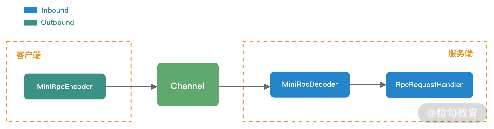
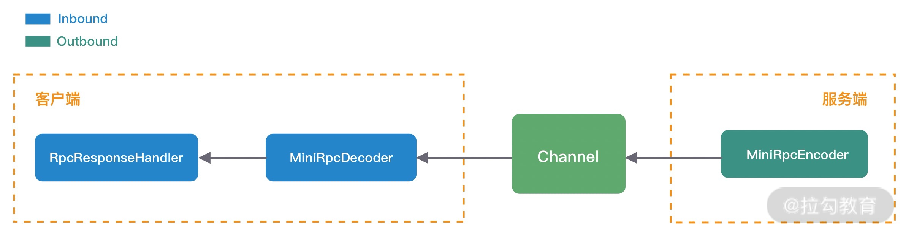

Netty的经典实用：蚂蚁的SoFABolt 

网址：https://github.com/sofastack/sofa-bolt


## 通讯机制

* 主要工作
  * 服务消费者实现协议编码，向服务提供者发送调用数据
  * 服务提供者收到数据后解码，然后向服务消费者发送响应数据，暂时忽略RPC请求是如何被调用的
  * 服务消费者收到响应数据后成功返回。

### RPC通用方案设计

* RPC请求调用过程

  

  * 数据发送前，服务消费者将 RPC 请求信息封装成 MiniRpcProtocol 对象，然后通过编码器 MiniRpcEncoder 进行二进制编码，最后直接向发送至远端即可。
  * 服务提供者收到请求数据后，将二进制数据交给解码器 MiniRpcDecoder，解码后再次生成 MiniRpcProtocol 对象，然后传递给 RpcRequestHandler 执行真正的 RPC 请求调用。

* RPC调用返回过程

  

  * 与 RPC 请求过程相反，是由服务提供者将响应结果封装成 MiniRpcProtocol 对象，然后通过 MiniRpcEncoder 编码发送给服务消费者
  * 服务消费者对响应结果进行解码，因为 RPC 请求是高并发的，所以需要 RpcRequestHandler 根据响应结果找到对应的请求，最后将响应结果返回

* 最终的服务消费者和服务提供者的ChannelPipeline结构

  


### 自定义RPC通信协议

* 协议是服务消费者和服务提供者之间通信的基础，主流的 RPC 框架都会自定义通信协议，相比于 HTTP、HTTPS、JSON 等通用的协议，自定义协议可以实现更好的性能、扩展性以及安全性

* 简版的RPC自定义协议

  ```txt
  +---------------------------------------------------------------+
  | 魔数 2byte | 协议版本号 1byte | 序列化算法 1byte | 报文类型 1byte  |
  +---------------------------------------------------------------+
  | 状态 1byte |        消息 ID 8byte     |      数据长度 4byte     |
  +---------------------------------------------------------------+
  |                   数据内容 （长度不定）                          |
  +---------------------------------------------------------------+
  ```

  * 协议分为
    * 协议头Header
    * 协议体Body
  * 协议头包括
    * 魔数
    * 协议版本号
    * 序列化算法
    * 报文类型
    * 状态
    * 消息ID
    * 消息长度
  * 协议体Body只包含
    * 数据内容部分，数据内容的长度是不固定的

  * 对应的协议实体类

    ```java
    @Data
    public class MiniRpcProtocol<T> implements Serializable {
        private MsgHeader header; // 协议头
        private T body; // 协议体
    }
    @Data
    public class MsgHeader implements Serializable {
        private short magic; // 魔数
        private byte version; // 协议版本号
        private byte serialization; // 序列化算法
        private byte msgType; // 报文类型
        private byte status; // 状态
        private long requestId; // 消息 ID
        private int msgLen; // 数据长度
    }
    ```

  * 在RPC场景中，MiniRpcProtocol中泛型的T对应的MiniRpcRequest类型，主要包含RPC远程调用需要的必须参数

    ```java
    @Data
    public class MiniRpcRequest implements Serializable {
        private String serviceVersion; // 服务版本
        private String className; // 服务接口名
        private String methodName; // 服务方法名
        private Object[] params; // 方法参数列表
        private Class<?>[] parameterTypes; // 方法参数类型列表
    }
    ```

* RPC通信的返回 MiniRpcResponse

  ```java
  @Data
  public class MiniRpcResponse implements Serializable {
      private Object data; // 请求结果
      private String message; // 错误信息
  }
  ```


### 序列化选型

* MiniRpcRequest 和 MiniRpcResponse 实体类表示的协议体内容都是不确定具体长度的，所以我们一般会选用通用且高效的序列化算法将其转换成二进制数据，这样可以有效减少网络传输的带宽，提升 RPC 框架的整体性能
* 目前比较常见的序列化算法包括
  * Json
  * Kryo
  * Hession
  * Protobuf

##### 实战

* 定义一个之后可以扩展的序列化接口

  ```java
  public interface RpcSerialization {
      <T> byte[] serialize(T obj) throws IOException;
      <T> T deserialize(byte[] data, Class<T> clz) throws IOException;
  }
  ```

* 提供两种实现方式

  * Hession方式

  ```java
  @Component
  @Slf4j
  public class HessianSerialization implements RpcSerialization {
      @Override
      public <T> byte[] serialize(T object) {
          if (object == null) {
              throw new NullPointerException();
          }
          byte[] results;
          HessianSerializerOutput hessianOutput;
          try (ByteArrayOutputStream os = new ByteArrayOutputStream()) {
              hessianOutput = new HessianSerializerOutput(os);
              hessianOutput.writeObject(object);
              hessianOutput.flush();
              results = os.toByteArray();
          } catch (Exception e) {
              throw new SerializationException(e);
          }
          return results;
      }
      @SuppressWarnings("unchecked")
      @Override
      public <T> T deserialize(byte[] bytes, Class<T> clz) {
          if (bytes == null) {
              throw new NullPointerException();
          }
          T result;
          try (ByteArrayInputStream is = new ByteArrayInputStream(bytes)) {
              HessianSerializerInput hessianInput = new HessianSerializerInput(is);
              result = (T) hessianInput.readObject(clz);
          } catch (Exception e) {
              throw new SerializationException(e);
          }
          return result;
      }
  }
  ```

  * Json方式

  ```java
  public class JsonSerialization implements RpcSerialization {
  
      private static final ObjectMapper MAPPER;
  
      static {
          MAPPER = generateMapper(JsonInclude.Include.ALWAYS);
      }
  
      private static ObjectMapper generateMapper(JsonInclude.Include include) {
          ObjectMapper customMapper = new ObjectMapper();
  
          customMapper.setSerializationInclusion(include);
          customMapper.configure(DeserializationFeature.FAIL_ON_UNKNOWN_PROPERTIES, false);
          customMapper.configure(DeserializationFeature.FAIL_ON_NUMBERS_FOR_ENUMS, true);
          customMapper.setDateFormat(new SimpleDateFormat("yyyy-MM-dd HH:mm:ss"));
  
          return customMapper;
      }
  
      @Override
      public <T> byte[] serialize(T obj) throws IOException {
          return obj instanceof String ? ((String) obj).getBytes() : MAPPER.writeValueAsString(obj).getBytes(StandardCharsets.UTF_8);
      }
  
      @Override
      public <T> T deserialize(byte[] data, Class<T> clz) throws IOException {
          return MAPPER.readValue(Arrays.toString(data), clz);
      }
  }
  ```

* 为了支持不同序列化方式，采用工厂模式来实现不同序列化算法之间的切换

  ```java
  public class SerializationFactory {
  
      public static RpcSerialization getRpcSerialization(byte serializationType) {
          SerializationTypeEnum typeEnum = SerializationTypeEnum.findByType(serializationType);
  
          switch (typeEnum) {
              case HESSIAN:
                  return new HessianSerialization();
              case JSON:
                  return new JsonSerialization();
              default:
                  throw new IllegalArgumentException("serialization type is illegal, " + serializationType);
          }
      }
  }
  ```

  

### 编码器实现

* 作用：将对象转换成字节流

* 实现：集成MessageToByteEncoder实现类，并且指明要转换的对象为MiniRpcRequest

  ```java
  public class MiniRpcEncoder extends MessageToByteEncoder<MiniRpcProtocol<Object>> {
  
      /*
      +---------------------------------------------------------------+
      | 魔数 2byte | 协议版本号 1byte | 序列化算法 1byte | 报文类型 1byte  |
      +---------------------------------------------------------------+
      | 状态 1byte |        消息 ID 8byte     |      数据长度 4byte     |
      +---------------------------------------------------------------+
      |                   数据内容 （长度不定）                          |
      +---------------------------------------------------------------+
      */
      @Override
      protected void encode(ChannelHandlerContext ctx, MiniRpcProtocol<Object> msg, ByteBuf byteBuf) throws Exception {
          MsgHeader header = msg.getHeader();
          byteBuf.writeShort(header.getMagic());
          byteBuf.writeByte(header.getVersion());
          byteBuf.writeByte(header.getSerialization());
          byteBuf.writeByte(header.getMsgType());
          byteBuf.writeByte(header.getStatus());
          byteBuf.writeLong(header.getRequestId());
  
          //进行序列化
          RpcSerialization rpcSerialization = SerializationFactory.getRpcSerialization(header.getSerialization());
          byte[] data = rpcSerialization.serialize(msg.getBody());
          byteBuf.writeInt(data.length);
          byteBuf.writeBytes(data);
      }
  }
  ```

  

### 解码器实现

* 作用：解码器 MiniRpcDecoder 相比于编码器 MiniRpcEncoder 要复杂很多，MiniRpcDecoder 的目标是将字节流数据解码为消息对象，并传递给下一个 Inbound 处理器。

* 需要继承ByteToMessageDecoder，并且重写decode()方法

* 源码

  ```java
  public class MiniRpcDecoder extends ByteToMessageDecoder {
  
      /*
      +---------------------------------------------------------------+
      | 魔数 2byte | 协议版本号 1byte | 序列化算法 1byte | 报文类型 1byte  |
      +---------------------------------------------------------------+
      | 状态 1byte |        消息 ID 8byte     |      数据长度 4byte     |
      +---------------------------------------------------------------+
      |                   数据内容 （长度不定）                          |
      +---------------------------------------------------------------+
      */
      @Override
      public final void decode(ChannelHandlerContext ctx, ByteBuf in, List<Object> out) throws Exception {
          if (in.readableBytes() < ProtocolConstants.HEADER_TOTAL_LEN) {
              return;
          }
          in.markReaderIndex();
  
          short magic = in.readShort();
          if (magic != ProtocolConstants.MAGIC) {
              throw new IllegalArgumentException("magic number is illegal, " + magic);
          }
  
          byte version = in.readByte();
          byte serializeType = in.readByte();
          byte msgType = in.readByte();
          byte status = in.readByte();
          long requestId = in.readLong();
  
          int dataLength = in.readInt();
          if (in.readableBytes() < dataLength) {
              in.resetReaderIndex();
              return;
          }
          byte[] data = new byte[dataLength];
          in.readBytes(data);
  
          MsgType msgTypeEnum = MsgType.findByType(msgType);
          if (msgTypeEnum == null) {
              return;
          }
  
          MsgHeader header = new MsgHeader();
          header.setMagic(magic);
          header.setVersion(version);
          header.setSerialization(serializeType);
          header.setStatus(status);
          header.setRequestId(requestId);
          header.setMsgType(msgType);
          header.setMsgLen(dataLength);
  
          RpcSerialization rpcSerialization = SerializationFactory.getRpcSerialization(serializeType);
          switch (msgTypeEnum) {
              case REQUEST:
                  MiniRpcRequest request = rpcSerialization.deserialize(data, MiniRpcRequest.class);
                  if (request != null) {
                      MiniRpcProtocol<MiniRpcRequest> protocol = new MiniRpcProtocol<>();
                      protocol.setHeader(header);
                      protocol.setBody(request);
                      out.add(protocol);
                  }
                  break;
              case RESPONSE:
                  MiniRpcResponse response = rpcSerialization.deserialize(data, MiniRpcResponse.class);
                  if (response != null) {
                      MiniRpcProtocol<MiniRpcResponse> protocol = new MiniRpcProtocol<>();
                      protocol.setHeader(header);
                      protocol.setBody(response);
                      out.add(protocol);
                  }
                  break;
              case HEARTBEAT:
                  // TODO
                  break;
          }
      }
  }
  ```

* 注意点
  * 只有当 ByteBuf 中内容大于协议头 Header 的固定的 18 字节时，才开始读取数据，否则就是不全的数据
  * 即使已经可以完整读取出协议头 Header，但是协议体 Body 有可能还未就绪。所以在刚开始读取数据时，需要使用 markReaderIndex() 方法标记读指针位置，当 ByteBuf 中可读字节长度小于协议体 Body 的长度时，再使用 resetReaderIndex() 还原读指针位置，说明现在 ByteBuf 中可读字节还不够一个完整的数据包
  * <font color='red'>抽象请求和响应体为同一个对象请求格式和响应格式</font>，根据不同的报文类型 MsgType，需要反序列化出不同的协议体对象。这样同一份格式就可以适配多种不同的具体body数据格式
    * 在 RPC 请求调用的场景下，服务提供者需要将协议体内容反序列化成 MiniRpcRequest 对象；在 RPC 结果响应的场景下，服务消费者需要将协议体内容反序列化成 MiniRpcResponse 对象。


### 请求处理和响应

* 在RPC请求调用链路中，服务提供者的MiniRpcDecoder编码器将二进制数据编码成MiniRpcProtocol<MiniRpcRequest>对象后，再传递给RpcRequestHandler执行RPC请求调用。
* RpcRequestHandler 也是一个 Inbound 处理器，它并不需要承担解码工作，所以 RpcRequestHandler 直接继承 <font color='blue'>SimpleChannelInboundHandler </font>即可，然后重写 channelRead0() 方法

* 实现

  ```java
  public class RpcRequestHandler extends SimpleChannelInboundHandler<MiniRpcProtocol<MiniRpcRequest>> {
  
      private final Map<String, Object> rpcServiceMap;
  
      public RpcRequestHandler(Map<String, Object> rpcServiceMap) {
          this.rpcServiceMap = rpcServiceMap;
      }
  
      @Override
      protected void channelRead0(ChannelHandlerContext ctx, MiniRpcProtocol<MiniRpcRequest> protocol) {
          RpcRequestProcessor.submitRequest(() -> {
              MiniRpcProtocol<MiniRpcResponse> resProtocol = new MiniRpcProtocol<>();
              MiniRpcResponse response = new MiniRpcResponse();
              MsgHeader header = protocol.getHeader();
              header.setMsgType((byte) MsgType.RESPONSE.getType());
              try {
                
                  //调用RPC服务
                  Object result = handle(protocol.getBody());
                  response.setData(result);
  
                  header.setStatus((byte) MsgStatus.SUCCESS.getCode());
                  resProtocol.setHeader(header);
                  resProtocol.setBody(response);
              } catch (Throwable throwable) {
                  header.setStatus((byte) MsgStatus.FAIL.getCode());
                  response.setMessage(throwable.toString());
                  log.error("process request {} error", header.getRequestId(), throwable);
              }
              ctx.writeAndFlush(resProtocol);
          });
      }
  }
  ```

  * 因为 RPC 请求调用是比较耗时的，所以比较推荐的做法是将 RPC 请求提交到自定义的业务线程池中执行。
  * 根据 handle() 的执行情况，MiniRpcProtocol`<MiniRpcResponse>` 最终会被设置成功或者失败的状态，以及相应的请求结果或者错误信息，最终通过 <font color='blue'>writeAndFlush() 方法将数据写回服务消费者。</font>>

* 当响应返回给消费端，流程

  1. 先经过 MiniRpcDecoder解码
     1. 根据报文类型获取msgType，解析出MiniRpcProtocol<MiniRpcResponse>响应结果
  2. 然后传递给RpcResponseHandler处理器
     1. RpcResponseHandler负责响应不同线程的请求结果

* RpcResponseHandler

  ```java
  public class RpcResponseHandler extends SimpleChannelInboundHandler<MiniRpcProtocol<MiniRpcResponse>> {
  
      @Override
      protected void channelRead0(ChannelHandlerContext ctx, MiniRpcProtocol<MiniRpcResponse> msg) {
          long requestId = msg.getHeader().getRequestId();
          MiniRpcFuture<MiniRpcResponse> future = MiniRpcRequestHolder.REQUEST_MAP.remove(requestId);
          future.getPromise().setSuccess(msg.getBody());
      }
  }
  
  public class MiniRpcRequestHolder {
  
      public final static AtomicLong REQUEST_ID_GEN = new AtomicLong(0);
  
      public static final Map<Long, MiniRpcFuture<MiniRpcResponse>> REQUEST_MAP = new ConcurrentHashMap<>();
  }
  
  
  @Data
  public class MiniRpcFuture<T> {
      private Promise<T> promise;
      private long timeout;
  
      public MiniRpcFuture(Promise<T> promise, long timeout) {
          this.promise = promise;
          this.timeout = timeout;
      }
  }
  ```

  * 重点
    1. 服务消费者在发起调用时，维护了请求 requestId 和 MiniRpcFuture`<MiniRpcResponse>` 的映射关系，RpcResponseHandler 会根据请求的 requestId 找到对应发起调用的 MiniRpcFuture，然后为 MiniRpcFuture 设置响应结果
    2. 采用Netty提供的Promise工具来实现RPC请求的同步等待
       1. Promise 基于 JDK 的 Future 扩展了更多新的特性，帮助我们更好地以同步的方式进行异步编程
       2. Promise 模式本质是一种异步编程模型，我们可以
          1. 先拿到一个查看任务执行结果的凭证(MiniRpcFuture)，不必等待任务执行完毕，
          2. 当我们需要获取任务执行结果时，再使用凭证提供的相关接口进行获取。

* 重要地址链接

  * Netty异步回调模式-Future和Promise解析
    * https://zhuanlan.zhihu.com/p/385350359

  
