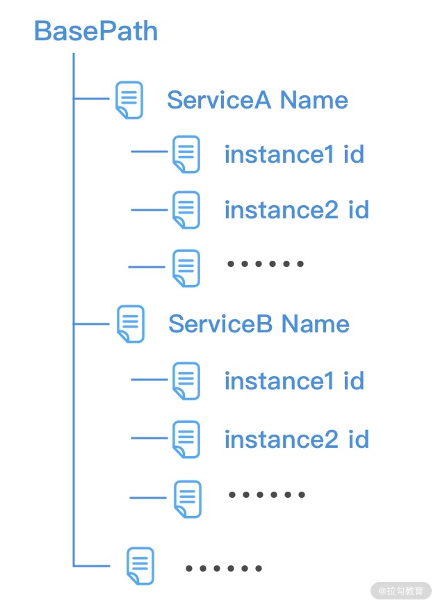

Netty的经典实用：蚂蚁的SoFABolt 

网址：https://github.com/sofastack/sofa-bolt

* 问题点
  * 如何控制流量能够均匀的分摊到每个服务提供者呢？？？


## 注册中心选型

* 服务消费者在发起 RPC 调用之前，需要知道服务提供者有哪些节点是可用的，而且服务提供者节点会存在上线和下线的情况。所以服务消费者需要感知服务提供者的节点列表的动态变化，
  * 在 RPC 框架中一般采用注册中心来实现服务的注册和发现。
* 高可用自然离不开 CAP 理论，一致性 Consistency、可用性 Availability 和分区容忍性 Partition tolerance 是无法同时满足的，
* 注册中心一般分为 CP 类型注册中心和 AP 类型注册中心。
  * CP：使用最为广泛的 Zookeeper 就是 CP 类型的注册中心，集群中会有一个节点作为 Leader，如果 Leader 节点挂了，会重新进行 Leader 选举，ZooKeeper 保证了所有节点的强一致性，但是在 Leader 选举的过程中是无法对外提供服务的，牺牲了部分可用性。
  * AP：Eureka 是典型的 AP 类型注册中心，在实现服务发现的场景下有很大的优势，整个集群是不存在 Leader、Flower 概念的，如果其中一个节点挂了，请求会立刻转移到其他节点上。可能会存在的问题是如果不同分区无法进行节点通信，那么可能会造成节点之间的数据是有差异的，所以 AP 类型的注册中心通过牺牲强一致性来保证高可用性 。
* 对于 RPC 框架而言，即使注册中心出现问题，也不应该影响服务的正常调用，所以 AP 类型的注册中心在该场景下相比于 CP 类型的注册中心更有优势。对于一个成熟的RPC框架而言，会提供多种注册中心的选择。


### 注册中心接口设计

* 注册中心主要用于存储服务的元数据信息，首先我们需要将服务元数据信息封装成一个对象，该对象包括服务名称、服务版本、服务地址和服务端口号

  ```java
  @Data
  public class ServiceMeta {
      private String serviceName;
      private String serviceVersion;
      private String serviceAddr;
      private int servicePort;
  }
  ```

* ​	提供一个通用的注册中心接口，该接口主要的操作对象时ServiceMeta，不应该与其他任何第三方的注册中心工具库有任何联系，此处正是解耦的地方。可以很好的把其他第三方的注册中心加入进来。

  ```java
  public interface RegistryService {
      void register(ServiceMeta serviceMeta) throws Exception;
      void unRegister(ServiceMeta serviceMeta) throws Exception;
      ServiceMeta discovery(String serviceName, int invokerHashCode) throws Exception;
      void destroy() throws IOException;
  }
  ```

  * 包括四个基本操作
    * 服务注册 register
    * 服务取消注册 unregister
    * 服务发现 discovery
    * 注册中心销毁 destroy

  


### 注册中心初始化和销毁

* Zookeeper 常用的开源客户端工具包有 ZkClient 和 Apache Curator，目前都推荐使用 Apache Curator 客户端

* Apache Curator 相比于 ZkClient，不仅提供的功能更加丰富，而且它的抽象层次更高，提供了更加易用的 API 接口以及 Fluent 流式编程风格。在使用 Apache Curator 之前，我们需要在 pom.xml 中引入 Maven 依赖

  ```xml
  <dependency>
      <groupId>org.apache.curator</groupId>
      <artifactId>curator-framework</artifactId>
      <version>2.12.0</version>
      <exclusions>
          <exclusion>
              <groupId>log4j</groupId>
              <artifactId>log4j</artifactId>
          </exclusion>
      </exclusions>
  </dependency>
  <dependency>
      <groupId>org.apache.curator</groupId>
      <artifactId>curator-recipes</artifactId>
      <version>2.12.0</version>
  </dependency>
  <dependency>
      <groupId>org.apache.curator</groupId>
      <artifactId>curator-x-discovery</artifactId>
      <version>2.12.0</version>
  </dependency>
  ```

* ZK客户端构建

  ```java
  public class ZookeeperRegistryService implements RegistryService {
      public static final int BASE_SLEEP_TIME_MS = 1000;
      public static final int MAX_RETRIES = 3;
      public static final String ZK_BASE_PATH = "/mini_rpc";
      private final ServiceDiscovery<ServiceMeta> serviceDiscovery;
      public ZookeeperRegistryService(String registryAddr) throws Exception {
          CuratorFramework client = CuratorFrameworkFactory.newClient(registryAddr, new ExponentialBackoffRetry(BASE_SLEEP_TIME_MS, MAX_RETRIES));
          client.start();
          JsonInstanceSerializer<ServiceMeta> serializer = new JsonInstanceSerializer<>(ServiceMeta.class);
          this.serviceDiscovery = ServiceDiscoveryBuilder.builder(ServiceMeta.class)
                  .client(client)
                  .serializer(serializer)
                  .basePath(ZK_BASE_PATH)
                  .build();
          this.serviceDiscovery.start();
      }
  }
  ```

  * 通过 CuratorFrameworkFactory 采用工厂模式创建 CuratorFramework 实例，构造客户端唯一需你指定的是重试策略，创建完 CuratorFramework 实例之后需要调用 start() 进行启动。然后我们需要创建 ServiceDiscovery 对象，由 ServiceDiscovery 完成服务的注册和发现，在系统退出的时候需要将初始化的实例进行关闭

  ```java
  @Override
  public void destroy() throws IOException {
      serviceDiscovery.close();
  }
  ```


### 服务注册发现

* 注册服务

  ```java
  @Override
  public void register(ServiceMeta serviceMeta) throws Exception {
      ServiceInstance<ServiceMeta> serviceInstance = ServiceInstance
              .<ServiceMeta>builder()
              .name(RpcServiceHelper.buildServiceKey(serviceMeta.getServiceName(), serviceMeta.getServiceVersion()))
              .address(serviceMeta.getServiceAddr())
              .port(serviceMeta.getServicePort())
              .payload(serviceMeta)
              .build();
      serviceDiscovery.registerService(serviceInstance);
  }
  ```

  * ServiceInstance对象代表了一个服务实例，包含

    * 名称 name
    * 唯一标识 id
    * 地址 address
    * 端口 port

  * 存储形式

    

    * 会将相同版本的RPC服务归类在一起，可以将ServiceInstance的名称name，根据服务名称和服务版本进行赋值

      ```java
      public class RpcServiceHelper {
          public static String buildServiceKey(String serviceName, String serviceVersion) {
              return String.join("#", serviceName, serviceVersion);
          }
      }
      ```

* RpcProvider在启动的时候，会将@RpcService注解识别需要发布的服务。现在可以使用RegisterService接口的register()方法将识别出的服务进行发布，最后RpcProvider#postProcessAfterInitialization()方法实现

  ```java
  @Override
  public Object postProcessAfterInitialization(Object bean, String beanName) throws BeansException {
      RpcService rpcService = bean.getClass().getAnnotation(RpcService.class);
      if (rpcService != null) {
          String serviceName = rpcService.serviceInterface().getName();
          String serviceVersion = rpcService.serviceVersion();
          try {
              ServiceMeta serviceMeta = new ServiceMeta();
              serviceMeta.setServiceAddr(serverAddress);
              serviceMeta.setServicePort(serverPort);
              serviceMeta.setServiceName(serviceName);
              serviceMeta.setServiceVersion(serviceVersion);
            
              //关键所在
              serviceRegistry.register(serviceMeta); // 注册服务
              rpcServiceMap.put(RpcServiceHelper.buildServiceKey(serviceMeta.getServiceName(), serviceMeta.getServiceVersion()), bean);
          } catch (Exception e) {
              log.error("failed to register service {}#{}", serviceName, serviceVersion, e);
          }
      }
      return bean;
  }
  ```

  * 服务提供者在启动后就可以将@RpcService注解修饰的服务发布到注册中心了。

* 消费者如何通过合理的负载均衡算法得到合适的服务节点呢？？


### 负载均衡算法基础

#### 一致性Hash算法

* 一致性Hash算法可以<font color='red'>保证每个服务节点分摊的流量尽可能均匀，而且能够把服务节点扩缩容带来的影响降到最低。</font>

* 一致性Hash算法使用一致性Hash环来实现，通过Hash函数将对象和服务器节点放置在哈希环上，一般来说服务器可以选择<font color='blue'>IP+Port进行Hash</font>。

  

  * 图中 C1、C2、C3、C4 是客户端对象，N1、N2、N3 为服务节点，然后在哈希环中顺时针查找距离客户端对象 Hash 值最近的服务节点，即为客户端对应要调用的服务节点

* 服务器新增一个N4节点的情况

  

  * N2和N4直接的客户端对象需要重新进行分配
    * 只有C3会被分配到新的节点N4
    * 其他都保持不变

* 问题：如果服务节点的数量很少，不管Hash算法如何，很大可能存在在服务节点负载不均的情况。而且上面的新服务节点N4新增时，仅仅分担了N1节点的流量，其他节点并没有流量变化。

  * 方法，使用虚拟节点

    

    * 相同颜色表示同一组虚拟服务器

    * 经过 Hash 函数计算后被均匀放置在哈希环中

    * 如果真实的服务节点越多，那么所需的虚拟节点就越少。

    * 在为客户端对象分配节点的时候，需要顺时针从哈希环中找到最近的虚拟节点，然后即可确定真实的服务节点

      

#### 负载均衡算法实现

* 提供一个负载均衡的接口，为了以后更好的选择不同的算法，接口定义中存在一个选择合适节点的方法，select

  ```java
  public interface ServiceLoadBalancer<T> {
      T select(List<T> servers, int hashCode);
  }
  ```

* 通用的一致性Hash算法

  ```java
  public class ZKConsistentHashLoadBalancer implements ServiceLoadBalancer<ServiceInstance<ServiceMeta>> {
      private final static int VIRTUAL_NODE_SIZE = 10;
      private final static String VIRTUAL_NODE_SPLIT = "#";
      @Override
      public ServiceInstance<ServiceMeta> select(List<ServiceInstance<ServiceMeta>> servers, int hashCode) {
          TreeMap<Integer, ServiceInstance<ServiceMeta>> ring = makeConsistentHashRing(servers); // 构造哈希环
          return allocateNode(ring, hashCode); // 根据 hashCode 分配节点
      }
      private ServiceInstance<ServiceMeta> allocateNode(TreeMap<Integer, ServiceInstance<ServiceMeta>> ring, int hashCode) {
          Map.Entry<Integer, ServiceInstance<ServiceMeta>> entry = ring.ceilingEntry(hashCode); // 顺时针找到第一个节点
          if (entry == null) {
              entry = ring.firstEntry(); // 如果没有大于 hashCode 的节点，直接取第一个
          }
          return entry.getValue();
      }
      private TreeMap<Integer, ServiceInstance<ServiceMeta>> makeConsistentHashRing(List<ServiceInstance<ServiceMeta>> servers) {
          TreeMap<Integer, ServiceInstance<ServiceMeta>> ring = new TreeMap<>();
          //每个服务端对象放置10个虚拟节点，包括自己
          for (ServiceInstance<ServiceMeta> instance : servers) {
              for (int i = 0; i < VIRTUAL_NODE_SIZE; i++) {
                  ring.put((buildServiceInstanceKey(instance) + VIRTUAL_NODE_SPLIT + i).hashCode(), instance);
              }
          }
          return ring;
      }
      private String buildServiceInstanceKey(ServiceInstance<ServiceMeta> instance) {
          ServiceMeta payload = instance.getPayload();
          return String.join(":", payload.getServiceAddr(), String.valueOf(payload.getServicePort()));
      }
  }
  ```
  * JDK 提供了 TreeMap 数据结构，可以非常方便地构造哈希环。
    * 通过计算出每个服务实例 ServiceInstance 的地址和端口对应的 hashCode，然后直接放入 TreeMap 中，TreeMap 会对 hashCode 默认从小到大进行排序。
    * 在为客户端对象分配节点时，通过 TreeMap 的 ceilingEntry() 方法找出大于或等于客户端 hashCode 的第一个节点，即为客户端对应要调用的服务节点。
    * 如果没有找到大于或等于客户端 hashCode 的节点，那么直接去 TreeMap 中的第一个节点即可。


### 服务发现

* 服务发现就比较简单，首先获取所有服务节点，然后通过一致性Hash算法找出相应的服务节点

  ```java
  @Override
  public ServiceMeta discovery(String serviceName, int invokerHashCode) throws Exception {
      Collection<ServiceInstance<ServiceMeta>> serviceInstances = serviceDiscovery.queryForInstances(serviceName);
      ServiceInstance<ServiceMeta> instance = new ZKConsistentHashLoadBalancer().select((List<ServiceInstance<ServiceMeta>>) serviceInstances, invokerHashCode);
      if (instance != null) {
          return instance.getPayload();
      }
      return null;
  }
  ```

  


## 扩展连接

* TreeMap的源码解析

  https://blog.csdn.net/lxk_1993/article/details/96429402?utm_medium=distribute.pc_relevant.none-task-blog-2%7Edefault%7ECTRLIST%7Edefault-2.no_search_link&depth_1-utm_source=distribute.pc_relevant.none-task-blog-2%7Edefault%7ECTRLIST%7Edefault-2.no_search_link

* 
