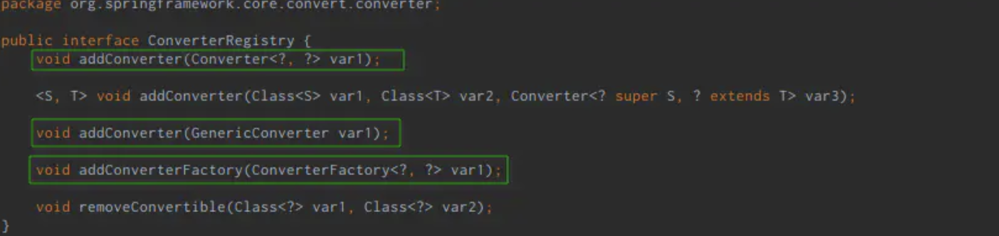

# 一、SpringBoot整合spring-shell

### 1、spring-shell介绍

> Spring-shell是Spring提供的一个组件，此组件可以将Java中的代码逻辑封装为shell命令。通过启动服务器上的shell服务来通过命令方式执行java代码逻辑

### 2、添加依赖


```xml
    <dependency>
        <groupId>org.springframework.shell</groupId>
        <artifactId>spring-shell-starter</artifactId>
        <version>2.0.0.RELEASE</version>
    </dependency>
```

### 3、声明shell命令

将java逻辑转换为命令需要`@ShellComponent`指定类为命令行组件、以及使用`@ShellMethod`指定方法为命令方法
 服务启动后界面会出现`shell:>`，默认情况下方法名称即使命令名称，针对大小写的名称比如`（getName）`会将大写字母进行处理为：`get-name`

### 4、demo

官网案例：


```kotlin
package foo;

@ShellComponent
public class TranslationCommands {

    private final TranslationService service;

    @Autowired
    public TranslationCommands(TranslationService service) {
      this.service = service;
    }

    @ShellMethod("Translate text from one language to another.")
    public String translate(
      @ShellOption(mandatory = true) String text,
      @ShellOption(mandatory = true, defaultValue = "en_US") Locale from,
      @ShellOption(mandatory = true) Locate to
    ) {
      // invoke service
      return service.translate(text, from, to);
    }
}
```

测试demo：

> 1、spring-shell默认使用方法名称作为命令的名称，我们可以在方法的注解中声明`key`属性来重命名其命令名称。
>  2、对于多参数的方法，我们可以使用参数顺序来和参数进行一一对应也可以使用`--argname`来对应命令中对具体参数名称。
>  3、匹配参数的`--`前缀并非是固定的，可以通过在注解中添加`prefix="-"`来调整前缀内容。
>  4、**针对参数的校验：**spring-shell使用`javax.validation.constraints`包中的注解进行校验。具体可以查看此包中的内容来尝试对命令内容进行限制。
>  5、**针对整体状态的校验**spring-shell使用`Availability`提供了另外一种校验。在connected没有连接的时候调用download命令是不合法的。所以在每次调用download命令时会执行命令`名称+Availability`的方法，在这个方法中可以根据执行结果输出对应的错误信息。
>  6、**自定义校验方法**除了使用默认的规则匹配方法，我们还可以主动去指定校验方法，使用`@ShellMethodAvailability`注解我们可以指定此命令的校验方法
>  7、**为校验指定需要限制的命令**除了为命令指定校验、也可以为校验指定需要限制的命令。当有多个命令需要接受同一种限制的时候，无需在所有方法中都添加相关注解，而是可以直接在校验方法中补充注解关联命令。
>  8、**为命令提供分组**`help`是spring-shell的一个内置命令，使用此命令可以查看spring-shell中所有存在的命令。如果我们的命令比较多的时候此时列出来的会是一个长长的清单，这个时候可以使用注释中的`group`属性对命令进行分组


```dart
package cn.opendatachain.shell.controller;

import cn.opendatachain.shell.entity.Node;
import cn.opendatachain.shell.service.NodeService;
import org.springframework.beans.factory.annotation.Autowired;
import org.springframework.shell.Availability;
import org.springframework.shell.standard.ShellCommandGroup;
import org.springframework.shell.standard.ShellComponent;
import org.springframework.shell.standard.ShellMethod;
import org.springframework.shell.standard.ShellOption;

import javax.validation.constraints.Size;
import java.util.List;

/**
 * OdcShellTest Description
 *
 * @author lsj
 * @version odc-manage 1.0.0.RELEASE
 * <b>Creation Time:</b> 2021/7/29 14:18
 */
@ShellComponent
@ShellCommandGroup("分组的命令")
public class OdcShellTest {

    @Autowired
    private NodeService nodeService;

    /**
     * 基础的命令
     * @return
     */
    @ShellMethod(value = "输入两个整数，获取相加结果")
    //    @ShellMethod("输入两个整数，获取相加结果")
    public List<Node> findAll() {
        return nodeService.findAll();
    }

    /**
     * 基础的命令
     * 输入：add 2 3
     * 输入：sum 2 3
     * 输出：5
     * @return
     */
    // key 命令名称
    @ShellMethod(value = "输入两个整数，获取相加结果", key = "sum")
//    @ShellMethod("输入两个整数，获取相加结果")
    public int add(int a, int b) {
        return a + b;
    }

    /**
     * 多参数 可以使用 --arg value 指定参数名称
     * 输入：echo-int --b 1 --a 2 --c 3
     * 输出：You said a=2, b=1, c=c
     *
     * 输入：echo-int 1 2 3
     * 输出：You said a=1, b=2, c=3
     * @return
     */
    @ShellMethod("通过明明参数名称，来指定输入的数据对应的参数名称")
    public String echoInt(int a, int b, int c) {
        return String.format("You said a=%d, b=%d, c=%d", a, b, c);
    }
    
    /**
     *
     * 输入：echo-int2 1 2  3
     * 输出：You said a=1, b=2, c=3
     *
     * 输入：echo-int2 -b 2 -a 3 --third 4
     * 输出：You said a=3, b=2, c=4
     * @return
     */
    @ShellMethod(value = "通过明明参数名称，强制的指定输入的数据对应的参数名称", prefix="-")
    public String echoInt2(int a, int b, @ShellOption("--third") int c) {
        return String.format("You said a=%d, b=%d, c=%d", a, b, c);
    }

    /**
     * 设置默认值
     * 输入：echo-string --who ' string is "name"'
     * 输出：input: string is "name"
     * @return
     */
    @ShellMethod("输入字符串")
    public String echoString(@ShellOption(defaultValue="World") String who) {
        return "input:" + who;
    }

    /**
     * 数组类参数
     * 输入：echo-array 2 3 4
     * 输出：input:2.0,3.0,4.0
     * @return
     */
    @ShellMethod("输入数组")
    public String echoArray(@ShellOption(arity=3) float[] numbers) {
        return "input:" + numbers[0] + "," + numbers[1] + "," + numbers[2];
    }

    /**
     * boolean类型参数,boolean 类型参数当你设置了参数会返回true
     * 输入：echo-boolean --force
     * 输出：input:true
     *
     * 输入：echo-boolean
     * 输出：input:false
     * @return
     */
    @ShellMethod("Terminate the system.")
    public String echoBoolean(boolean force) {
        return "input:" + force;
    }

    @ShellMethod("只能输入长度为8至40的内容")
    public String changePassword(@Size(min = 8, max = 40) String password) {
        return "Password successfully set to " + password;
    }

    private boolean connected;

    @ShellMethod("设置链接状态为true")
    public void connect() {
        connected = true;
    }

    /**
     * 输入：download
     * 输出：
     * Command 'download' exists but is not currently available because 没有进行链接
     * Details of the error have been omitted. You can use the stacktrace command to print the full stacktrace.
     *
     * 第二次输入
     * 输入:>connect
     * 输出:>download
     */
    @ShellMethod(value = "必须链接后才能执行的方法",group = "其他组")
    public String download() {
        System.out.println("123");
        return "123";
    }

    public Availability addAvailability() {
        return connected
            ? Availability.available()
            : Availability.unavailable("没有进行链接");
    }
}
```


# 二、自定义Spring Shell

### 概述

官网：[https://projects.spring.io/spring-shell/](https://links.jianshu.com/go?to=https%3A%2F%2Fprojects.spring.io%2Fspring-shell%2F)。
 Spring Shell除了提供一些常用的内置命令之外，还允许开发者对一些默认功能进行定制。

### 自定义内置命令

##### 禁用内置命令

禁用Spring Shell的内置命令非常简单，只需要在`pom.xml`文件中进行简单配置即可，如下所示：


```xml
<!-- Spring Shell -->
<dependency>
    <groupId>org.springframework.shell</groupId>
    <artifactId>spring-shell-starter</artifactId>
    <version>2.0.0.RELEASE</version>
    <exclusions>
        <!-- 禁用内置命令 -->
        <exclusion>
            <groupId>org.springframework.shell</groupId>
            <artifactId>spring-shell-standard-commands</artifactId>
        </exclusion>
    </exclusions>
</dependency>
```


```bash
shell:>help
No command found for 'help'
shell:>exit
No command found for 'exit'
shell:>
```

> 完全禁用了所有内置命令之后，将无法通过`help`命令查询其他命令信息，也不能再使用`exit`命令退出应用。
>  因此，如果有需要的情况下，应该只是禁用某些内置命令。

> 如果需要禁用指定内置命令，需要在代码中设置对应的命令属性为false，格式为：`spring.shell.command.<command>.enabled=true`。

例如，需要禁用`help`命令：

**方式一：**

```dart
@SpringBootApplication
public class TestSpringshellApplication {
    public static void main(String[] args) {
        String[] disabledCommands = new String[]{"--spring.shell.command.help.enabled=false"};
        String[] fullArgs = StringUtils.concatenateStringArrays(args, disabledCommands);
        SpringApplication.run(TestSpringshellApplication.class, fullArgs);
    }
}
```


**方式二：**

```bash
spring:
  shell:
    command:
      help:
        enabled: false
```


```bash
# help命令将不再能使用
shell:>help
No command found for 'help'
Details of the error have been omitted. You can use the stacktrace command to print the full stacktrace.
shell:>exit
```

如果禁用的是其他命令，如：`clear`，在Spring Shell应用启动之后通过`help`命令不再能看被禁用的命令了。


```dart
@SpringBootApplication
public class TestSpringshellApplication {
    public static void main(String[] args) {
        // 禁用了内置的clear命令
        String[] disabledCommands = new String[]{"--spring.shell.command.clear.enabled=false"};
        String[] fullArgs = StringUtils.concatenateStringArrays(args, disabledCommands);
        SpringApplication.run(TestSpringshellApplication.class, fullArgs);
    }
}
```


```bash
shell:>help
AVAILABLE COMMANDS

Built-In Commands
        exit, quit: Exit the shell.
        help: Display help about available commands.
        script: Read and execute commands from a file.
        stacktrace: Display the full stacktrace of the last error.
```

显然，在禁用了指定的内置命令之后，通过`help`命令将不能看到该命令了。


##### 覆盖内置命令

如果希望重写内置命令的实现，可以通过实现接口`org.springframework.shell.standard.commands.<Command>.Command`来完成（如：需要重写clear命令的实现，实现接口`org.springframework.shell.standard.commands.Clear.Command）`。
 如下为重写内置命令`script`的实现：


```java
import org.springframework.shell.standard.ShellComponent;
import org.springframework.shell.standard.ShellMethod;
import org.springframework.shell.standard.commands.Script;
// 实现接口org.springframework.shell.standard.commands.Script.Command
@ShellComponent
public class MyScript implements Script.Command {
    // 注意：命令名称与内置命令保持一致
    @ShellMethod("Read and execute commands from a file.")
    public void script() {
      / // 实现自定义逻辑
        System.out.println("override default script command");
    }
}
```

有意思的是，此时在内置命令**“Built-In Commands”**分组中将不能看到`script`命令了，而是在自定义的分组中，


```bash
shell:>help
AVAILABLE COMMANDS

Built-In Commands  # 在内置命令分组中看不到重写的命令了
        clear: Clear the shell screen.
        exit, quit: Exit the shell.
        help: Display help about available commands.
        stacktrace: Display the full stacktrace of the last error.

My Script          # 重写的命令此时在自定义分组中
        scriptdo: Read and execute commands from a file.
```

如果希望被覆盖的内置命令依然能够在**“Built-In Commands”**分组中看到，可以通过注解`@ShellMethod`的`group`属性指定。


```csharp
// 指定被覆盖的内置命令分组为“Built-In Commands”
@ShellMethod(value = "Read and execute commands from a file.", group = "Built-In Commands")
public void script() {
    System.out.println("override default script command");
}
```


```bash
shell:>help
AVAILABLE COMMANDS

Built-In Commands
        clear: Clear the shell screen.
        exit, quit: Exit the shell.
        help: Display help about available commands.
        script: Read and execute commands from a file.
        stacktrace: Display the full stacktrace of the last error.

shell:>script
override default script command
```


### 自定义命令提示符

默认情况下，Spring Shell启动之后显示的是一个黄色的命令提示符（`shell:>`）等待用户输入。
 可以通过Spring Shell提供的接口`org.springframework.shell.jline.PromptProvider`对该命令提示符进行定制。


```java
package cn.opendatachain.shell.config;

import org.jline.utils.AttributedString;
import org.jline.utils.AttributedStyle;
import org.springframework.shell.jline.PromptProvider;
import org.springframework.stereotype.Component;

/**
 * OdcPromptProvider Description
 *
 * @author lishijian
 * @version odc-shell 1.0.0.RELEASE
 * <b>Creation Time:</b> 2021/7/30 10:00
 */
@Component
public class OdcPromptProvider implements PromptProvider {
    @Override
    public AttributedString getPrompt() {
        // 定制命令提示符为红色的“odc-shell:>”
        return new AttributedString("odc-shell:>",AttributedStyle.DEFAULT.foreground(AttributedStyle.RED));
    }
}
```


### 自定义命令行选项行为

Spring Shell提供了2个默认的`ApplicationRunner`，用于实现命令行选项的行为。


 1、`InteractiveShellApplicationRunner`用于启动交互式界面，接收用户输入命令。
 2、`ScriptShellApplicationRunner`用于在应用启动时从程序参数中读取指定文件中的命令并执行，具体来讲：将多个命令写在文件中，并通过参数的形式将包含了批量命令的文件路径传递给程序，传递的文件路径参数必须以“@”开始，如下示例：


```bash
$ java -jar /home/test/sun/workspace/test-springshell/target/test-springshell-0.0.1-SNAPSHOT.jar @/home/test/cmd
```

文件`/home/test/cmd`中的内容为：


```bash
$ cat /home/test/cmd 
help
```

这样，在启动程序时，将会自动执行`/home/test/cmd`文件中的命令（如果文件不存在，启动应用时报错）。
 值得注意的是： 当在程序参数中存在“@local_file_path”这样的参数时，应用启动后执行完文件“local_file_path”内命令之后就退出了，不会进入交互式命令行界面（上述示例中，应用启动后执行`help`命令之后就退出了）。

如果Spring Shell默认提供的上述2个`ApplicationRunner`无法满足需求，可以自定义其他的命令行选项行为，直接实现接口`org.springframework.boot.ApplicationRunner`即可。

### 自定义参数转换器

默认情况下，Spring Shell使用[标准的Spring类型转换机制](https://links.jianshu.com/go?to=https%3A%2F%2Fdocs.spring.io%2Fspring%2Fdocs%2F4.3.11.RELEASE%2Fspring-framework-reference%2Fhtmlsingle%2F%23core-convert)将命令行的文本参数转换为指定的类型。
 实际上，Spring Shell是通过`DefaultConversionService`注册`Converter<S, T>`，`GenericConverter`或者`ConverterFactory<S, R>`类型的Bean对象来实现对命令行参数进行类型转换的。




换句话说，如果我们需要自定义类型转换器，只需要简单实现接口`org.springframework.core.convert.converter.Converter<S, T>`就可以了。


```java
// 自定义类型
public class Food {
    private String value = null;
    public Food(String value) {
        this.value = value;
    }

    @Override
    public String toString() {
        return new StringBuilder()
                .append("Food{").append("value='").append(value).append("'}")
                .toString();
    }
}

// 自定义类型转换器
@Component
public class MyConverter implements Converter<String, Food> {
    @Override
    public Food convert(String s) {
        // 将输入参数转换为Food类型实例
        return new Food(s);
    }
}

// 使用自定义转换类型
@ShellComponent
public class ConvertionCmd {
    // 在命令方法中直接可以获取Food对象，这是通过前面的自定义类型转换器MyConverter实现的
    @ShellMethod("Conversion food")
    public String food(Food food) {
        return food.toString();
    }
}
```

在命令行指定命令`food`：


```csharp
#food apple
Food{value='apple'}
```

显然，通过自定义类型转换器可以实现对命令参数的特殊处理，非常实用。


原文链接：https://www.jianshu.com/p/8de9d882f8fa

