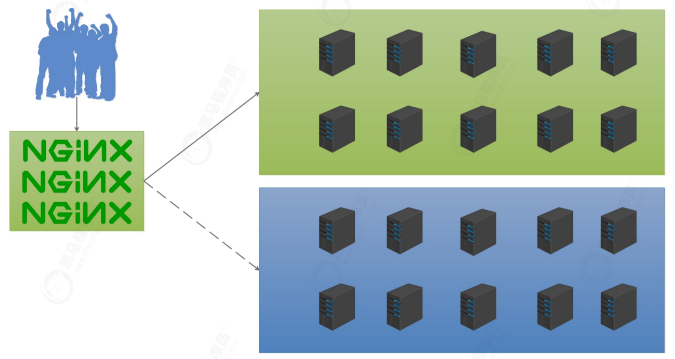
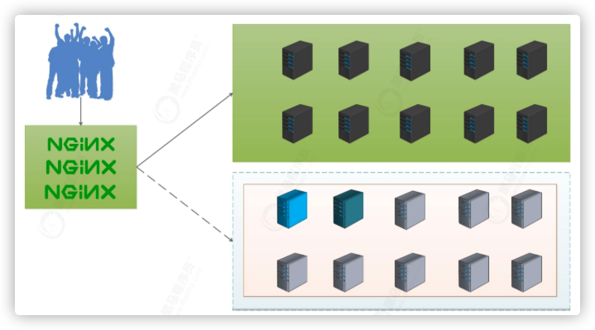
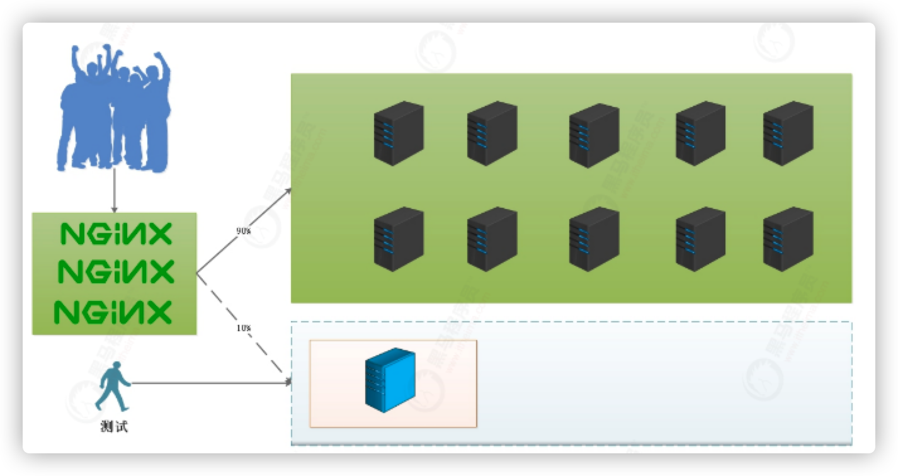
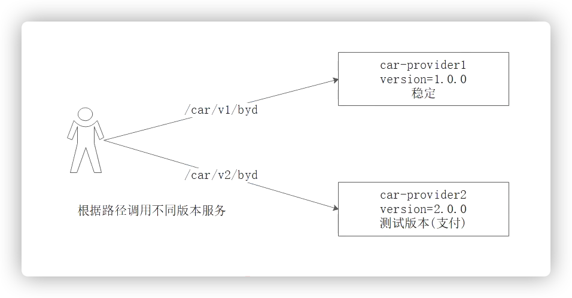
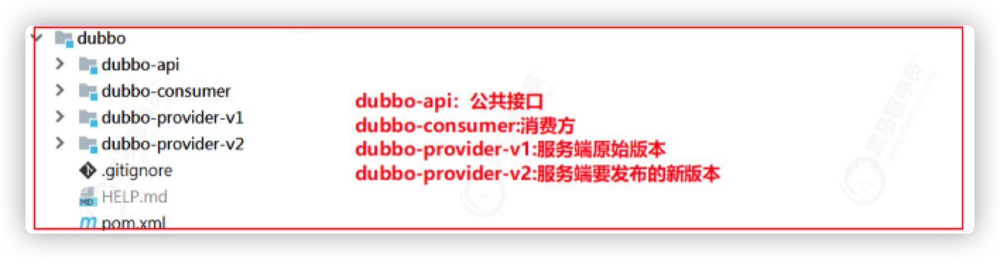
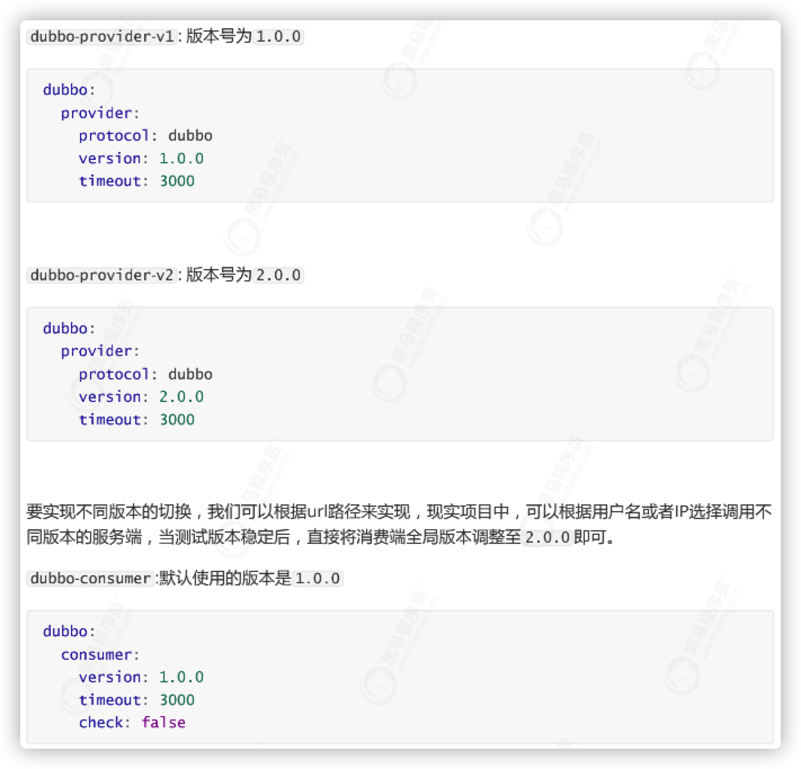
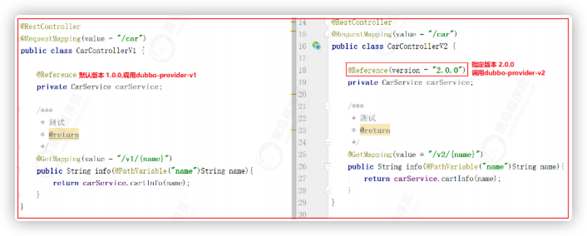

## 基本概念

* 灰度发布：
  * 项目发布方案之一
  * 不停服务的情况下，让**少量流量（少量用户）**访问新发布的版本（灰度版本），期间如果发现任何问题，可以随时撤掉新版本，如果新版本没有问题，逐步把旧服务的流量全部落到新服务版本上

### 方案

#### 1. 蓝绿方案

* 同时运行t**两个版本**的应用
  * 蓝绿部署的时候，并不停止掉老版本，而是**直接部署一套新版本**，等新版本运行起来后，再将流量切换到新版本上。
* 但是蓝绿部署要求在升级过程中，同时运行**两套程序**，对硬件的要求就是日常所需的二倍，
* 问题
  * 有钱的公司可以搞搞，没钱还是算了，直接复制一套，两倍的机器价值

#### 2. 滚动发布

* 过程
  * 升级过程中，并不一下子启动所有新版本，是**先启动一台新版本，再停止一台老版本，然后再启动一台新版本，再停止一台老版本**，直到升级完成
  * 这样在整个升级过程中，就需要多一台机器就好
* 问题
  * 由于新版本可能是不稳定的，不可用的额，在滚动升级期间，整个系统处于非常不稳定的状态，如果发现了问题，是老的服务呢，还是新的服务

#### 3. 灰度发布

* 过程

  * 在灰度发布开始后，先启动一个新版本应用，但是并不直接将流量切过来，而是测试人员对新版本进行

    线上测试，启动的这个新版本应用，就是我们的金丝雀

  * 如果没有问题，那么可以将**少量的用户流量**导入到新版本上，然后再对新版本做运行状态观察，收集各种运行时数据，如果此时对新旧版本做各种数据对比，就是所谓的A/B测试。

  * 当确认新版本运行良好后，再**逐步将更多的流量**导入到新版本上，在此期间，还可以不断地调整新旧两个版本的运行的服务器副本数量，以使得新版本能够承受越来越大的流量压力

  * 直到将100%的流量都切换到新版本上，最后关闭剩下的老版本服务，完成灰度发布。

* 灰度过程中，如果发现新版本有问题，立刻将流量切回老版本上，这样就会将负面影响控制在最小范围

* 灰度发布概念
  * **稳定版本**：上面黑的
  * 测试版本：下面蓝色，那么谁去访问测试版本呢？？
    * 特定的用户群体
      1. 公测用户
      2. 内部用户
      3. 。。。
    * 特定的软件
      1. 外部页面
      2. APP客户端

## Dubbo灰度发布

### 1. 根据请求路径切流

* 需求：根据请求路径进行切流

  

  * 根据不同的访问路径访问不同的服务版本
    * v1访问1.0
    * v2访问2.0

* 案例工程

  

  * Provider-v1：稳定版本
  * Provider-v2：测试版本

* 实现

  * provider使用dubbo，分别提供两个版本

    

  * consumer的两个controller，分别引入，两个版本号

    

