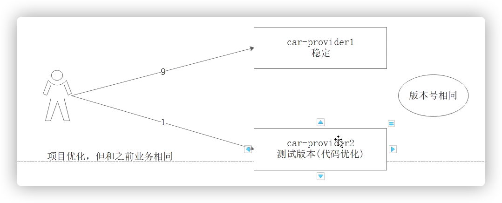

## 基本概念

* 灰度发布：
  * 项目发布方案之一
  * 不停服务的情况下，让**<font color='red'>少量流量（少量用户）</font>**访问新发布的版本（灰度版本），期间如果发现任何问题，可以随时撤掉新版本，如果新版本没有问题，逐步把旧服务的流量全部落到新服务版本上


### 方案

#### 1. 蓝绿方案


* 同时运行t**<font color='red'>两个版本</font>**的应用
  * 蓝绿部署的时候，并不停止掉老版本，而是**<font color='red'>直接部署一套新版本</font>**，等新版本运行起来后，再将流量切换到新版本上。
* 但是蓝绿部署要求在升级过程中，同时运行**<font color='red'>两套程序</font>**，对硬件的要求就是日常所需的二倍，
* 问题
  * 有钱的公司可以搞搞，没钱还是算了，直接复制一套，两倍的机器价值


#### 2. 滚动发布


* 过程
  * 升级过程中，并不一下子启动所有新版本，是**<font color='blue'>先启动一台新版本，再停止一台老版本，然后再启动一台新版本，再停止一台老版本</font>**，直到升级完成
  * 这样在整个升级过程中，就需要多一台机器就好
* 问题
  * 由于新版本可能是不稳定的，不可用的额，在滚动升级期间，整个系统处于非常不稳定的状态，如果发现了问题，是老的服务呢，还是新的服务


#### 3. 灰度发布


* 过程

  * 在灰度发布开始后，先启动一个新版本应用，但是并不直接将流量切过来，而是测试人员对新版本进行

    线上测试，启动的这个新版本应用，就是我们的金丝雀

  * 如果没有问题，那么可以将**<font color='red'>少量的用户流量</font>**导入到新版本上，然后再对新版本做运行状态观察，收集各种运行时数据，如果此时对新旧版本做各种数据对比，就是所谓的A/B测试。

  * 当确认新版本运行良好后，再**<font color='red'>逐步将更多的流量</font>**导入到新版本上，在此期间，还可以不断地调整新旧两个版本的运行的服务器副本数量，以使得新版本能够承受越来越大的流量压力

  * 直到将100%的流量都切换到新版本上，最后关闭剩下的老版本服务，完成灰度发布。

* 灰度过程中，如果发现新版本有问题，立刻将流量切回老版本上，这样就会将负面影响控制在最小范围

* 灰度发布概念
  * **<font color='blue'>稳定版本</font>**：上面黑的
  * 测试版本：下面蓝色，那么谁去访问测试版本呢？？
    * 特定的用户群体
      1. 公测用户
      2. 内部用户
      3. 。。。
    * 特定的软件
      1. 外部页面
      2. APP客户端


## Dubbo灰度发布

### 1. 根据请求路径切流

* 需求：根据请求路径进行切流，根据版本匹配切流

  

  * 根据不同的访问路径访问不同的服务版本
    * v1访问1.0
    * v2访问2.0

* 案例工程

  

  * Provider-v1：稳定版本
  * Provider-v2：测试版本

* 实现

  * provider使用dubbo，分别提供两个版本

    

  * consumer的两个controller，分别引入，两个版本号

    


### 2. 按照权重切流

​		

 		如果是代码优化这样的需求变更，想让少部分使用测试版本，大多数都是用稳定版本

* 需求
  * 测试版本，20%流量
  * 稳定版本，80%流量
* 实现
  * 只需要在provider的地方，提供出服务的权重大小就好了


## Nginx + Lua灰度发布

* 分为
  * 静态页灰度发布
    * 根据IP进行切流
  * 应用动态发布
    * 例如，内部员工访问测试版本，外部人员使用稳定版本


### 动态服务灰度发布

* 业务需求
  * IP切流

  1. 获取用户的IP
  2. 判断用户的IP是否属于内部员工的IP
     1. 如果是内部员工的IP，则访问grap（灰度系统）
     2. 如果不是内部员工的IP，则访问非灰度系统

  

* IP切流动态服务灰度发布方式的实现要借助Nginx+Lua和Redis了

* 步骤：

  * 先把公司内部的IP全部存储在Redis缓存中
  * 当用户访问系统的时候，先通过Lua脚本根据IP查询Redis缓存
    * 如果Redis缓存数据存在就表明使用灰度系统
    * 如果没有缓存则使用稳定版系统

* 实战

  * lua脚本

    ```lua
    --客户端IP 
    -- 获取用户的请求头信息
    local headers=ngx.req.get_headers()
    -- 获取IP
    local ip=headers["X-REAL-IP"] or headers["X_FORWARDED_FOR"] or ngx.var.remote_addr or "0.0.0.0" 
    --local ip = "192.168.211.1" 
    
    --引入redis依赖 
    local redis = require("resty.redis"); 
    local red = redis:new() 
    red:set_timeout(2000) 
    red:connect("192.168.211.142", 6379) 
    --执行查询
    
    local grayresult=red:get(ip); 
    red:close() 
    if grayresult==nil or grayresult==nil or grayresult==ngx.null then 
        --没有数据则查询主服务 
        ngx.var.upstream = "sys" 
    else
        --如果有数据，则查询灰度服务 
        ngx.var.upstream = "gray" 
    end
    ```

  * nginx配置

    * nginx.conf

    

    * 具体代码

      ```conf
      #灰度系统负载均衡池 
      upstream gray { 
      	server 192.168.211.1:18082; 
      }
      
      #稳定系统负载均衡池 
      upstream sys { 
      	server 192.168.1.5:18081; 
      }
      
      server { 
      	listen 80; 
      	server_name localhost; 
      	
      	#charset koi8-r; 
      	
      	#access_log logs/host.access.log main;
      	
      	#所有动态请求 
      	location / { 
      				#设置负载均衡池 ，定义一个变量，给的值是空
      				set $upstream ''; 
      			
      				#查找负载均衡池 ，通过lua脚本来设置upstream的值
      				#  可以阻端程序，也会设置上面的变量，这样下面的Proxy_pass的upstream就被Lua脚本赋值
      				access_by_lua_file /usr/local/openresty/nginx/lua/loadip.lua; 
      			
      				#反向代理
      				# 判断用户IP，如果IP是内部员工IP，则访问grap灰度系统，否则访问sys稳定系统
      				# 通过上面的lua脚本判断IP，并给变量upstream赋值
      				proxy_pass http://$upstream; 
      			} 
      }
      ```

      

### 静态资源灰度发布

* 需求

  * 把稳定静态资源放在了 /usr/local/openresty/nginx/static1/ 目录下
  * 把灰度静态页资源放在了  /usr/local/openresty/nginx/static2/ 目录下
  * 要求公司员工IP访问灰度发布的静态页，
  * 非公司员工IP访问稳定版本页面

  

* 想法

  * 又使用到了lua脚本来设置不同的静态资源路径

* 实现

  * Lua脚本

    ```lua
    --客户端IP 
    local headers=ngx.req.get_headers() 
    local ip=headers["X-REAL-IP"] or headers["X_FORWARDED_FOR"] or ngx.var.remote_addr or "0.0.0.0" 
    --local ip = "192.168.211.1" 
    
    --引入redis依赖 
    local redis = require("resty.redis"); 
    local red = redis:new() 
    red:set_timeout(2000) 
    red:connect("192.168.211.142", 6379) 
    --执行查询 
    
    local grayresult=red:get(ip); 
    red:close() 
    if grayresult==nil or grayresult==nil or grayresult==ngx.null then 
      	--没有数据则查询主服务 
      	ngx.var.homepath = "/usr/local/openresty/nginx/static1/" 
    else
      	--如果有数据，则查询灰度服务 
        ngx.var.homepath = "/usr/local/openresty/nginx/static2/" 
    end
    ```

  * nginx.conf配置如下：图片、静态页、样式、脚本，我们都进行灰度发布，如下配合

    ```conf
    #静态资源 
    location ~* \.(jpg|png|html|css|js|woff|ttf|woff2) { 
    		#静态资源路径设置 
    		set $homepath ''; 
    		
    		#lua脚本校验使用静态资源 
    		access_by_lua_file /usr/local/openresty/nginx/lua/home.lua; 
    		
    		#静态资源root配置 
    		root $homepath; 
    }
    ```

    


## ID切流灰度发布

* 现在的项目大多数已经是微服务项目，而微服务项目几乎都是前天传递JWT令牌到后台，要想实现ID切流，我们需要在代理层识别用户身份（JWT令牌），我们需要引入 lua-resty-jwt 模块，是用于ngx_lua 和 LuaJIT 的 Lua 实现库，在该模块能实现Jwt令牌生成、Jwt令牌校验，依赖库的地址：https://github.com/SkyLothar/lua-resty-jwt。

* 需求

  * 特定的用户ID使用测试版本，其他ID使用稳定版本

* 令牌实现

  * 先利用 lua-resty-jwt 生成令牌,再解析令牌

    1. 创建 make.lua 用于生成令牌

       ```lua
       ngx.header.content_type="application/json;charset=utf8" 
       local cjson = require "cjson" 
       local jwt = require "resty.jwt" 
       
       --生成令牌 
       --lua-resty-jwt为秘钥 
       local jwt_token = jwt:sign( 
         	"lua-resty-jwt", 
         	{ 
           		header={typ="JWT", alg="HS256"}, 
           		payload={name="zhangsan"} 
           } 
       )
       ngx.say(jwt_token)
       ```

    2. 创建 token.lua 用户校验令牌

       ```lua
       local cjson = require "cjson" 
       local jwt = require "resty.jwt" 
       
       --获取请求头中的令牌数据 
       local auth_header = ngx.var.http_Authorization 
       local jwt_obj = jwt:verify("lua-resty-jwt", auth_header) 
       ngx.say(cjson.encode(jwt_obj))
       ```

  * nginx配置:nginx.conf

    ```conf
    #校验令牌 
    location /check { 
    		content_by_lua_file /usr/local/openresty/nginx/lua/token.lua; 
    }
    
    #生成令牌 
    location /token { 
    		content_by_lua_file /usr/local/openresty/nginx/lua/make.lua; 
    }
    ```

  * 测试

    

  

* ID切流实现

  * 步骤

    1. 获取用户的令牌信息
    2. 调用token.lua库，识别令牌是否有效
       1. 如果令牌有效，判断用户的ID账号是否为内部员工账号
          1. 如果是，则访问灰度服务
       2. 如果不是内部账号，则访问稳定服务

  * 代码

    * id.lua

      ```lua
      local cjson = require "cjson" 
      local jwt = require "resty.jwt" 
      
      --获取请求头中的令牌数据 
      local auth_header = ngx.var.http_Authorization 
      local jwt_obj = jwt:verify("lua-resty-jwt", auth_header) 
      --解析的用户名 
      local username = jwt_obj["payload"]["name"] 
      
      if username=="zhangsan" then
         --没有数据则查询主服务 
         ngx.var.idpath = "/usr/local/openresty/nginx/static1/" 
      else
         --如果有数据，则查询灰度服务 
         ngx.var.idpath = "/usr/local/openresty/nginx/static2/" 
      end
      ```

    * nginx.conf

      ```conf
      #ID切流 
      location =/1.html { 
      		#静态资源路径设置 
      		set $idpath ''; 
      		
      		#lua脚本校验使用静态资源 
      		access_by_lua_file /usr/local/openresty/nginx/lua/id.lua; 
      		
      		#静态资源root配置 
      		root $idpath; 
      }
      ```


## GateWay灰度发布

* 请求流程

  

  * 关键点：在于Gateway的路由选择，实质上是一个负载均衡器，还有一个重点是前面的过滤器

* 类方法

  

* ReactiveLoadBalancerClientFilter

  * 整体路程

    1. 拦截用户的所有请求，会调用此类中的Filter方法
       1. 先获取用户请求的url，这个目的是为了，判断当前请求用不用进行处理
          1. 根据当前用户请求的schema进行处理，如果shema是Lb，代表负载，则进行处理，否则不处理
       2. 调用choose方法，获取真实的实例
          1. 会把用户请求的url地址域名换成正式服务的IP和端口号
       3. 进入下一个调用链路，不由我们去处理

  * 重要属性

    ```java
    public class ReactiveLoadBalancerClientFilter implements GlobalFilter, Ordered {
    
    	private static final Log log = LogFactory
    			.getLog(ReactiveLoadBalancerClientFilter.class);
    
    	private static final int LOAD_BALANCER_CLIENT_FILTER_ORDER = 10150;
    
      //用于创建客户端，用于创建负载均衡器
    	private final LoadBalancerClientFactory clientFactory;
    
      //负载均衡器的属性配置
    	private LoadBalancerProperties properties;
      
      
      //构造方法进行初始化，所以，如果创建一个过滤器，那么就需要创建这两个对象
      //并且通过构造方法进行诸如
      public ReactiveLoadBalancerClientFilter(LoadBalancerClientFactory clientFactory,
    			LoadBalancerProperties properties) {
    		this.clientFactory = clientFactory;
    		this.properties = properties;
    	}
      ...
        
    }
    ```

    

  * filter方法，拦截所有请求，执行此处的过滤器方法

    ```java
    
    // ServerWebExchange 处理用户请求的信息封装 包括下面内容
    //										1. 用户请求提交的数据
    //										2. 处理用户请求的路由对象
    @Override
    @SuppressWarnings("Duplicates")
    public Mono<Void> filter(ServerWebExchange exchange, GatewayFilterChain chain) {
      
      //1. 获取url，是路由信息，在yml文件中配置的属性信息，不是真正请求的url
      URI url = exchange.getAttribute(GATEWAY_REQUEST_URL_ATTR);
      String schemePrefix = exchange.getAttribute(GATEWAY_SCHEME_PREFIX_ATTR);
      
      //1.1 只处理lb的负载请求，其他的不进行灰度处理
      if (url == null
          || (!"lb".equals(url.getScheme()) && !"lb".equals(schemePrefix))) {
        return chain.filter(exchange);
      }
      // preserve the original url
      addOriginalRequestUrl(exchange, url);
    
      if (log.isTraceEnabled()) {
        log.trace(ReactiveLoadBalancerClientFilter.class.getSimpleName()
                  + " url before: " + url);
      }
    
      
      //2. 调用choose方法，最终会调用 RoundRobinLoadBalance负载均衡器
      return choose(exchange).doOnNext(response -> {
    
        if (!response.hasServer()) {
          throw NotFoundException.create(properties.isUse404(),
                                         "Unable to find instance for " + url.getHost());
        }
    
        //2.1  用户请求的真实地址，域名的方式
        URI uri = exchange.getRequest().getURI();
    
        // if the `lb:<scheme>` mechanism was used, use `<scheme>` as the default,
        // if the loadbalancer doesn't provide one.
        String overrideScheme = null;
        if (schemePrefix != null) {
          overrideScheme = url.getScheme();
        }
    
        //2.2 获取当前处理用户请求的实例对象信息
        DelegatingServiceInstance serviceInstance = new DelegatingServiceInstance(
          response.getServer(), overrideScheme);
    
        //2.3 将用户请求的uri地址中的域名，换成处理用户请求服务的IP+port
        URI requestUrl = reconstructURI(serviceInstance, uri);
    
        if (log.isTraceEnabled()) {
          log.trace("LoadBalancerClientFilter url chosen: " + requestUrl);
        }
        exchange.getAttributes().put(GATEWAY_REQUEST_URL_ATTR, requestUrl);
      }).then(chain.filter(exchange));
    }
    ```

  * choose方法

    ```java
    private Mono<Response<ServiceInstance>> choose(ServerWebExchange exchange) {
      URI uri = exchange.getAttribute(GATEWAY_REQUEST_URL_ATTR);
      
      //创建负载均衡器实例 - RoundRonbinLoadBalancer
      ReactorLoadBalancer<ServiceInstance> loadBalancer = this.clientFactory
        .getInstance(uri.getHost(), ReactorLoadBalancer.class,
                     ServiceInstance.class);
      if (loadBalancer == null) {
        throw new NotFoundException("No loadbalancer available for " + uri.getHost());
      }
      
      //用来从多个实例中，获取一个用于处理用户请求的实例，RoundRobinLoadBalance.choose()
      return loadBalancer.choose(createRequest());
    }
    
    ```

* RoundRobinLoadBalancer

  * 重要属性

    ```java
    public class RoundRobinLoadBalancer implements ReactorServiceInstanceLoadBalancer {
    
    	private static final Log log = LogFactory.getLog(RoundRobinLoadBalancer.class);
    
      //轮询下标
    	private final AtomicInteger position;
    
    	@Deprecated
    	private ObjectProvider<ServiceInstanceSupplier> serviceInstanceSupplier;
    
      
      //只要已创建当前负载均衡器，就初始化下面两个参数
      
      //处理当前用户请求的服务列表信息封装
    	private ObjectProvider<ServiceInstanceListSupplier> serviceInstanceListSupplierProvider;
    
      //配置中的service名称，用于去注册中心获取服务列表的作用
    	private final String serviceId;
      
      ...
    }
    ```

  * choose方法

    ```java
    	public Mono<Response<ServiceInstance>> choose(Request request) {
    		// TODO: move supplier to Request?
    		// Temporary conditional logic till deprecated members are removed.
    		if (serviceInstanceListSupplierProvider != null) { //可用服务集合封装
    			ServiceInstanceListSupplier supplier = serviceInstanceListSupplierProvider
    					.getIfAvailable(NoopServiceInstanceListSupplier::new);//获取当前提供处理的服务列表信息
          
          //轮询获取列表中的某个服务实例
    			return supplier.get().next().map(this::getInstanceResponse);
    		}
        
        //空处理逻辑
    		ServiceInstanceSupplier supplier = this.serviceInstanceSupplier
    				.getIfAvailable(NoopServiceInstanceSupplier::new);
    		return supplier.get().collectList().map(this::getInstanceResponse);
    	}
    ```

    
