## 基本概念

* 任务调度
  * 定时任务，指基于给定时间点，自动执行任务

* 组成
  * 协调器/调度中心
    * 任务分配
    * 更像是server
  * 执行器
    * 任务执行
    * 更像是client
  * 可视化平台
    * 任务管理：CRUD，配置，统计

* 分类

  * 定时任务
    * 定位于单机定时场景。例如Crontab，计划任务，Quartz
    * 如果做成多节点的时候，要注意，同一时刻只能由一个节点执行任务
    * 存在性能瓶颈
  * 分布式调用系统（分片调度系统）
    * 定位于任务的分片执行场景，很多任务分别存储到不同的分片上，不同的分片可以同时执行处于分片上的任务，达到并发处理的效果，提高处理效率
    * 场景：定时生成一批商品清单，支付清算跑批，定时对一批用户发送推送通知等等
    * 关注点：数据分片，多实例运行
    * 框架：Elastic-job，XXL-job，PowerJob
  * 工作流调度系统（大数据调度系统）
    * 定位于任务的流程化处理场景。
    * 场景：大数据的离线数仓报表处理业务--从数据采集，清洗，各个层级的报表汇总运算，数据导出
    * 关注点：数据的流转、运行隔离
    * 框架：Apache DolphinScheduler、Linkedln azkaban、airflow
  * 集群调度系统
    * 底层物理资源的分配管理
    * 目标：最大化利用集群机器的硬件资源。例如 K8s，Mesos，阿里伏羲

  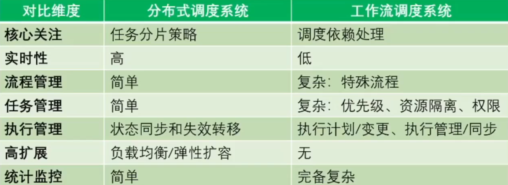

  * ELastic-job在做分布式调度和工作流调度的合并

* 分布式调度 VS 延迟消息

  * 事件驱动 VS 时间驱动
    * 事件驱动更适用延迟消息
    * 时间驱动需细分，如：涉及对外交互，选用分布式调度
  * 低实时性 VS 高实时性
    * 非精确时间执行场景适合分布式调度，如 日批，月批
    * 实时性高更适用 延迟消息
  * 批量处理 VS 单次处理
    * 批量处理堆积数据更加高效，在低实时性时比消息中间件更优优势，更适用延迟消息
    * 业务逻辑只能批量处理，只能分布式调度，如话费每月算

  

  

* 需求分析

  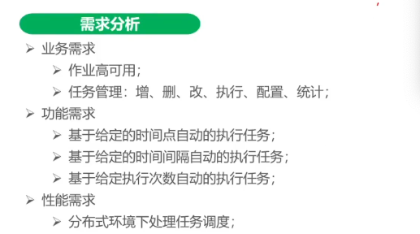

* 有两个池

  * 作业（Job）
    * 用户在指定时间执行的指定行为
    * 是元数据，要做的事情的定义
  * 任务(Task)
    * Job的执行单元，执行步骤
  * 例如
    * QQ升级，就是一个定义，一个Job
      * 0-10000号交给机器1，每个分配，每个机器的执行就是一个task
    * 数仓执行，那么数仓就是一个job
      * 执行的步骤，清洗了，汇总了就是一个task
  * 关系：
    * 简单说：Job包含多个Task，是Task的集合

* 设计目标

  * 高可用
    * 弹性伸缩
    * 分布式设计
  * 高容错
    * 自诊断修复
    * 节点故障能够转移作业

* 轻量设计架构图

  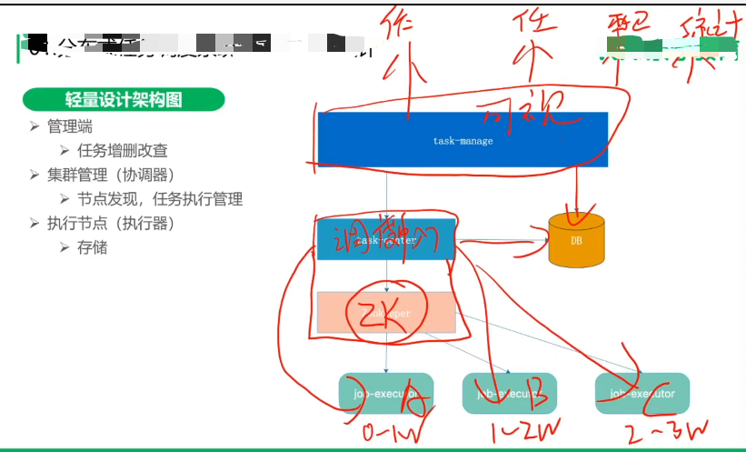

* 设计选型

  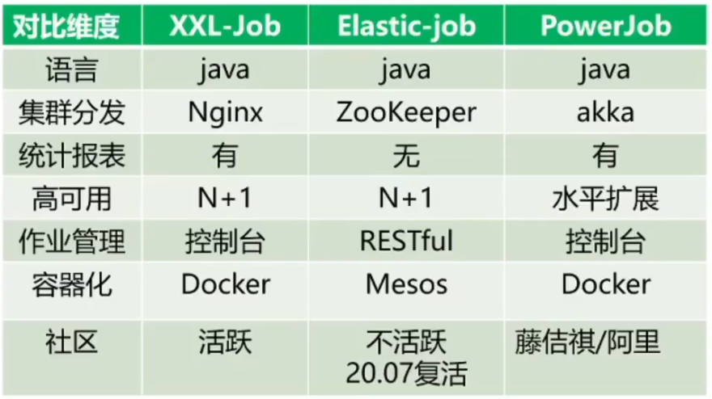

## Elastic-Job

* Elastic-Job-Lite

  ➢ 轻量级无中心化解决方案

  ​	* 没有注册中心* 

  ➢ jar包提供分布式任务的协调服务

* Elastic-Job-Cloud

​	➢ 自研Mesos Framework的解决方案

​	➢ 应用分发以及进程隔离等功能	

* 核心组件

  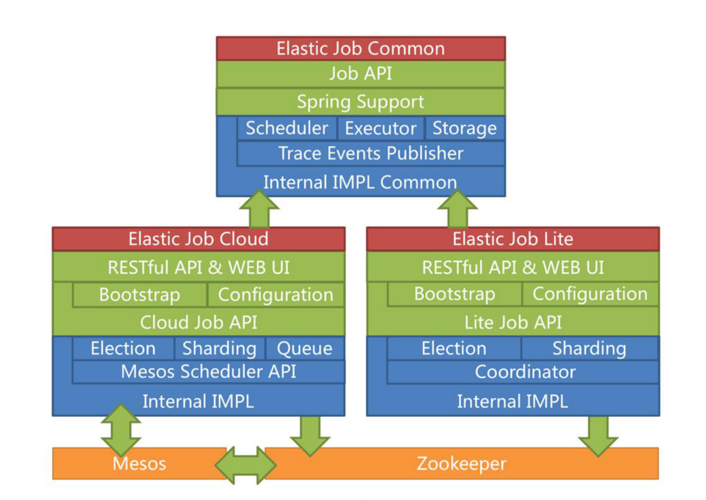

  
  * Lite中，会进行执行器的选举，监听，转移

* Elastic-Job-Lite 基本架构

  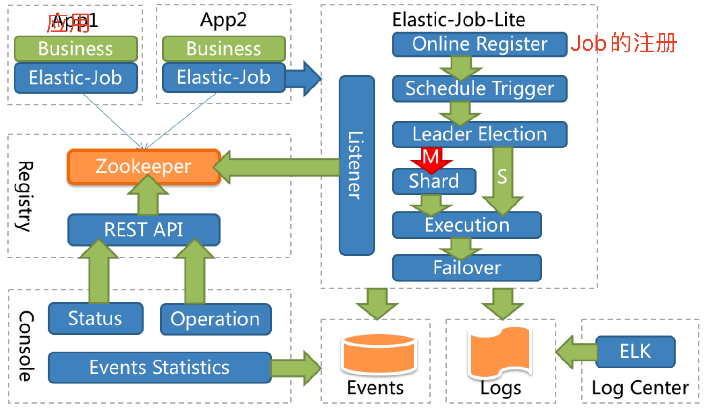

  * Online Register
    * jar启动会上报作业job，然后注册Job
  * Schedule Trigger
    * 开启一个调度任务，调度任务就会定期执行job
  * Leader Election
    * 进行选主，针对Job的执行进行选主，好比应用1和应用2都注册相同的job，那么同一时刻只有一个执行，那么久需要选择出哪个应用去执行此Job
    * 选主的流程，哪个应用先注册到ZK上，就认为选择了哪个，哪个是主
    * 主节点，会进行Shard，进行分片，好比应用1变成了主节点，那么就会shard，确定哪些分片自己负责，哪些分片，由子节点负责，并且会记录到ZK中，进行存储。
  * Execution
    * 主从节点都进入执行周期，定时去ZK拉取分片信息，分片信息定时执行任务
  * Failover
    * 失败的时候，会有一个Failover处理
  * ZK：功能，做了一个存储的功能，也做了一个选主的功能，
    * 对于应用而言：使用ZK也可以动态感知应用的状态，同时也起到存储的功能
    * 对于管理后端页面而言，使用ZK进行了存储数据的功能

* Shard抽象流程，为了避免和业务的强依赖，怎么理解呢，因为可能每个不同的业务，进行分片的时候，分片字段不一样，所以需要进行抽象，生成shard类进行处理

  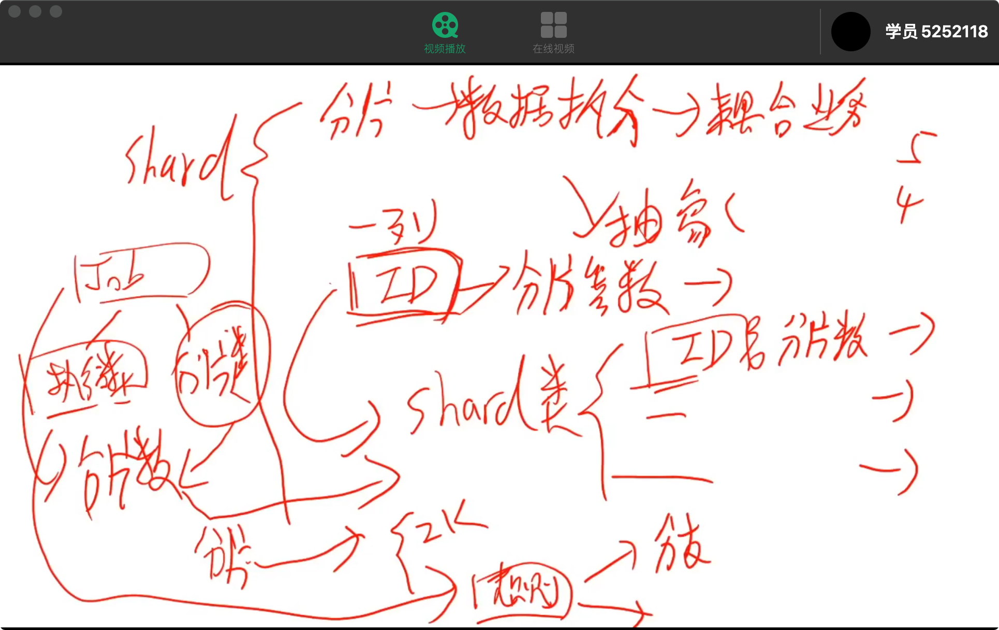

### 作业开发与部署

1. 添加依赖

   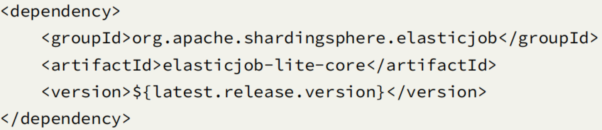

2. 编写作业

   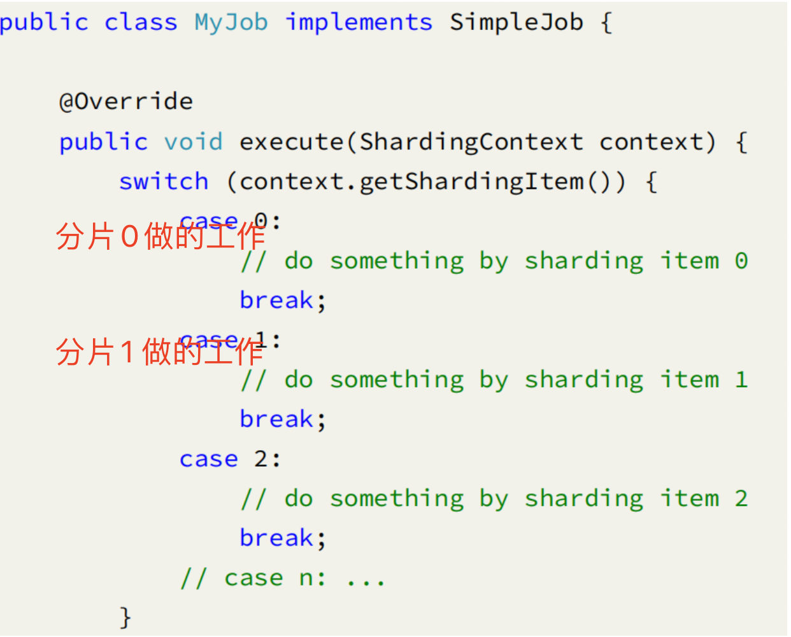

3. 作业配置

   1. 含义，配置一个Job，名称为MyJob，共有三个分片，同时，每5秒执行一次

   

4. 作业调度

   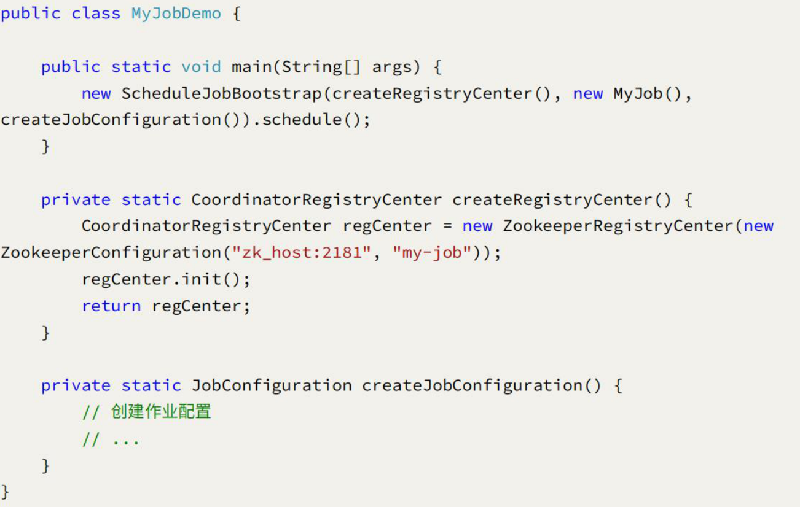

### 作业注册与分片

#### 作业注册

* 流程

  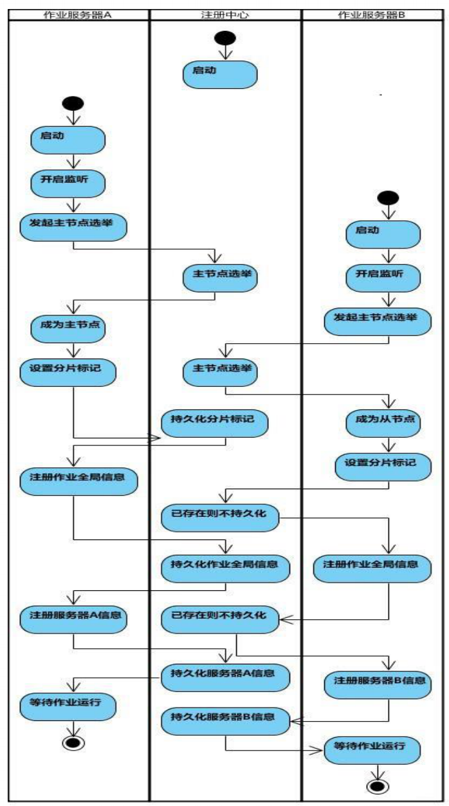

  * 主要工作
    1. 主节点的选举
    2. Job任务的全局信息存储到ZK，如果存在就不再存储
    3. 作业服务器的实例信息，全部注册到ZK上

* ZK上的数据存储设计

  1. config节点：作业配置信息，以JSON格式存储
  2. instance节点：作业运行实例信息，所有作业服务器信息
     1. 子节点是当前作业运行实例的主键（IP地址和PID构成）
     2. **作业一旦创建则不能修改作业名称，如果修改名称将视为新的作业**
  3. sharding节点：作业分片信息
     1. 子节点是分片项序号，**从零开始，至分片总数减一**
     2. 分片项序号的子节点存储详细信息：用于控制和记录分片运行状态
  4. leader节点：作业服务器主节点信息
     1. Election：主节点选举，选举的主节点编码，指向主节点
     2. Sharding：分片信息
     3. faliover：失败转移处理

