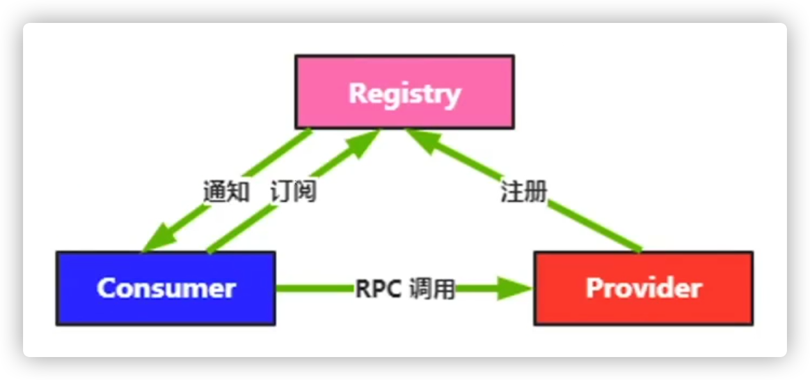
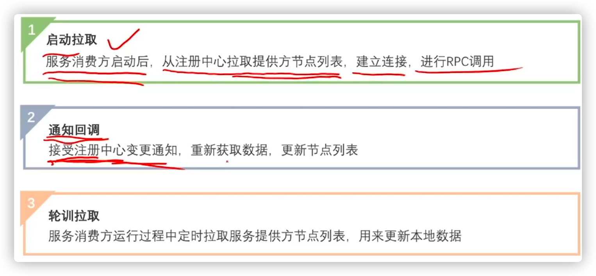
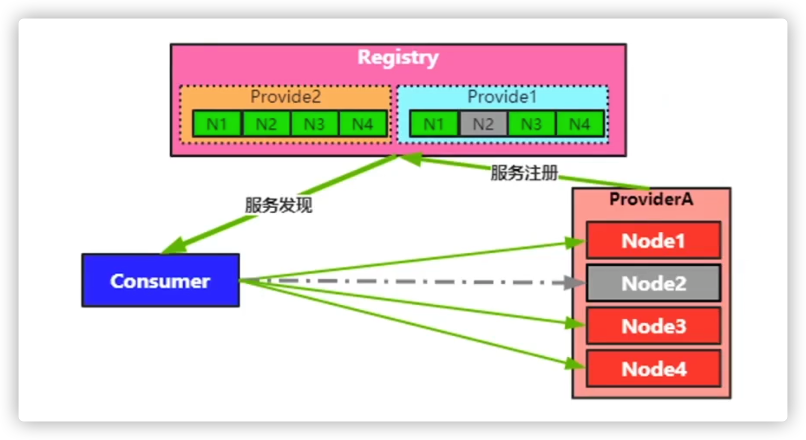
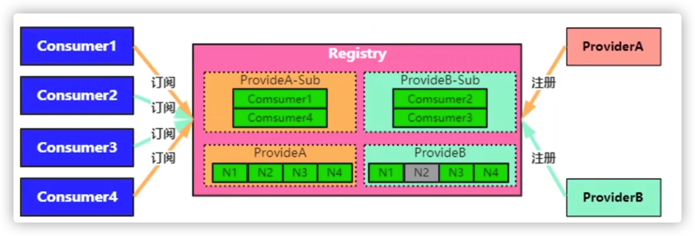

## 基本概念

* 定义：
  
  * 用来实现微服务实例的自定注册与发现，是分布式系统的核心基础服务
  
* 没有注册中心的时候，服务如何获取其他服务的信息，如果需要节点上下线，那么就得等流量没有的时候，重启服务器进行，但是呢，这种情况，根本可能性很低，所以，遇到这样的情况，需要通过注册中心来实现节点的上下线。

  * 第一个是全局配置文件
  * 第二个是模块各自维护，存在的问题呢就是如果需要新的数据的时候，那就得重启服务进行添加

* 注册中心主要功能

  

  * 服务注册
  * 服务发现
  * 健康检查
  * 变更通知

* 服务注册

  * 服务提供方将自身路由信息发布到注册中心，供消费者获取用于与提供方建立连接并发起调用

  * 可以将下面的信息注册的注册中心上

    

* 服务发现

  * 服务消费方通过访问注册中心获取服务提供方节点路由信息

  * 主要拉取的时机方式

    

    * 通知回调，一般处理方式，如果有节点上下线的操作的时候，网络中两个通知可能由于网络原因到达接收端的顺序和发布的不一样，好比，先下线然后上线，但是呢，接收是反过来的，为了避免这个问题，当发生数据变化的时候，通知接收端去拉取数据，而不是把数据推送给接收端，这样，无论是上线还是下线，配置肯定是变化了，这样接收端再去拉取就不会出现顺序问题。
    * 循环拉取，兜底策略

* 健康检查

  

  * 确保已注册节点健康度，能够及时准确剔除失效节点，保证服务发现正确性
  * 失败原因
    * 部署重启
    * 服务假死
      * 提供者正常上报心跳，提供者端心跳线程支持工作，但是提供给消费者的接口不能进行访问。
    * 异常终止
  * 解决方案
    * 上报心跳
      * 提供者定时向注册中心发送ping，告知注册中心，自己是存活的，但是，无法进行假死服务的判断，所以需要，进行高度定制
    * 服务探测
      * 注册中心的高度定制，RPC提供一个探活协议。提供者会提供一个接口，让注册中心可以进行访问，这个接口和正常的业务接口类似，只是简单的处理Ping请求，这样，虽然提供者假死了，即使心跳正常，注册中心通过访问此接口，也是可以知道服务器是否挂了。

* 变更通知

  * 当服务提供方节点发生变更时，注册中心应该能够第一时间把变更事件或变更后的数据推送到服务订阅方

    

  * 解决方案

    * 注册中心**为每个服务提供方建立订阅列表**，当服务方节点变更时通知所有订阅该服务的消费方节点
