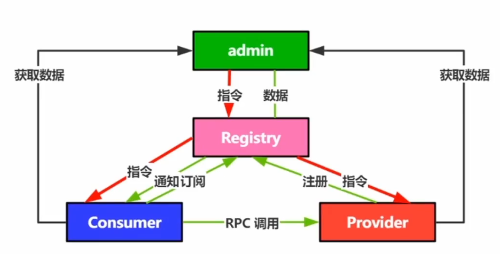

## 基本概念

* 定义：
  
  * 用来实现微服务实例的自定注册与发现，是分布式系统的核心基础服务
  
* 没有注册中心的时候，服务如何获取其他服务的信息，如果需要节点上下线，那么就得等流量没有的时候，重启服务器进行，但是呢，这种情况，根本可能性很低，所以，遇到这样的情况，需要通过注册中心来实现节点的上下线。

  * 第一个是全局配置文件
  * 第二个是模块各自维护，存在的问题呢就是如果需要新的数据的时候，那就得重启服务进行添加

* 注册中心主要功能

  

  * 服务注册
  * 服务发现
  * 健康检查
  * 变更通知

## 设计分析

* 服务注册

  * 服务提供方将自身路由信息发布到注册中心，供消费者获取用于与提供方建立连接并发起调用

  * 可以将下面的信息注册的注册中心上

    

* 服务发现

  * 服务消费方通过访问注册中心获取服务提供方节点路由信息

  * 主要拉取的时机方式

    

    * 通知回调，一般处理方式，如果有节点上下线的操作的时候，网络中两个通知可能由于网络原因到达接收端的顺序和发布的不一样，好比，先下线然后上线，但是呢，接收是反过来的，为了避免这个问题，当发生数据变化的时候，通知接收端去拉取数据，而不是把数据推送给接收端，这样，无论是上线还是下线，配置肯定是变化了，这样接收端再去拉取就不会出现顺序问题。
    * 循环拉取，兜底策略

* 健康检查

  

  * 确保已注册节点健康度，能够及时准确剔除失效节点，保证服务发现正确性
  * 失败原因
    * 部署重启
    * 服务假死
      * 提供者正常上报心跳，提供者端心跳线程支持工作，但是提供给消费者的接口不能进行访问。
    * 异常终止
  * 解决方案
    * 上报心跳
      * 提供者定时向注册中心发送ping，告知注册中心，自己是存活的，但是，无法进行假死服务的判断，所以需要，进行高度定制
    * 服务探测
      * 注册中心的高度定制，RPC提供一个探活协议。提供者会提供一个接口，让注册中心可以进行访问，这个接口和正常的业务接口类似，只是简单的处理Ping请求，这样，虽然提供者假死了，即使心跳正常，注册中心通过访问此接口，也是可以知道服务器是否挂了。

* 变更通知

  * 当服务提供方节点发生变更时，注册中心应该能够第一时间把变更事件或变更后的数据推送到服务订阅方

    

  * 解决方案

    * 注册中心**为每个服务提供方建立订阅列表**，当服务方节点变更时通知所有订阅该服务的消费方节点

* 注册中心存储设计

  * 数据组织，可能存在两种方式，用来解释，提供者在注册中心是按照什么维度进行存储的

    * 第一种：集群维度来存储，意思是按照一个集群，来存储提供者节点

      * 使用此模式，因为如果节点变化了，新增或者删除，但是集群对外而言肯定是不变的，肯定是按照集群维度来进行存储的，规避了集群内部集群节点的变化，存储的方式就是，对外表现PA集群，但是内部还是四个提供者节点

        

    * 第二种，节点维度，那么就是一系列节点的列表，那么如何去寻找，某个集群的节点呢，显然是不合适的

    

  * 订阅数据组织

    * 两种方式

      * 第一种，节点方式，一个消费者订阅一个节点，在订阅列表List中加入一条数据

        

        * 初步看是没有问题的，可以通过订阅列表来找到提供者，但是如果一个服务提供者下线了，没有很方便的手段，可以通过下线的提供者，找到所有的订阅列表然后删除关系，只能遍历所有的消费者的订阅数据，然后判断如果订阅了，然后进行删除，所以此方法显然是不合适的

          

      * 第二种方式，集群的方式，ProviderB谁订阅了，显然有C1和C2，如果下线的话是可以直接同步到数据，但是这个方式显然也有一个问题，消费者如何知道自己订阅了哪个呢，不能每个都遍历吧，no ,no ,no ，这个方式就是上面的数据组织，其内部也维护了消费者与集群之间的关系，这样通过集群就可以知道了，如果一个节点下线，可以通过订阅数据来找到哪些消费者需要通知，然后再找数据组织，删除关系即可。

        

         * **问题：那么节点方式是否也需要**
           	* 需要的，虽然PB，里面存储的是C1和C2，但实际上还是C1和C2集群的节点，如果C2 有节点上线或者下线，是不是也需要通知PB和PC进行跟新节点数据，这样当PB修改时，可以通知到新的节点，所以就是两个方向，都是需要的，只要存在需求，就需要

* 超时扫描，不太适合注册中心，IM系统里面

  * 解释

    

     * 存在两个三个部分
       	* 指向绿色数组的指针，每一秒移动一个位置（此处可能有疑问），每隔一秒移动一个位置
          	* 绿色的数组，每个元素是一个桶，后面是一个链表，表示什么时候超时
       	* 黄色的是，通过计算之前，按照超时时间形成的链表
    * 过程
      * 一个服务节点，创建的时候，通过当前时间 和超时间隔，计算出超时时间expireTime
        * 通过  expireTime % BUCKET_SIZE 计算出自己处于哪个桶中，先加入桶中，同时返回节点，当前的超时时间
      * 等到下次此服务心跳的时候，服务会上报上一次的超时时间，oldexpireTime，还有根据当前时间计算出的下一次超时时间 newexpireTime，这样服务端收到心跳后，会先，根据
        * oldexpireTime % BUCKET_TIME计算出，当前节点位于哪个桶中，先删除掉
        * 然后，通过newexpireTime % BUCKET_TIME 计算出新桶，将此节点加入到
      * 每当 指针指向某个桶，就认为此桶后面所有的服务都是超时的，不用去判断里面的超时时间，加速效率，而正常心跳的节点，会在每次心跳之后更新自己的位置，所以，只要正常就不会被指针指向，所以，是动态变化的

* 节点变更通知

  * 前提
    * 假设注册中心是由五个节点组成，五个节点之前存在连接，C是服务调用方，P是服务提供方，红色的P下线了，现在要通知给其他红色的C，但是目前只有一个C是处于同一个注册中心节点上，如何通知给其他节点呢？
  
      
  
      * 将P下线广播给其他节点所有节点，如果存在订阅的C，那么就去执行通知事件
  
  * gossip协议
  
    * 散播流程
  
      * 第一个周期，随机散播两个节点
  
        
  
      * 第二个周期，新散播的节点继续散播
  
        
  
      * 第三个通知，新的节点继续通知
  
        ​      	  
  
    * 理论
  
      * 六度分离理论
      * 周期性散播消息
      * 随机选择N个节点散播
      * 散播不重复不回传
        * 不重复，一个节点通知其他节点只会通知一次
        * 不回传，1通知了2，2不会通知1

## 注册中心本质和设计思考

* 抛开应用，只从实现功能角度看，注册中心是 **订阅+存储**

* 存储系统主要关注点

  

  * 数据可靠性
    * 数据冗余存储，确保不会因为单节点故障导致数据丢失
  * 数据一致性（存储多份的问题）
    * 各节点间数据同步，保证数据一致性
  * 服务可用性
    * 多节点对等的对外提供服务

* CAP定理

  

* 注册中心，遵循AP最好，CP也是可以的。

* 注册中心选型

  

## Nacos注册中心深入分析

* 功能分析
  * 服务注册和健康检查
  * 数据模型
  * 数据一致性保障

### 健康检查

* 两类节点

  * 临时节点：心跳注册

  * 持久化节点：tcp/http探测

    

* 临时实例使用心跳上报方式维持活性，策略为

  * 5秒上报
  * 15秒标记不健康
  * 30秒剔除

### 数据模型

#### 数据存储

* 一般数据存储格式：一个服务，部署在多个实例上

  

  

* nacos数据存储：一个集群包含多个实例，每个实例又提供不同的服务，同时这样，通过不同的cluster可以做到资源的隔离，一部分访问左边的集群，一部分访问右边的集群。

  

#### 数据隔离

* 在Service上面分了四层

  * User：账号
  * NameSpace：对下面的nacos集群进行了屏蔽，用户只知道那个命名空间，而NameSpace是知道对应的那个集群
  * Group：对服务又进行了分组，最后是Service

  

#### 数据一致性保障

* Nacos使用Distro AP 一致性算法来保证一致性问题

* 原理：

  

  * Nacos集群由三个节点组成
  * 每个节点负责不同的服务注册信息，红色为自己负责的
  * 对于Naocs1而言负责Node1 Node2的写入，以及其他节点信息的读取
  * 如果一个服务把Node1的信息修改提交给了Nacos2，那么就会路由到真正的执行节点Node1
  * Node1执行结束后，会向Nocos2和Nocos3进行广播，通知他们Node1节点信息变更请修改

* 问题

  * 出现数据不一致如何解决
    * 多广播几次就好了，好比客户端心跳发送数据给Nocos2，发现Nocos1处理，但是发送过程中挂了，因为客户端会5秒一次上传心跳，包括自己信息，那么久会不断的请求Nacos1，只要复活了，就会再次广播，达到最终的一致性
  * 服务端节点宕机
    * nacos2挂了，起不起来了，那么nacos1和nacos3就会针对节点数据进行重新分配，因为每个节点都是全量的数据，只需要判断哪些节点自己数据，自己都是具有全部信息的
  * 集群网络分区
    * 五个服务节点，然后一个是2个节点在一个网络区域，另外三个在其他网络区域，如果保证两个区域的数据都是全量的呢，还是客户端进行心跳的时候，随机心跳，这样有可能会落到第一个分区，有可能落到第二个分区，这样两个分区的数据就是全量的数据

## Zookeepr实现深入剖析

* 核心模块
  * 选主逻辑
  * 数据一致性保证
  * 数据模型
* 原理
  * 服务注册：创建临时节点
  * 服务发现：查询Node节点数据
  * 健康检查：临时节点
  * 信息订阅：Watch机制
* 服务注册
  * ZK顺序一致性，不保证读到最新数据
  * 选举过程中不可用
* 服务发现
  * ZK顺序一致性，不保证读到最新数据
  * 选举过程中不可用

### 选主逻辑

* 节点角色：server节点组成的一个集群，在集群中存在一个唯一的leader节点负责响应写入请求，其他节点只负责接收转发client请求
  * Leader：响应写入请求，发起提案，超过半数Follower同意写入，写入成功
  * Follower：响应查询，将写入请求发给Leader，参与选举和写入投票
  * ObServer：响应查询，将写入请求发给Leader，不参与投票，只接受写入结果

* 选主逻辑

  * 投票
    * 主节点：获得法定数量票数最多的节点，一半以上

  * 判断依据

    * Epoch：leader的任期
    * ZXID：Zookeeper事务ID，越大表示数据越新
    * SID：集群中每个节点的唯一编号

  * 比较策略

    * 任期大的胜出
    * 任期相同的
      * ZXID大的胜出
      * ZXID相同的
        * SID大的胜出

  * 流程图

    

    * 节点进入Looking状态
    * 广播发起投票
    * 选出最大发起二次投票
    * 超过半数成为主

### 数据一致性

* Zab协议 Zookeeper Atomic Broadcast

* Leader负责处理写入请求

* 两阶段提交

* 原理图

  

  * 客户端写入数据，到达Leader
  * Leader会发起一个提案，将信息和提案，全部发给所有Follower节点。但是此时数据并没有写入到Follower的磁盘中。只是写到内存中
  * 如果Follower有半数同意写入数据。发送commit给所有Follower，准许写入，写入生效，对于Observer此时会让其进行写入

* ZAB协议保证的是最终一致性，不是强一致性或者说是顺序一致性，写入1，2，3，真正写到磁盘中也是1，2，3不会出现2，3，1这样的情况。而这个顺序一致性，是通过连续的ZXID保证的。同一个任命期，事务计数器是连续的。而且因为创建这个提案是主节点创建，那肯定是连续递增的。

  

### 数据模型

* 数据存储：树状存储结构
  * 永久节点
  * 临时节点

#### DataNode

* ZK中存储的最小单元，是持久化数据节点描述的最小单位
* DataNode属性
  * DataNode parent：父节点的引用
  * Byte data[]：该节点存储数据
  * Long acl：访问控制权限
  * StatPersisted stat：持久化节点状态
  * Set<String.> children：子节点列表，只包含一级，需要层层路径才可以找到节点
  * 这个内部可以获取到直接的上级父节点，对于子节点而言，需要依赖树结构中的nodes，通过路径获取对应的节点信息。此处没有将所有的几点信息加入其中。而是路径，可以认为是节省空间，因为子节点很多，而父节点呢，就只有一个，所以，可以将父节点的具体信息加入其中。个人理解

#### DataTree

* DataTree
  * ConcurrentHashMap<String,DataNode> nodes; key是path，value是找到的节点，存储着路径下对应的所有树节点信息。具体信息可以获取到内部的DataNode节点，
  * WatchManager dataWatchs：数据变更通知
  * WatchManager childWatchs：节点变更通知
  * String rootZookeeper：根节点
  * Map<Long,HashSet<String,>> ephemerals：临时节点信息，注册的时候都是使用的临时节点
    * key是session，value是path的集合，通过此结构可以知道如果session连接断了，就可以找到注册了这个session的哪些路径数据，提供方session在注册中心由哪些路径节点和他有关系
  * HashMap<String,HashSet<Watcher.>> watchTable：即使没有了session，也可以通过路径找到watcher结婚
    * 路径对应的一堆watcher，path对应的节点，都有哪些consumer对应了这个节点，也就是通过上面的map ，找到提供方对应哪些路径，通过该map可以得知哪些消费方订阅了提供方，这样session一段，就可以通知这些消费方了，Provider和Consumer的关系
  * HashMap<Watcher,HashSet<String,>> watch2Paths：通过watcher也可以找到对应的path路劲
    * 可以通过watcer，Consumer下线了，可以通过这个watch找到订阅了哪些provider的路径地址。set就是提供者的路径地址。进而更新上面的watchTable，将提供方上的consumer删除掉。Consumer和provider的关系
    * 通过 watchTable  watch2Paths可以做订阅通知的事情。

#### ZKDataBase

* 负责管理zookeeper的数据，会话信息和事务日志
* 成员
  * DataTree dataTree
  * ConcurrentHashMap<Long,Interger> sessionsWithTimeouts：客户端会话连接管理
  * FileTxnSnapLog snapLog：事务日志
* 核心原理
  * 服务注册：创建临时节点
  * 服务发现：查询Node节点数据
  * 健康检查：临时节点
  * 信息订阅：Watch机制

## Zookeeper注册中心应用

### Dubbo使用

* 结构图

  

  * 消费方，订阅的是providers，只要providers下面有子节点变更，就会收到通知
  * 监控：订阅的是service这一级，比消费方更高一级，**问题：monitor是如何知道有哪些service服务的**

### 服务注册

* 类图

  

* dubbo注册到ZK的数据

  

### 服务订阅

* 类图

  

* 源码

#### 变更通知

* RegisterDirectory#notify -> refreshOverrideAndInvoker

  

  * refreshOverrideAndInvoker 覆盖节点变更节点

  

  

  #### 节点订阅

* RegistryDirectory#refer -> doRefer ->  subscribe ->FailbackRegistry # subscribe

  

  * 最后的逻辑
    * 先删除【removeFailedSubscribed】订阅的重试
    * 执行 真正订阅方法 doSubscribe
    * 如果执行失败了，将此次的订阅任务变成后台异步的重试任务执行

* ZookeeperRegistry#doSubscribe

  

  * 接口名为* 订阅所有服务，就是monitor的逻辑。需要订阅到root那一层
  * zkListeners是什么
    * key 是一个URL，可以认为是path
    * Value 呢，代表的是一个监听器，以及ChildListener,通过查看childListner发现是节点变更处理的方法
      * 所以，value是监听器以及监听器处理方法
    * 同时说明了一个url，存在多个监听器进行监听，所以是一个双层的map
  * 如果listeners==null，表示没有消费者订阅，创建一个订阅Map集合
  * 如果zkListener，晋挺器为空，绑定订阅的Listener，绑定处理方法，然后遍历所有的服务，然后遍历订阅

  

  * dubbo下面所有的service全部订阅

* 服务调用方订阅提供方，还是上面的方法，只是if不同

  

  * 先通过路径获取提供方，如果发现没有，则创建一个路径已经对应的监听器，如果从来没有进行过监听，这创建一个Map，同时将监听器，注册上去，同时，在发生变化的时候，执行ZookeeperRegister.this.notify方法
  * 最后是拿到当前节点下面所有的数据，notify相当于刚启动的时候，第一次订阅

### 注册中心和服务治理

* 原理图

  

  * 管理端，连接注册中心，下发指令，然后通过注册中心，下发指令给消费端和提供短

* 服务治理下发通道

  * 动态权重
  * 流量路由
  * 服务熔断降级
  * 权限管理
  * 动态过载保护策略
  * AB测试

#### 灰度发布

* 原理图

  

* 管理端修改灰度节点权重

  * 通过注册中心变更配置，消费者获取变化数据，然后通过百分比进行路由，最后，如果没问题，全量发布

* 核心流程

  * 降低权重
  * 发布服务
  * 观察业务
  * 全量发布

#### 服务熔断

* 定义：

  * 当某个服务提供方异常不可用，或实际情况需要暂停掉其他业务，有损提供服务，可以通过注册中心下发熔断指令

* 原理图

  

* 流程

  * admin下发指令，到注册中心，注册中心配置变更
  * 消费端收到变更通知，然后再选择提供者的时候，不对熔断的服务进行访问

### 实现思考

* 注册中心，如果简单而言，就需要思考
  1. 自带存储
     1. 市面上的ZK或者nacos都是自己实现的存储，没有使用外面的redis等等
  2. 集群部署，保障高可用
  3. 集群部署，那么就**需要考虑数据一致性问题，数据同步问题，要么是ZAB，要么是Raft**，需要一致性算法来进行数据同步
* 需要上面这么复杂吗
  * 难道不是上面的
    * 一个是，数组存储，做几个链表，存储关系
    * 一个是，长连接进行通知，数据和fd的关系映射好，加个超时不就可以了
  * 逻辑+配套存储
    * 存储呢
      * 使用redis或者其他
    * 逻辑呢
      * 注册
        * 数据填进去存储
      * 发现
        * 简单使用查询的方式，进行发现
      * 通知，最复杂的地方
        * 发现哪个节点断了，就去变更列表，通知到需要变更的服务
* 为何市面上没有按照，逻辑+配置存储来设计呢？？？
  * 注册中心，作为一个核心的组件，依赖于外部的redis或者mysql，那么必然不伦不类，注册中心的稳定性还依赖外部组件的稳定性
  * 注册中心，作为一个独立的系统，就需要保证数据存储，保证数据一致性
  * 但是自己实现的话，是可以使用的

