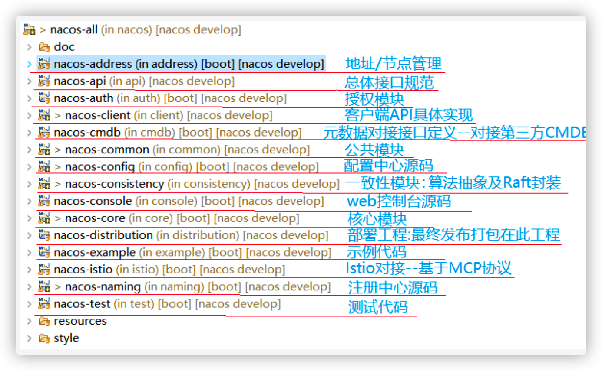
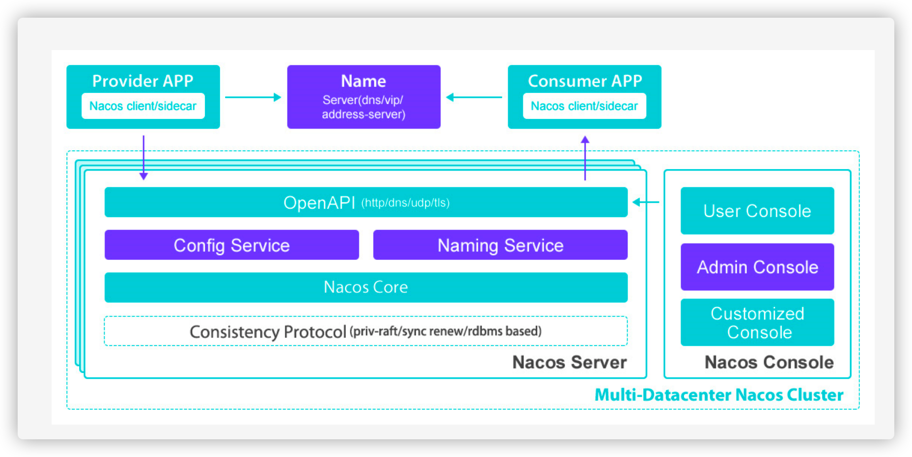
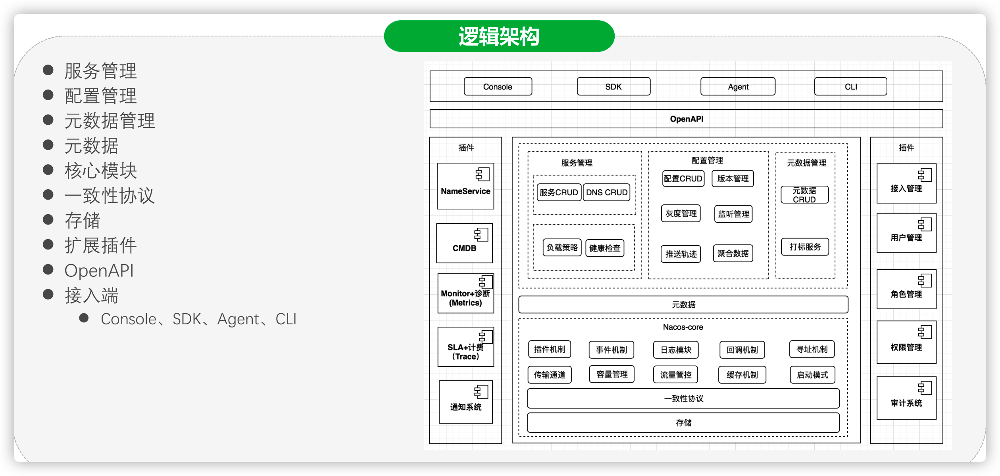

## 基础

1. 定义
   1. 一个更易于构建云原始应用的**动态服务发现、配置管理和服务管理平台**
      1. 注册中心
      2. 配置中心

2. Nacos包结构

   

3. 架构图

   

4. 逻辑架构图

   

### 需求至简抽象分析思维模型

**TODO**

## 补充

### 一致性问题

原文地址：https://zhuanlan.zhihu.com/p/193802636

* 定义
  * 简单理解就是不同端，对于同一份数据存储的数据在任何时刻都是一样的e
* 典型的一致性问题
  * 下单和减库存的一致性
    * 下单减库存有一致性的需求，如果下单了但是没有减库存造成的结果是超卖，
    * 如果减库存了但是下单失败会导致少卖
  * 缓存和数据库的数据库一致性
    * 电商系统一般会将热点数据缓存来减少数据库的访问压力，这要求缓存和数据库数据是一致的
    * 如果数据库数据发生变更但同步到缓存失败，这时就产生了缓存和数据库数据的不一致问题
  * 两系统协调一致性
    * 上面两个都可以归结为此案例，系统是上下游的关系，由于超时等原因可能导致两系统的数据的状态不对。

