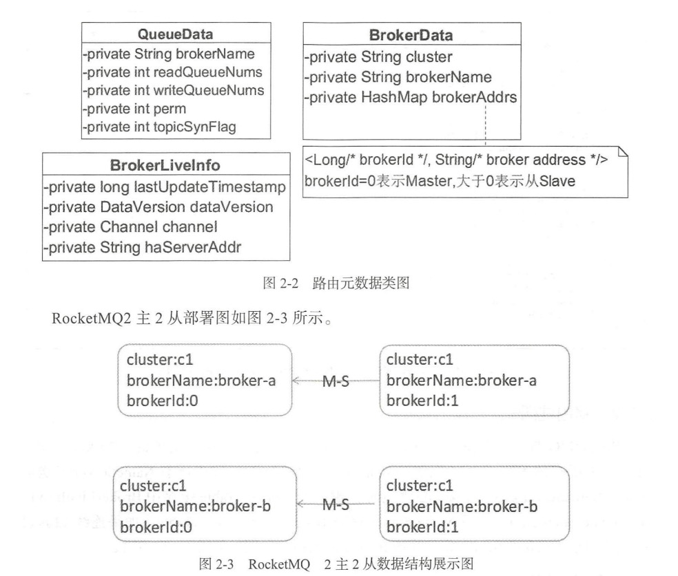

## 探索点

* 作用：
  * 分布式服务SOA的注册中心主要提供服务调用的解析服务，指引服务调用方法（消费方）找到远处的服务提供者
  
    * Provider信息注册
    * Consumer信息获取
    * Broker集群的部署信息
  
    
  
* 问题
  * 问题一：存储什么数据？
    * 存储着Topic和Broker的关联信息，具体是不是呢？
    
  * 问题二：如果避免单点故障，提高高可用？？？
    * 相当于热备，部署多个互不通讯的NameServer，多个节点部署保证高可用
    
  * **<font color='blue'>问题三：Broker是如何向NameServer注册信息的？？？</font>**
  
    * **每个Broker都会向每个NameServer进行服务注册**，由于Broker是通过心跳机制，建立连接的，所以，即使是某个NameSrv不可用，在下次心跳的时候还是会把信息传递上去
  
  * **<font color='blue'>问题四：系统是如何从NameServer获取消息的</font>**
  
    * 客户端主动拉取信息
  
  * **<font color='blue'>问题五：Broker宕机了，NameServer是如何感知到的？</font>**
  
    * Broker会每隔**30s**向每一个NameServer发送心跳请求，证明自己还活着。而NameServer再接收到心跳请求后，就会记录下这台Broker发送心跳请求的时间。
    * 然后，NameServer自己每**10s**会扫描一次所有Broker留下的心跳请求时间，如果发现哪台Broker留下来的心跳请求时间距离当前时间超过**120s**了，那么就会断定这台Broker已经挂掉了，就会更新自己的Broker列表信息。
  
  * **<font color='blue'>问题六：系统是如何感知到Broker宕机的？</font>**
  
    * 刚才我们知道了Broker宕机后，NameServer是可以感知到的，但生产者和消费者系统如果不能感知到宕机的信息，问题还是不能解决的，那么系统是如何感知到Broker宕机的呢？难道只要有Broker宕机了，NameServer就要主动发送消息给各个系统吗？
  
      这是不靠谱的，就算是NameServer主动发送消息给所有系统，也无法解决问题。
  
      我们想一下，如果这时候Broker宕机了，但是同时生产者已经把消息发出来给这台宕机的Broker了，而这个时候NameServer经过心跳检测刚刚感知到这个情况，再去主动发送给这个生产者，这样当然不能解决问题，报错已经发生了。
  
      再想一下，NameServer就算是不主动发送消息给生产者，上边我们已经了解每个系统间隔一段时间就会主动向NameServer拉取信息了，所以NameServer主动发送消息既不能保证实时性，又是一个多此一举的过程。
  
      
  
      那么实际解决方案是什么呢？**<font color='red'>交给生产者来自己解决</font>**


## 知识点


## 特征

* NameServer 每30秒，检测一次 Broker 是否存活，如果检测到 Broker 宕机，则从路由表中将其移除；这是为了降低 NameServer 实现的复杂性，**<font color='red'>在消息发送端提供容错机制保证消息发送的高可用性</font>**。

* NameServer 本身的高可用可**<font color='red'>通过部署多台 NameServer 服务器来实现，NameServer 服务器之间互不通信</font>**，也就是 NameServer 服务器之间在某一时刻的数据并不会完全相同，这对消息发送不会造成任何影响，这是 NameServer 设计的一个亮点，NameServer 设计追求简单高效。

  


## NameServer结构

* 整个NameServer的核心就是一个**<font color='red'>NamesrvController对象</font>**。这个controller对象就跟java Web开发中的Controller功能类似，都是响应客户端请求的。
* 在创建NamesrvController对象时，有两个关键的配置文件
  * NamesrvConfig这个是NameServer自己运行需要的配置信息
  * NettyServerConfig包含Netty服务端的配置参数，固定的占用了9876端口。比较有意思的是这个9876端口并没有提供覆盖的方法
* 然后在启动服务时，启动了一个RemotingServer。这个就是用来响应请求的。
* 在关闭服务时，关闭了四个东西
  * remotingServer，响应请求的服务；
  * remotingExecutor Netty服务线程池; 
  * scheduledExecutorService 定时任务;
  * fileWatchService 这个是用来跟踪acl配置的(acl的配置文件是实时热加载的)。


## 启动流程 

### 时序图


### 步骤

1. 解析命令行参数
2. 解析配置文件
3. 创建NamesrvConfig、NettyServerConfig配置对象
4. 创建NameServerController的NameServer控制器
5. 启动控制器
6. **<font color='red'>注册系统shutDown钩子，释放系统资源</font>**


#### 具体源码

##### NamesrvStartup

1. NamesrvStartup.main

   ```java
   public static void main(String[] args) {
     main0(args);
   }
   
   public static NamesrvController main0(String[] args) {
   
     try {
   
       //解析配置文件，创建填充NameServerConfig,NettyServerConfig属性值
       NamesrvController controller =     public static void main(String[] args) {
           main0(args);
       }
   
       public static NamesrvController main0(String[] args) {
   
           try {
   
               //解析配置文件，创建填充NameServerConfig,NettyServerConfig属性值
               NamesrvController controller = createNamesrvController(args);
               start(controller);
               String tip = "The Name Server boot success. serializeType=" + RemotingCommand.getSerializeTypeConfigInThisServer();
               log.info(tip);
               System.out.printf("%s%n", tip);
               return controller;
           } catch (Throwable e) {
               e.printStackTrace();
               System.exit(-1);
           }
   
           return null;
       }(args);
       start(controller);
       String tip = "The Name Server boot success. serializeType=" + RemotingCommand.getSerializeTypeConfigInThisServer();
       log.info(tip);
       System.out.printf("%s%n", tip);
       return controller;
     } catch (Throwable e) {
       e.printStackTrace();
       System.exit(-1);
     }
   
     return null;
   }
   ```

2. createNamesrvController

   ```java
   public static NamesrvController createNamesrvController(String[] args) throws IOException, JoranException {
     System.setProperty(RemotingCommand.REMOTING_VERSION_KEY, Integer.toString(MQVersion.CURRENT_VERSION));
     //PackageConflictDetect.detectFastjson();
   
     Options options = ServerUtil.buildCommandlineOptions(new Options());
     commandLine = ServerUtil.parseCmdLine("mqnamesrv", args, buildCommandlineOptions(options), new PosixParser());
     if (null == commandLine) {
       System.exit(-1);
       return null;
     }
   
   
     //1. 创建NamesrvConfig配置文件
     final NamesrvConfig namesrvConfig = new NamesrvConfig();
     final NettyServerConfig nettyServerConfig = new NettyServerConfig();
     //1.2 绑定端口
     nettyServerConfig.setListenPort(9876);
   
     //配置文件的目录地址
     if (commandLine.hasOption('c')) {
       String file = commandLine.getOptionValue('c');
       if (file != null) {
         InputStream in = new BufferedInputStream(new FileInputStream(file));
         properties = new Properties();
         properties.load(in);
         
         //命令行语句对象化
         //此工具类，将namesrvConfig中的基本类型，使用properties进行注入
         MixAll.properties2Object(properties, namesrvConfig);
         MixAll.properties2Object(properties, nettyServerConfig);
   
         namesrvConfig.setConfigStorePath(file);
   
         System.out.printf("load config properties file OK, %s%n", file);
         in.close();
       }
     }
   
     if (commandLine.hasOption('p')) {
       InternalLogger console = InternalLoggerFactory.getLogger(LoggerName.NAMESRV_CONSOLE_NAME);
       MixAll.printObjectProperties(console, namesrvConfig);
       MixAll.printObjectProperties(console, nettyServerConfig);
       System.exit(0);
     }
   
     //命令行属性，对象化
     MixAll.properties2Object(ServerUtil.commandLine2Properties(commandLine), namesrvConfig);
   
     if (null == namesrvConfig.getRocketmqHome()) {
       System.out.printf("Please set the %s variable in your environment to match the location of the RocketMQ installation%n", MixAll.ROCKETMQ_HOME_ENV);
       System.exit(-2);
     }
   
     LoggerContext lc = (LoggerContext) LoggerFactory.getILoggerFactory();
     JoranConfigurator configurator = new JoranConfigurator();
     configurator.setContext(lc);
     lc.reset();
     configurator.doConfigure(namesrvConfig.getRocketmqHome() + "/conf/logback_namesrv.xml");
   
     log = InternalLoggerFactory.getLogger(LoggerName.NAMESRV_LOGGER_NAME);
     //打印配置属性
     MixAll.printObjectProperties(log, namesrvConfig);
     MixAll.printObjectProperties(log, nettyServerConfig);
   
     final NamesrvController controller = new NamesrvController(namesrvConfig, nettyServerConfig);
   
     
     // 注册配置文件和命令行配置和默认配置，注册到所有属性的配置文件中
     controller.getConfiguration().registerConfig(properties);
   
     return controller;
   }
   ```

3. start()

   ```java
   public static NamesrvController start(final NamesrvController controller) throws Exception {
   
     if (null == controller) {
       throw new IllegalArgumentException("NamesrvController is null");
     }
   
   
     //1. NameSrvController初始化
     boolean initResult = controller.initialize();
     if (!initResult) {
       controller.shutdown();
       System.exit(-3);
     }
   
     //2. 注册JVM钩子函数
     //优点：如果代码中使用了线程池，一种优雅停机的方式是注册一个JVM钩子函数，在JVM进程关闭之前，先将线程池关闭，及时释放资源
     Runtime.getRuntime().addShutdownHook(new ShutdownHookThread(log, new Callable<Void>() {
       @Override
       public Void call() throws Exception {
         controller.shutdown();
         return null;
       }
     }));
   
     //NameServer真正启动
     controller.start();
   
     return controller;
   }
   
   ```

##### NamesrvController

* Initialize()

  ```java
  public boolean initialize() {
  
    //1. 加载KV配置
    this.kvConfigManager.load();
  
    //2. 创建Netty网络处理对象
    this.remotingServer = new NettyRemotingServer(this.nettyServerConfig, this.brokerHousekeepingService);
  
    this.remotingExecutor =
      Executors.newFixedThreadPool(nettyServerConfig.getServerWorkerThreads(), new ThreadFactoryImpl("RemotingExecutorThread_"));
  
    this.registerProcessor();
  
  
    //3. 开启定时任务，每隔10s扫描一个Broker，移除处于不激活状态的broker
    this.scheduledExecutorService.scheduleAtFixedRate(new Runnable() {
  
      @Override
      public void run() {
        NamesrvController.this.routeInfoManager.scanNotActiveBroker();
      }
    }, 5, 10, TimeUnit.SECONDS);
  
  
    //4. 开启单线程的定时任务，每隔10分钟打印一次KV配置
    this.scheduledExecutorService.scheduleAtFixedRate(new Runnable() {
  
      @Override
      public void run() {
        NamesrvController.this.kvConfigManager.printAllPeriodically();
      }
    }, 1, 10, TimeUnit.MINUTES);
  
    if (TlsSystemConfig.tlsMode != TlsMode.DISABLED) {
      // Register a listener to reload SslContext
      try {
        fileWatchService = new FileWatchService(
          new String[] {
            TlsSystemConfig.tlsServerCertPath,
            TlsSystemConfig.tlsServerKeyPath,
            TlsSystemConfig.tlsServerTrustCertPath
          },
          new FileWatchService.Listener() {
            boolean certChanged, keyChanged = false;
            @Override
            public void onChanged(String path) {
              if (path.equals(TlsSystemConfig.tlsServerTrustCertPath)) {
                log.info("The trust certificate changed, reload the ssl context");
                reloadServerSslContext();
              }
              if (path.equals(TlsSystemConfig.tlsServerCertPath)) {
                certChanged = true;
              }
              if (path.equals(TlsSystemConfig.tlsServerKeyPath)) {
                keyChanged = true;
              }
              if (certChanged && keyChanged) {
                log.info("The certificate and private key changed, reload the ssl context");
                certChanged = keyChanged = false;
                reloadServerSslContext();
              }
            }
            private void reloadServerSslContext() {
              ((NettyRemotingServer) remotingServer).loadSslContext();
            }
          });
      } catch (Exception e) {
        log.warn("FileWatchService created error, can't load the certificate dynamically");
      }
    }
  
    return true;
  }
  ```

* start()

  ```java
  public void start() throws Exception {
    //netty服务端的启动
    this.remotingServer.start();
  
    if (this.fileWatchService != null) {
      this.fileWatchService.start();
    }
  }
  ```

### 总结

* 可以学习到的点
  * 理解启动流程
  * 开发技巧：将启动的配置做成一个对象，包括NameSrvConfig和NettyConfig，当使用的时候直接获取，先通过配置文件解析，转换成property然后赋值给config
  * 工具类
  * JVM的钩子函数，特别是线程池，当JVM停止时使用钩子函数来进行shutdown
  * 通过JDK最基本的定时任务进行Broker和KV打印的定时任务
* 问题点
  * 没有解决broker宕机之后的高可用


## NameServer路由

### 路由元数据

* 主要保存与Broker有直接关系和间接关系的数据，方便Producer和Consumer获取这些信息

* 源码

  ```java
  public class RouteInfoManager {
     
      /**
       * 此处注意点：
       *  brokerAddrTable中是不包含，心跳检测的结果的
       *  brokerLiveTable中才包含了心跳检测的结果，因为基础信息时各个broker上报的，而健康检查是NameServer去定时任务检查出来的
       * 工作：
       *  工作中，也涉及到健康检查的数据，但是因为健康检查的状态保存在了服务节点的基础信息中，导致，需要重新覆盖基础信息，那么结果就是
       *  如果健康检查是老数据，当健康检查完毕后回写数据的时候，实际上节点信息已经修改，导致修改的被心跳检测的老数据覆盖。更新无效
       */
  
      //消息队列路由信息，消息发送时更具路由表进行负载均衡
      private final HashMap<String/* topic */, List<QueueData>> topicQueueTable;
  
      //Broker基础信息，包含brokerName,所属集群名称，主备Broker地址
      private final HashMap<String/* brokerName */, BrokerData> brokerAddrTable;
  
      //Broker集群信息，存储着集群中所有Broker名称
      private final HashMap<String/* clusterName */, Set<String/* brokerName */>> clusterAddrTable;
  
      //Broker状态信息。NameServer每次收到心跳包时会替换该消息
      private final HashMap<String/* brokerAddr */, BrokerLiveInfo> brokerLiveTable;
  
      //Broker 上的 FilterServer 列表，用于类模式消息滤
      private final HashMap<String/* brokerAddr */, List<String>/* Filter Server */> filterServerTable;
    
     
      ......
    
  }  
  ```

  ```txt
  RocketMQ 基于订阅发布机制， 一个 Topic 拥有多个消息队列 ，一 个Broker 为每一主题默认创建4个读队列 和 4个写队列。多个 Broker 组成一个集群， BrokerName 由相同的多台 Broker 组成 Master-Slave 架构， brokerId 为 0 代表 Master， 大于 0 表示 Slave 。BrokerLivelnfo 中的 lastUpdateTimestamp 存储上次收到 Broker 心跳包的时间。
  ```




* QueueData：Topic队列数据

  

  ```java
  public class QueueData implements Comparable<QueueData> {
  
      //存储的broker名称
      private String brokerName;
  
      //读队列数
      private int readQueueNums;
  
      //写队列数
      private int writeQueueNums;
  
      //读写权限
      private int perm;
  }  
  ```

  * 一个topic有多个消息队列，这些消息队列分布在不同的broker上，一个Queuedata对应一个broker上某topic对应读写队列的结构

    

* BrokerData

  

  ```java
  public class BrokerData implements Comparable<BrokerData> {
      //集群
      private String cluster;
  
      //名称
      private String brokerName;
  
      //所有broker的地址信息，brokerId=0表示Master,大于0表示Slave
      private HashMap<Long/* brokerId */, String/* broker address */> brokerAddrs;
   		
    	......
  }  
  ```

* BrokerLiveInfo

  

  ```java
  /**
   * Broker存活信息，值对象
   */
  class BrokerLiveInfo {
      //上次收到Broker心跳包的时间
      private long lastUpdateTimestamp;
  
      //数据版本
      private DataVersion dataVersion;
  
      //心跳检测通道，基于Netty
      private Channel channel;
  
      //消息过滤器地址
      private String haServerAddr;
     
      ......
  }  
  ```


### 路由注册

* 原理

  * 启动时
    * Broker发送心跳包给NameSrv
  * 运行中
    * Broker每隔向**<font color='red'>30s</font>**群中所有NameServer发送心跳包
    * NameSrv收到心跳包会更新brokerLiveTable缓存中**<font color='red'>lastUpdateTimestamp</font>**，然后每隔**<font color='red'>10s</font>**扫描brokerLiveTable，如果连续**<font color='red'>120s</font>**没有收到心跳包，NameServer将移除该Broker的路由信息同时关闭Socket连接

* 时序图

  

* 整体结构图

  

  

#### Broker发送心跳包

##### BrokerController

* BrokerController#start

  ```java
  //Broker 定时向 NameServer 注册信息，范围：10秒~60秒，默认 30秒注册一次
  this.scheduledExecutorService.scheduleAtFixedRate(new Runnable() {
  
    @Override
    public void run() {
      try {
        BrokerController.this.registerBrokerAll(true, false, brokerConfig.isForceRegister());
      } catch (Throwable e) {
        log.error("registerBrokerAll Exception", e);
      }
    }
  }, 1000 * 10, Math.max(10000, Math.min(brokerConfig.getRegisterNameServerPeriod(), 60000)), TimeUnit.MILLISECONDS);
  
  
  public synchronized void registerBrokerAll(final boolean checkOrderConfig, boolean oneway, boolean forceRegister) {
    TopicConfigSerializeWrapper topicConfigWrapper = this.getTopicConfigManager().buildTopicConfigSerializeWrapper();
    
    //.....一些非主流程的代码.....
  
    //这里才是比较关键的地方，先判断是否需要注册，然后调用doRegisterBrokerAll方法真正去注册
    if (forceRegister || needRegister(this.brokerConfig.getBrokerClusterName(),
                                      this.getBrokerAddr(),
                                      this.brokerConfig.getBrokerName(),
                                      this.brokerConfig.getBrokerId(),
                                      this.brokerConfig.getRegisterBrokerTimeoutMills())) {
      doRegisterBrokerAll(checkOrderConfig, oneway, topicConfigWrapper);
    }
  }
  
  
  private void doRegisterBrokerAll(boolean checkOrderConfig, boolean oneway,
          TopicConfigSerializeWrapper topicConfigWrapper) {
  
    //为什么返回的是个List？？？
    //  这就是因为Broker是向所有NameServer进行注册
    List<RegisterBrokerResult> registerBrokerResultList = this.brokerOuterAPI.registerBrokerAll(
      this.brokerConfig.getBrokerClusterName(),
      this.getBrokerAddr(),
      this.brokerConfig.getBrokerName(),
      this.brokerConfig.getBrokerId(),
      this.getHAServerAddr(),
      topicConfigWrapper,
      this.filterServerManager.buildNewFilterServerList(),
      oneway,
      this.brokerConfig.getRegisterBrokerTimeoutMills(),
      this.brokerConfig.isCompressedRegister());
  
    //如果注册结果的数量大于0，那么就对结果进行处理，只有有一个成功，就认为注册成功
    // 说明了 Broker认为NameServer是无状态的，认为每个数据都是一致的，只要一个成功，就认为所有都成功
    if (registerBrokerResultList.size() > 0) {
      RegisterBrokerResult registerBrokerResult = registerBrokerResultList.get(0);
      if (registerBrokerResult != null) {
  
        //主节点地址
        if (this.updateMasterHAServerAddrPeriodically && registerBrokerResult.getHaServerAddr() != null) {
          this.messageStore.updateHaMasterAddress(registerBrokerResult.getHaServerAddr());
        }
  
        //从节点地址
        this.slaveSynchronize.setMasterAddr(registerBrokerResult.getMasterAddr());
  
        if (checkOrderConfig) {
          this.getTopicConfigManager().updateOrderTopicConfig(registerBrokerResult.getKvTable());
        }
      }
    }
  }
  ```

##### BrokerOuterAPI

* registerBrokerAll，每一个请求，RocketMQ都会定义一个RequestCode,然后再服务端会对应的网络处理器(processor包中

  ```java
  public List<RegisterBrokerResult> registerBrokerAll(
    final String clusterName,
    final String brokerAddr,
    final String brokerName,
    final long brokerId,
    final String haServerAddr,
    final TopicConfigSerializeWrapper topicConfigWrapper,
    final List<String> filterServerList,
    final boolean oneway,
    final int timeoutMills,
    final boolean compressed) {
  
    final List<RegisterBrokerResult> registerBrokerResultList = Lists.newArrayList();
    List<String> nameServerAddressList = this.remotingClient.getNameServerAddressList();
    if (nameServerAddressList != null && nameServerAddressList.size() > 0) {
  
      // 构建注册请求
      //
      /**
  
           RocketMQ 网络传输基于 Netty 具体网络实现细节本书不会过细去剖析，在这里介绍一下网络跟踪方法：
           每一个请求，RocketMQ 都会定义一个 RequestCode，然后再服务端会对应相应的网络处理器(processor 包中)，只需整库搜索 RequestCode 即可找到相应的处理逻辑。
  
           发送心跳包具体逻辑，首先封装请求包头 Header
           brokerAddr：broker 地址
           brokerId：brokerId:0:Master;大于 0:Slave
           brokerName: broker 名称
           clusterName: 集群名称
           haServerAddr：master地址，初次请求时该值为空，slave 向 NameServer 注册后返回。
           requestBody:
              filterServerList:消息过滤服务器列表。
              topicConfigWrapper: 主题配置， opicConfigWrapper 内部封装的是 TopicConfigManager 中的 topicConfigTable，
                  内部存储的是 Broker 启动时默认的一些Topic, MixAll.SELF_TEST_TOPIC、 MixAll.DEFAULT_TOPIC(AutoCreateTopicEnable=true)、
                  MixAll.BENCHMARK_TOPIC、MixAll.OFFSET_MOVED_EVENT、 BrokerConfig#brokerClusterName、 BrokerConfig#brokerName。
                  Broker 中 Topic 默认存储在${Rocket_Home}/store/confg/topic.json 中。
           */
  
      
      //封装请求包头(Header)
      final RegisterBrokerRequestHeader requestHeader = new RegisterBrokerRequestHeader();
      requestHeader.setBrokerAddr(brokerAddr);//broker地址
      requestHeader.setBrokerId(brokerId);//0:Master,大于0：Slave
      requestHeader.setBrokerName(brokerName);//Broker名称
      requestHeader.setClusterName(clusterName);//集群名称
      requestHeader.setHaServerAddr(haServerAddr);//master地址，
      requestHeader.setCompressed(compressed);
  
      RegisterBrokerBody requestBody = new RegisterBrokerBody();
      requestBody.setTopicConfigSerializeWrapper(topicConfigWrapper);
      requestBody.setFilterServerList(filterServerList);
      final byte[] body = requestBody.encode(compressed);
      final int bodyCrc32 = UtilAll.crc32(body);
      requestHeader.setBodyCrc32(bodyCrc32);
      final CountDownLatch countDownLatch = new CountDownLatch(nameServerAddressList.size());
      
      //向所有的NameServer发送心跳包
      for (final String namesrvAddr : nameServerAddressList) {
        brokerOuterExecutor.execute(new Runnable() {
          @Override
          public void run() {
            try {
              
              //内部为Netty的发送方式，发送的协议对象为RemotingCommand
              //每个RemotingCommand会有一个Code，用来说明此消息是什么类型，让消费端使用
              //特定的处理器来处理
              //如果处理失败了就断开连接
              RegisterBrokerResult result = registerBroker(namesrvAddr,oneway, timeoutMills,requestHeader,body);
              
              //注册Broker和注册结果
              if (result != null) {
                registerBrokerResultList.add(result);
              }
  
              log.info("register broker[{}]to name server {} OK", brokerId, namesrvAddr);
            } catch (Exception e) {
              log.warn("registerBroker Exception, {}", namesrvAddr, e);
            } finally {
              countDownLatch.countDown();
            }
          }
        });
      }
  
      
      //异步转同步
      try {
        countDownLatch.await(timeoutMills, TimeUnit.MILLISECONDS);
      } catch (InterruptedException e) {
      }
    }
  
    return registerBrokerResultList;
  }
  ```
  
  * **<font color='red'>异步转同步好处：可以让多个发送的操作，同时进行，还有一点，如果不是异步执行的话，那么每个请求都需要等待很长时间，结果就是这个方法肯定超时，不得不说，细节呀，学习一波</font>**
  
  * registerBroker逻辑
  
    1. 通过broker地址获取本地缓存的**<font color='red'>通道channel</font>**
  
       1. 如果channel不存在就创建，否则就拿到之前创建的缓存
  
    2. 执行远程调用
  
       1. 如果发生通道异常的情况，就关闭此次的通道，**<font color='red'>在下次心跳的时候，把信息传上去</font>**，如果是其他异常，打印日志信息，通道保持
  
          ```java
          @Override
              public RemotingCommand invokeSync(String addr, final RemotingCommand request, long timeoutMillis)
                  throws InterruptedException, RemotingConnectException, RemotingSendRequestException, RemotingTimeoutException {
                  long beginStartTime = System.currentTimeMillis();
                  final Channel channel = this.getAndCreateChannel(addr);
                  if (channel != null && channel.isActive()) {
                      try {
                        
                          //前置钩子方法
                          doBeforeRpcHooks(addr, request);
                          long costTime = System.currentTimeMillis() - beginStartTime;
                        
                          //等待时间太久超时了
                          if (timeoutMillis < costTime) {
                              throw new RemotingTimeoutException("invokeSync call timeout");
                          }
                          RemotingCommand response = this.invokeSyncImpl(channel, request, timeoutMillis - costTime);
                          //后置钩子方法
                          doAfterRpcHooks(RemotingHelper.parseChannelRemoteAddr(channel), request, response);
                          return response;
                        
                      //通道异常情况  
                      } catch (RemotingSendRequestException e) {
                          log.warn("invokeSync: send request exception, so close the channel[{}]", addr);
                          this.closeChannel(addr, channel);
                          throw e;
                      } catch (RemotingTimeoutException e) {
                          if (nettyClientConfig.isClientCloseSocketIfTimeout()) {
                              this.closeChannel(addr, channel);
                              log.warn("invokeSync: close socket because of timeout, {}ms, {}", timeoutMillis, addr);
                          }
                          log.warn("invokeSync: wait response timeout exception, the channel[{}]", addr);
                          throw e;
                      }
                  } else {
                      this.closeChannel(addr, channel);
                      throw new RemotingConnectException(addr);
                  }
              }
          ```


#### NameServer处理心跳包

* 上面Broker已经将心跳信息发送给所有的NameServer了，那么NameServer如何处理呢？？？


##### DefaultRequestProcessor

* 网络处理器解析请求类型

  

* 当有请求进来之后，查看processRequest方法

  ```java
  @Override
  public RemotingCommand processRequest(ChannelHandlerContext ctx,
                                        RemotingCommand request) throws RemotingCommandException {
  
    if (ctx != null) {
      log.debug("receive request, {} {} {}",
                request.getCode(),
                RemotingHelper.parseChannelRemoteAddr(ctx.channel()),
                request);
    }
  
  
    
    switch (request.getCode()) {
      case RequestCode.PUT_KV_CONFIG:
        return this.putKVConfig(ctx, request);
      case RequestCode.GET_KV_CONFIG:
        return this.getKVConfig(ctx, request);
      case RequestCode.DELETE_KV_CONFIG:
        return this.deleteKVConfig(ctx, request);
      case RequestCode.QUERY_DATA_VERSION:
        return queryBrokerTopicConfig(ctx, request);
  
        //注册broker
      case RequestCode.REGISTER_BROKER:
        Version brokerVersion = MQVersion.value2Version(request.getVersion());
        if (brokerVersion.ordinal() >= MQVersion.Version.V3_0_11.ordinal()) {
          return this.registerBrokerWithFilterServer(ctx, request);
        } else {
          return this.registerBroker(ctx, request);
        }
      case RequestCode.UNREGISTER_BROKER:
        return this.unregisterBroker(ctx, request);
  
        //路由信息是客户端，即消费者和提供者来主动发起拉取，而不是NameServer推送给他们
        //是非实时的
      case RequestCode.GET_ROUTEINTO_BY_TOPIC:
        return this.getRouteInfoByTopic(ctx, request);
      case RequestCode.GET_BROKER_CLUSTER_INFO:
        return this.getBrokerClusterInfo(ctx, request);
      case RequestCode.WIPE_WRITE_PERM_OF_BROKER:
        return this.wipeWritePermOfBroker(ctx, request);
      case RequestCode.GET_ALL_TOPIC_LIST_FROM_NAMESERVER:
        return getAllTopicListFromNameserver(ctx, request);
      case RequestCode.DELETE_TOPIC_IN_NAMESRV:
        return deleteTopicInNamesrv(ctx, request);
      case RequestCode.GET_KVLIST_BY_NAMESPACE:
        return this.getKVListByNamespace(ctx, request);
      case RequestCode.GET_TOPICS_BY_CLUSTER:
        return this.getTopicsByCluster(ctx, request);
      case RequestCode.GET_SYSTEM_TOPIC_LIST_FROM_NS:
        return this.getSystemTopicListFromNs(ctx, request);
      case RequestCode.GET_UNIT_TOPIC_LIST:
        return this.getUnitTopicList(ctx, request);
      case RequestCode.GET_HAS_UNIT_SUB_TOPIC_LIST:
        return this.getHasUnitSubTopicList(ctx, request);
      case RequestCode.GET_HAS_UNIT_SUB_UNUNIT_TOPIC_LIST:
        return this.getHasUnitSubUnUnitTopicList(ctx, request);
      case RequestCode.UPDATE_NAMESRV_CONFIG:
        return this.updateConfig(ctx, request);
      case RequestCode.GET_NAMESRV_CONFIG:
        return this.getConfig(ctx, request);
      default:
        break;
    }
    return null;
  }
  ```

* registerBroker -> routeInfoManager.registerBroker


##### RouteInfoManager

* registerBroker：注册的主要逻辑

  ```java
  // NameServe 与 Broker 保持长连接，Broker 状态存储在 brokerLiveTable 中，
  // NameServer 每收到一个心跳包，将更新 brokerLiveTable 中关于 Broker 的状态信息以及路由表（topicQueueTable、brokerAddrTable、 brokerLiveTable、 filterServerTable）。
  // 更新上述路由表（HashTable）使用了锁粒度较少的读写锁，允许多个消息发送者（Producer）并发读配置信息，保证消息发送时的高并发。 但同一时刻 NameServer 只处理一个 Broker 心跳包，多个心跳包请求串行执行。
  
  // NameServer 接受 Broker 的注册心跳包
  
  // 路由注册需要加写锁，防止并发修改 RouteInfoManager 中的路由表。
  // 首先判断Broker 所属集群是否存在，如果不存在，则创建，然后将broker名加入到集群broker集合中
  public RegisterBrokerResult registerBroker(
    final String clusterName,
    final String brokerAddr,
    final String brokerName,
    final long brokerId,
    final String haServerAddr,
    final TopicConfigSerializeWrapper topicConfigWrapper,
    final List<String> filterServerList,
    final Channel channel) {
    RegisterBrokerResult result = new RegisterBrokerResult();
    try {
      try {
  
  
        //1. 加锁，防止并发修改路由表  clusterAddrTable
        //Broker 所属集群是否存在， 如果不存在，则创建，然后将 broker 名加入到集群 Broker 集合中。
        this.lock.writeLock().lockInterruptibly();
  
        //1.1 首先判断Broker所属集群是否存在，如果不存在，则创建，然后将broker加入到集群中
        Set<String> brokerNames = this.clusterAddrTable.get(clusterName);
        if (null == brokerNames) {
          brokerNames = new HashSet<String>();
          this.clusterAddrTable.put(clusterName, brokerNames);
        }
        brokerNames.add(brokerName);
  
  
  
        //2. 维护BrokerData的信息,首先从 brokerAddrTable 根据 BrokerName 尝试获取 Broker 信息，
        //// 如果不存在，则新建 BrokerData 并放入 brokerAddrTable 中， registerFirst 设置为 true，如果存在，直接替换原先的， registerFirst 设置 false ，表示非第一次注册
        boolean registerFirst = false;
        
        //集群信息
        BrokerData brokerData = this.brokerAddrTable.get(brokerName);
        //集群信息不存在，创建broker放入集群中
        if (null == brokerData) {
          registerFirst = true;
          brokerData = new BrokerData(clusterName, brokerName, new HashMap<Long, String>());
          this.brokerAddrTable.put(brokerName, brokerData);
        }
        Map<Long, String> brokerAddrsMap = brokerData.getBrokerAddrs();
        //Switch slave to master: first remove <1, IP:PORT> in namesrv, then add <0, IP:PORT>
        //The same IP:PORT must only have one record in brokerAddrTable
        Iterator<Entry<Long, String>> it = brokerAddrsMap.entrySet().iterator();
        while (it.hasNext()) {
          Entry<Long, String> item = it.next();
          if (null != brokerAddr && brokerAddr.equals(item.getValue()) && brokerId != item.getKey()) {
            it.remove();
          }
        }
  
        String oldAddr = brokerData.getBrokerAddrs().put(brokerId, brokerAddr);
        registerFirst = registerFirst || (null == oldAddr);
  
  
        //3. 如果Broker为master，并且Broker Topic配置信息发生变化或者初次注册，则需要创建
        //   或跟新Topic路由元数据，填充topicQueueTable，其实就是为默认主题自动注册路由信息，
        //   包含MixAll.DEFAULT_TOPIC路由信息
        if (null != topicConfigWrapper
            && MixAll.MASTER_ID == brokerId) {
          if (this.isBrokerTopicConfigChanged(brokerAddr, topicConfigWrapper.getDataVersion())
              || registerFirst) {
            ConcurrentMap<String, TopicConfig> tcTable =
              topicConfigWrapper.getTopicConfigTable();
            if (tcTable != null) {
              for (Map.Entry<String, TopicConfig> entry : tcTable.entrySet()) {
                //Broker -> Queue的跟新 -> topicQueueTable
                //跟新主题，和对列信息
                this.createAndUpdateQueueData(brokerName, entry.getValue());
              }
            }
          }
        }
  
  
        // Broker -> brokerLiveInfo
        //4. 更新BrokerLiveInfo，存活Broker信息表，BrokerLiveInfo是执行路由删除的重要依据
        BrokerLiveInfo prevBrokerLiveInfo = this.brokerLiveTable.put(brokerAddr,
                                                                     new BrokerLiveInfo(
                                                                       System.currentTimeMillis(),//记录最近一次的心跳时间，到lastUpdateTimestamp
                                                                       topicConfigWrapper.getDataVersion(),
                                                                       channel,
                                                                       haServerAddr));
        if (null == prevBrokerLiveInfo) {
          log.info("new broker registered, {} HAServer: {}", brokerAddr, haServerAddr);
        }
  
        if (filterServerList != null) {
          if (filterServerList.isEmpty()) {
            this.filterServerTable.remove(brokerAddr);
          } else {
            this.filterServerTable.put(brokerAddr, filterServerList);
          }
        }
  
  
        //5. 注册Broker的过滤器Server地址列表，一个Broker上会关联多个FilterServer消息过滤服务器
        if (MixAll.MASTER_ID != brokerId) {
          String masterAddr = brokerData.getBrokerAddrs().get(MixAll.MASTER_ID);
          if (masterAddr != null) {
            BrokerLiveInfo brokerLiveInfo = this.brokerLiveTable.get(masterAddr);
            if (brokerLiveInfo != null) {
              result.setHaServerAddr(brokerLiveInfo.getHaServerAddr());
              result.setMasterAddr(masterAddr);
            }
          }
        }
      } finally {
  
        //读写锁
        this.lock.writeLock().unlock();
      }
    } catch (Exception e) {
      log.error("registerBroker Exception", e);
    }
  
    return result;
  }
  ```

  * 其中主要就是更新，NameServer中路由表的信息，下面是更新Topic与QueueData的关系

    ```java
    private void createAndUpdateQueueData(final String brokerName, final TopicConfig topicConfig) {
      QueueData queueData = new QueueData();
      queueData.setBrokerName(brokerName);
      queueData.setWriteQueueNums(topicConfig.getWriteQueueNums());
      queueData.setReadQueueNums(topicConfig.getReadQueueNums());
      queueData.setPerm(topicConfig.getPerm());
      queueData.setTopicSynFlag(topicConfig.getTopicSysFlag());
    
      List<QueueData> queueDataList = this.topicQueueTable.get(topicConfig.getTopicName());
    
      //该topic是第一次注册，新增
      if (null == queueDataList) {
        queueDataList = new LinkedList<QueueData>();
        queueDataList.add(queueData);
        this.topicQueueTable.put(topicConfig.getTopicName(), queueDataList);
        log.info("new topic registered, {} {}", topicConfig.getTopicName(), queueData);
      } else {
        boolean addNewOne = true;
    
        Iterator<QueueData> it = queueDataList.iterator();
        while (it.hasNext()) {
          QueueData qd = it.next();
          if (qd.getBrokerName().equals(brokerName)) {
            //topic对应的Queue没变，不做处理
            if (qd.equals(queueData)) {
              addNewOne = false;
            } else {
              //topic对应的queueData信息更改，先移除然后进行新增
              log.info("topic changed, {} OLD: {} NEW: {}", topicConfig.getTopicName(), qd,
                       queueData);
              it.remove();
            }
          }
        }
    
        if (addNewOne) {
          queueDataList.add(queueData);
        }
      }
    }
    ```

* 亮点
  * NameServe与Broker保持长连接
  * Broker 状态存储在 brokerLiveTable 中，NameServer 每收到一个心跳包，将更新 brokerL iveT ble 中关于 Broker 的状态信息以及路由表（ topicQueueTable brokerAddrTab le brokerLiveTabl fi lterServerTable）
  * 读写锁的使用：因为路由信息，存在着读，Producer和Consumer都使用其中的数据，但是必须保证这些路由信息的原子性，所以，使用了读写锁来提高性能。


### 路由删除

* RocketMQ有两个触发点来触发路由删除

  * NameServer定时扫描brokerLiveTable检测上次心跳包与当前系统时间的时间差，如果时间戳大于120s，则需要移除该Broker信息
  * Broker在正常被关闭的情况下，会执行unregisterBroker指令

* 第一个触发点入口

  ```java
  //3. 开启定时任务，每隔10s扫描一个Broker，移除处于不激活状态的broker
  this.scheduledExecutorService.scheduleAtFixedRate(new Runnable() {
  
    @Override
    public void run() {
      NamesrvController.this.routeInfoManager.scanNotActiveBroker();
    }
  }, 5, 10, TimeUnit.SECONDS);
  ```

#### NamesrvController

##### initialize

```java
public boolean initialize() {

  ......

  //3. 开启定时任务，每隔10s扫描一个Broker，移除处于不激活状态的broker
  this.scheduledExecutorService.scheduleAtFixedRate(new Runnable() {

    @Override
    public void run() {
      NamesrvController.this.routeInfoManager.scanNotActiveBroker();
    }
  }, 5, 10, TimeUnit.SECONDS);


  ....
}

```


#### RouteInfoManager

##### scanNotActiveBroker

```java
/**
     * 浏览并且清理未生效的Broker
     *
     *
     * 问题点？？？
     *
     *      1. 什么时候去更新时间呢？？？
     *        心跳注册会更新时间点
     *        
     *      2. 为何要分开操作呢？？？
     *          更新是由broker心跳方式触发
     *          删除，则是有NameServer自动去检测，这样分开好处，不同的动作交给不同的执行者执行，如果心跳响应也进行删除操作，那么就会影响响应
     *          而且删除操作，是由NameServer来进行维护的和Broker上传心跳包，进行跟新无关
     */
public void scanNotActiveBroker() {
  Iterator<Entry<String, BrokerLiveInfo>> it = this.brokerLiveTable.entrySet().iterator();
  while (it.hasNext()) {
    Entry<String, BrokerLiveInfo> next = it.next();
    long last = next.getValue().getLastUpdateTimestamp();

    //距离上次收到心跳包的事件如果超过了当前时间的120s，NameServer则认为该Broker已不可用，需要将它移除
    if ((last + BROKER_CHANNEL_EXPIRED_TIME) < System.currentTimeMillis()) {

      //关闭通道
      RemotingUtil.closeChannel(next.getValue().getChannel());
      it.remove();
      log.warn("The broker channel expired, {} {}ms", next.getKey(), BROKER_CHANNEL_EXPIRED_TIME);

      //删除涉及Broker数据的Map，brokerLiveTable  filterServer
      this.onChannelDestroy(next.getKey(), next.getValue().getChannel());
    }
  }
}
```

* 此处，Namesrv存在单方面关闭通道，那么Broker如果需要发送信息的话，会发现通道关闭了，然后就会删除通道缓存，下次心跳的时候再上传Broker元信息

```java
public void onChannelDestroy(String remoteAddr, Channel channel) {
    String brokerAddrFound = null;
    if (channel != null) {
        try {
            try {
                this.lock.readLock().lockInterruptibly();
                Iterator<Entry<String, BrokerLiveInfo>> itBrokerLiveTable =
                        this.brokerLiveTable.entrySet().iterator();
                while (itBrokerLiveTable.hasNext()) {
                    Entry<String, BrokerLiveInfo> entry = itBrokerLiveTable.next();
                    if (entry.getValue().getChannel() == channel) {
                        brokerAddrFound = entry.getKey();
                        break;
                    }
                }
            } finally {
                this.lock.readLock().unlock();
            }
        } catch (Exception e) {
            log.error("onChannelDestroy Exception", e);
        }
    }

    if (null == brokerAddrFound) {
        brokerAddrFound = remoteAddr;
    } else {
        log.info("the broker's channel destroyed, {}, clean it's data structure at once", brokerAddrFound);
    }

    if (brokerAddrFound != null && brokerAddrFound.length() > 0) {

        try {
            try {
                // Step1：申请写锁，根据 brokerAddress 从 brokerLiveTable、filterServerTable移除
                this.lock.writeLock().lockInterruptibly();
                this.brokerLiveTable.remove(brokerAddrFound);
                this.filterServerTable.remove(brokerAddrFound);

                // Step2 ：维护 brokerAddrTable。 遍历从 HashMap<String /* brokerName */， BrokerData> brokerAddrTable，
                // 从 BrokerData 的 HashMap<Long/* broker*/， String /* broker address */> brokerAddrs 中，找到具体的 Broker，
                // 从 BrokerData 移除 ，如果移除后在 BrokerData 中不再包含其他 Broker ，则 brokerAddrTable 中移除该 brokerName 对应的条目
                String brokerNameFound = null;
                boolean removeBrokerName = false;
                Iterator<Entry<String, BrokerData>> itBrokerAddrTable =
                        this.brokerAddrTable.entrySet().iterator();
                while (itBrokerAddrTable.hasNext() && (null == brokerNameFound)) {
                    BrokerData brokerData = itBrokerAddrTable.next().getValue();

                    Iterator<Entry<Long, String>> it = brokerData.getBrokerAddrs().entrySet().iterator();
                    while (it.hasNext()) {
                        Entry<Long, String> entry = it.next();
                        Long brokerId = entry.getKey();
                        String brokerAddr = entry.getValue();
                        if (brokerAddr.equals(brokerAddrFound)) {
                            brokerNameFound = brokerData.getBrokerName();
                            it.remove();
                            log.info("remove brokerAddr[{}, {}] from brokerAddrTable, because channel destroyed",
                                    brokerId, brokerAddr);
                            break;
                        }
                    }

                    if (brokerData.getBrokerAddrs().isEmpty()) {
                        removeBrokerName = true;
                        itBrokerAddrTable.remove();
                        log.info("remove brokerName[{}] from brokerAddrTable, because channel destroyed",
                                brokerData.getBrokerName());
                    }
                }
                // Step3:根据 BrokerName,从 clusterAddrTable 中找到 Broker 并从集群中移除。如果移除后，集群中不包含任何 Broker，则将该集群从 clusterAddrTable 中移除。
                if (brokerNameFound != null && removeBrokerName) {
                    Iterator<Entry<String, Set<String>>> it = this.clusterAddrTable.entrySet().iterator();
                    while (it.hasNext()) {
                        Entry<String, Set<String>> entry = it.next();
                        String clusterName = entry.getKey();
                        Set<String> brokerNames = entry.getValue();
                        boolean removed = brokerNames.remove(brokerNameFound);
                        if (removed) {
                            log.info("remove brokerName[{}], clusterName[{}] from clusterAddrTable, because channel destroyed",
                                    brokerNameFound, clusterName);

                            if (brokerNames.isEmpty()) {
                                log.info("remove the clusterName[{}] from clusterAddrTable, because channel destroyed and no broker in this cluster",
                                        clusterName);
                                it.remove();
                            }

                            break;
                        }
                    }
                }
                // Step4: 根据 brokerName，遍历所有主题的队列，如果队列中包含了当前 Broker 的队列，则移除，如果 topic 只包含待移除Broker 的队列的话，从路由表中删除该 topic
                if (removeBrokerName) {
                    Iterator<Entry<String, List<QueueData>>> itTopicQueueTable =
                            this.topicQueueTable.entrySet().iterator();
                    while (itTopicQueueTable.hasNext()) {
                        Entry<String, List<QueueData>> entry = itTopicQueueTable.next();
                        String topic = entry.getKey();
                        List<QueueData> queueDataList = entry.getValue();

                        Iterator<QueueData> itQueueData = queueDataList.iterator();
                        while (itQueueData.hasNext()) {
                            QueueData queueData = itQueueData.next();
                            if (queueData.getBrokerName().equals(brokerNameFound)) {
                                itQueueData.remove();
                                log.info("remove topic[{} {}], from topicQueueTable, because channel destroyed",
                                        topic, queueData);
                            }
                        }

                        if (queueDataList.isEmpty()) {
                            itTopicQueueTable.remove();
                            log.info("remove topic[{}] all queue, from topicQueueTable, because channel destroyed",
                                    topic);
                        }
                    }
                }
            } finally {
                // step5：释放锁，完成路由删除
                this.lock.writeLock().unlock();
            }
        } catch (Exception e) {
            log.error("onChannelDestroy Exception", e);
        }
    }
}
```


### 路由发现

* 路由发现是**<font color='red'>非实时</font>**的，当Topic路由出现变化后，NameServer**<font color='red'>不主动推送给客户端，而是由客户端定时拉取最新的路由</font>**

* 路由结果对象

  * TopicRouteData

    

    ```java
    /**
     * 主题路由元信息
     *
     *   主题和哪些角色有关
     *        message queue
     *        broker
     *          broker filter
     */
    public class TopicRouteData extends RemotingSerializable {
    
        //顺序消息配置内容
        private String orderTopicConf;
    
        //主题所在topic对列元数据
        private List<QueueData> queueDatas;
    
        //主题所在的broker元数据
        private List<BrokerData> brokerDatas;
    
        //broker上过滤服务器地址列表，broker元信息中既然没有路由信息
        private HashMap<String/* brokerAddr */, List<String>/* Filter Server */> filterServerTable;
    
    
    }
    ```


#### DefaultRequestProcessor

* Netty请求的统一入口

##### processRequest：客户端请求Namesrv统一入口

```java
@Override
public RemotingCommand processRequest(ChannelHandlerContext ctx,
                                      RemotingCommand request) throws RemotingCommandException {

  if (ctx != null) {
    log.debug("receive request, {} {} {}",
              request.getCode(),
              RemotingHelper.parseChannelRemoteAddr(ctx.channel()),
              request);
  }


  switch (request.getCode()) {
    case RequestCode.PUT_KV_CONFIG:
      return this.putKVConfig(ctx, request);
    case RequestCode.GET_KV_CONFIG:
      return this.getKVConfig(ctx, request);
    case RequestCode.DELETE_KV_CONFIG:
      return this.deleteKVConfig(ctx, request);
    case RequestCode.QUERY_DATA_VERSION:
      return queryBrokerTopicConfig(ctx, request);

      //注册broker
    case RequestCode.REGISTER_BROKER:
      Version brokerVersion = MQVersion.value2Version(request.getVersion());
      if (brokerVersion.ordinal() >= MQVersion.Version.V3_0_11.ordinal()) {
        return this.registerBrokerWithFilterServer(ctx, request);
      } else {
        return this.registerBroker(ctx, request);
      }
    case RequestCode.UNREGISTER_BROKER:
      return this.unregisterBroker(ctx, request);

      
      //---------------获取Topic信息------------
      //路由信息是客户端，即消费者和提供者来主动发起拉取，而不是NameServer推送给他们
      //是非实时的
    case RequestCode.GET_ROUTEINTO_BY_TOPIC:
      return this.getRouteInfoByTopic(ctx, request);
    case RequestCode.GET_BROKER_CLUSTER_INFO:
      return this.getBrokerClusterInfo(ctx, request);
    case RequestCode.WIPE_WRITE_PERM_OF_BROKER:
      return this.wipeWritePermOfBroker(ctx, request);
    case RequestCode.GET_ALL_TOPIC_LIST_FROM_NAMESERVER:
      return getAllTopicListFromNameserver(ctx, request);
    case RequestCode.DELETE_TOPIC_IN_NAMESRV:
      return deleteTopicInNamesrv(ctx, request);
    case RequestCode.GET_KVLIST_BY_NAMESPACE:
      return this.getKVListByNamespace(ctx, request);
    case RequestCode.GET_TOPICS_BY_CLUSTER:
      return this.getTopicsByCluster(ctx, request);
    case RequestCode.GET_SYSTEM_TOPIC_LIST_FROM_NS:
      return this.getSystemTopicListFromNs(ctx, request);
    case RequestCode.GET_UNIT_TOPIC_LIST:
      return this.getUnitTopicList(ctx, request);
    case RequestCode.GET_HAS_UNIT_SUB_TOPIC_LIST:
      return this.getHasUnitSubTopicList(ctx, request);
    case RequestCode.GET_HAS_UNIT_SUB_UNUNIT_TOPIC_LIST:
      return this.getHasUnitSubUnUnitTopicList(ctx, request);
    case RequestCode.UPDATE_NAMESRV_CONFIG:
      return this.updateConfig(ctx, request);
    case RequestCode.GET_NAMESRV_CONFIG:
      return this.getConfig(ctx, request);
    default:
      break;
  }
  return null;
}
```


##### getRoutelnfoByTopic

```java
public RemotingCommand getRouteInfoByTopic(ChannelHandlerContext ctx,
                                           RemotingCommand request) throws RemotingCommandException {
  final RemotingCommand response = RemotingCommand.createResponseCommand(null);
  final GetRouteInfoRequestHeader requestHeader =
    (GetRouteInfoRequestHeader) request.decodeCommandCustomHeader(GetRouteInfoRequestHeader.class);


  //1. 调用 RouterlnfoManager 的方法，从路由 topicQueueTable brokerAddrTable
  //fiterServerTable 中分别填充 TopicRouteData 中的 List<QueueData＞、 List<BrokerData＞和filterServer 地址表
  TopicRouteData topicRouteData = this.namesrvController.getRouteInfoManager().pickupTopicRouteData(requestHeader.getTopic());


  //2. 如果找到主题对应的路由信息并且该主题为顺序消息，则从 NameServer KVconfig 中获取关于顺序消息相 的配置填充路由信息
  if (topicRouteData != null) {
    if (this.namesrvController.getNamesrvConfig().isOrderMessageEnable()) {
      String orderTopicConf =
        this.namesrvController.getKvConfigManager().getKVConfig(NamesrvUtil.NAMESPACE_ORDER_TOPIC_CONFIG,
                                                                requestHeader.getTopic());
      topicRouteData.setOrderTopicConf(orderTopicConf);
    }

    byte[] content = topicRouteData.encode();
    response.setBody(content);
    response.setCode(ResponseCode.SUCCESS);
    response.setRemark(null);
    return response;
  }

  //如果找不到路由信息 CODE 则使用 TOPIC NOT_EXISTS ，表示没有找到对应的路由
  response.setCode(ResponseCode.TOPIC_NOT_EXIST);
  response.setRemark("No topic route info in name server for the topic: " + requestHeader.getTopic()
                     + FAQUrl.suggestTodo(FAQUrl.APPLY_TOPIC_URL));
  return response;
}
```


### 总结

* 总体流程图


## 工具类

### MixAll

* 执行property与对象的转换

```java
public static void printObjectProperties(final InternalLogger logger, final Object object) {
  printObjectProperties(logger, object, false);
}

public static void printObjectProperties(final InternalLogger logger, final Object object,
                                         final boolean onlyImportantField) {
  Field[] fields = object.getClass().getDeclaredFields();
  for (Field field : fields) {
    if (!Modifier.isStatic(field.getModifiers())) {
      String name = field.getName();
      if (!name.startsWith("this")) {
        Object value = null;
        try {
          field.setAccessible(true);
          value = field.get(object);
          if (null == value) {
            value = "";
          }
        } catch (IllegalAccessException e) {
          log.error("Failed to obtain object properties", e);
        }

        if (onlyImportantField) {
          Annotation annotation = field.getAnnotation(ImportantField.class);
          if (null == annotation) {
            continue;
          }
        }

        if (logger != null) {
          logger.info(name + "=" + value);
        } else {
        }
      }
    }
  }
}

public static String properties2String(final Properties properties) {
  StringBuilder sb = new StringBuilder();
  for (Map.Entry<Object, Object> entry : properties.entrySet()) {
    if (entry.getValue() != null) {
      sb.append(entry.getKey().toString() + "=" + entry.getValue().toString() + "\n");
    }
  }
  return sb.toString();
}
```


#### 参考文档

* https://www.jianshu.com/p/2e4d8a6fa843
