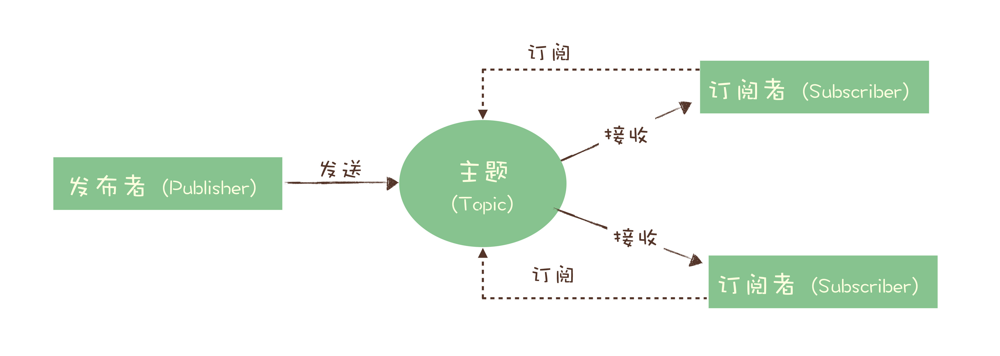

## 适用场景

1. 异步处理

   1. 好处
      1. 可以更快返回结果
      2. 减少等待，自然实现了步骤之间的并发，提升系统总体的性能

2. 流量控制

   1. 使用消息队列隔离网关和后端服务，以达到流量控制和保护后端服务的目的。

      1. 流程变成

         

         1. 网关在接收到请求后，将请求放入请求消息队列
         2. 后端服务从请求消息队列中获取APP请求，完成后续秒杀处理过程，然后返回结果

      2. 问题

         1. 增加了系统调用链环节，导致总体的响应时间延迟变长
         2. 上下游系统都要将同步调用改成异步消息，增加了系统的复杂度

   2. 优化方案：如果能预估出秒杀服务的处理能力，就可以用消息队列实现一个令牌桶，更简单地进行流量控制。

      1. 令牌桶控制流量的原理是：单位时间内只发放固定数量的令牌到令牌桶中，规定服务在处理请求之前**必须先从令牌桶中拿出一个令牌**，**如果令牌桶中没有令牌，则拒绝请求**。这样就保证单位时间内，能处理的请求不超过发放令牌的数量，起到了流量控制的作用。

         

      2. 令牌桶可以简单地用一个有固定容量的消息队列加一个“令牌发生器”来实现：令牌发生器按照预估的处理能力，匀速生产令牌并放入令牌队列（如果队列满了则丢弃令牌），网关在收到请求时去令牌队列消费一个令牌，获取到令牌则继续调用后端秒杀服务，如果获取不到令牌则直接返回秒杀失败。

3. 服务解耦

4. 引入消息队列同样的也会出现下面问题：

   1. 引入消息队列带来的延迟问题
   2. 增加了系统的复杂度
   3. 可能产生数据不一致问题

## MQ选型

1. rabbitmq：
   1. 优点：轻量，迅捷，容易部署和使用，拥有灵活的路由配置
   2. 缺点：性能和吞吐量较差，不易进行二次开发
2. rocketmq：
   1. 优点：性能好，稳定可靠，有活跃的中文社区，特点响应快
   2. 缺点：兼容性较差，但随意影响力的扩大，该问题会有改善
3. kafka：
   1. 优点：拥有强大的性能及吞吐量，兼容性很好
   2. 缺点：由于“攒一波再处理”导致延迟比较高
4. pulsar：
   1. 采用存储和计算分离的设计，是消息队里产品中黑马，值得持续关注
5. 其中RocketMQ怎么做到低延迟？？？
   1. 主要是设计上的选择问题，Kafka中到处都是“批量和异步”设计，它更关注的是整体的吞吐量，而RocketMQ的设计选择更多的是尽量及时处理请求。
   2. 比如发消息，同样是用户调用了send()方法，RockMQ它会直接把这个消息发出去，而Kafka会把这个消息放到本地缓存里面，然后择机异步批量发送。
   3. 所以，RocketMQ它的时延更小一些，而Kafka的吞吐量更高。

## 主题、队列

### 队列

* 队列的演变过程

  * 一开始，队列就是类似数据结构的队列。

    

  * 出现问题

    * 如果需要将一份消息分发给多个消费者，要去每个消费者都能收到全量的消息。如果是单个队列的话，那么消费完就没有了，满足不了需求

    * 可行方案

      * 为每个消费者创建一个单独的队列，让生产者发送多份

        * 缺点：浪费资源，而且生产者不知道消费者有多少个呀。而且为每个消费者单独发送一份消息，实际上违背了消息队列“解耦”这个设计初衷

      * 为了解决上面的问题

        * 演化出了另一种模型“发布-订阅模型”

        

* RocketMQ的发布订阅模式

  * 为了保证消息的可靠发送，可靠消费，RocketMQ提供了确认机制，但是同样引入了问题，为了确保消息的有序性，在某一条消息被成功消费之前，下一条消息是不能被消费的，否则就会出现消息空洞，违背了有序性的原则？？？
    * 解决方法
      * 增加了队列的概念，在队列的基础上保证了消息的有序，前一条没有消费完，后面的不会被消费
  * RocketMQ 中，订阅者的概念是通过消费组（Consumer Group）来体现的。每个消费组都消费主题中一份完整的消息，不同消费组之间消费进度彼此不受影响，也就是说，一条消息被 Consumer Group1 消费过，也会再给 Consumer Group2 消费。

  * 消费记录的保存
    * 在 Topic 的消费过程中，由于消息需要被不同的组进行多次消费，所以消费完的消息并不会立即被删除，这就需要 RocketMQ 为每个消费组在每个队列上维护一个消费位置（Consumer Offset），这个位置之前的消息都被消费过，之后的消息都没有被消费过，每成功消费一条消息，消费位置就加一。这个消费位置是非常重要的概念，我们在使用消息队列的时候，丢消息的原因大多是由于消费位置处理不当导致的。

## 事务

* 消息队列中的“事务”，主要解决的是消息生产者和消息消费者的数据一致性问题。
* 常见的分布式事务实现
  * 2PC（二阶段提交）
  * TCC（Try-Confirm-Cancel）
  * 事务消息
    * 适用场景：需要异步更新数据，并且对数据实时性不太高的场景

### 分布式事务

* 消息队列实现分布式事务

  

  * 订单系统在消息队列上开启一个事务。然后订单系统给消息服务器发送一个“半消息”，这个半消息不是说消息内容不完整，它包含的内容就是完整的消息内容，半消息和普通消息的唯一区别是，**在事务提交之前，对于消费者来说，这个消息是不可见的。**
  * 半消息发送成功后，订单系统就可以执行本地事务了，在订单库中创建一条订单记录，并提交订单库的数据库事务。然后根据本地事务的执行结果决定提交或者回滚事务消息。如果订单创建成功，那就提交事务消息，购物车系统就可以消费到这条消息继续后续的流程。如果订单创建失败，那就回滚事务消息，购物车系统就不会收到这条消息。这样就基本实现了“要么都成功，要么都失败”的一致性要求。

* 问题

  * 上面如果4发生失败了，怎么办，

    * Kafka，直接抛出异常，让用户自行处理，我们可以在业务代码中反复重试提交，直到提交成功。或者删除之前创建的订单进行补偿

    * RocketMQ，则是使用事务反查的机制。

      * 在提交或者回滚事务消息时发生网络异常，RocketMQ的Broker没有收到提交或者回滚的请求，Broker会定期去Producer上反查这个事务对应的本地事务的状态。然后根据反查结果决定提交还是回滚这个事务。
      * 为了支持这个反查机制，业务代码需要实现一个反查本地事务状态的接口，告知RocketMQ本地事务是成功还是失败
      * 这个反查本地事务的实现，并不依赖消息的发送方，也就是订单服务的某个实例节点上的任何数据。这种情况下，即使是发送事务消息的那个订单服务节点宕机了，RocketMQ 依然可以通过其他订单服务的节点来执行反查，确保事务的完整性。

      

## 消息不丢失

