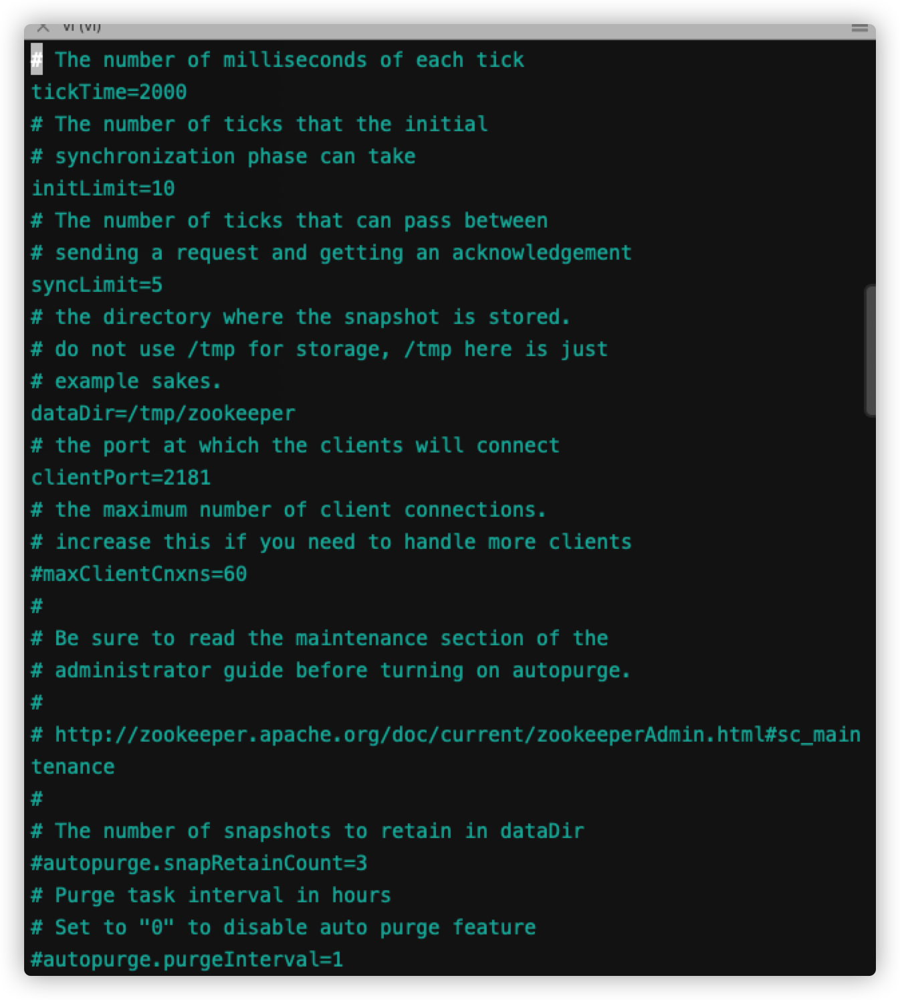

参照[官方安装指南](https://link.jianshu.com?t=http%3A%2F%2Fzookeeper.apache.org%2Fdoc%2Fcurrent%2FzookeeperStarted.html)

#### 下载压缩包

从 [此地址](https://link.jianshu.com?t=http%3A%2F%2Fmirrors.hust.edu.cn%2Fapache%2Fzookeeper%2Fstable%2F) 下载zookeeper-3.4.10.tar.gz

#### 解压

```
> tar -zxvf zookeeper-3.4.10.tar.gz //解压
> cd zookeeper-3.4.10/conf //切换到配置目录下
> mv zoo_sample.cfg zoo.cfg //更改默认配置文件名称
> vi zoo.cfg //编辑配置文件，自定义dataDir
```

#### 启动Server

```
> cd zookeeper-3.4.10/bin //切换到 bin目录
> ./zkServer.sh start //启动
ZooKeeper JMX enabled by default
Using config: zookeeper-3.4.10/bin/../conf/zoo.cfg
Starting zookeeper ... STARTED
```

#### Cli连接

```
> cd zookeeper-3.4.10/bin //切换到 bin目录
> ./zkCli.sh -server 127.0.0.1:2181
[zk: 127.0.0.1:2181(CONNECTED) 0] help //输入help命令
ZooKeeper -server host:port cmd args
    stat path [watch]
    set path data [version]
    ls path [watch]
    delquota [-n|-b] path
    ls2 path [watch]
    setAcl path acl
    setquota -n|-b val path
    history
    redo cmdno
    printwatches on|off
    delete path [version]
    sync path
    listquota path
    rmr path
    get path [watch]
    create [-s] [-e] path data acl
    addauth scheme auth
    quit
    getAcl path
    close
    connect host:port

/////////////////////官方测试命令////////////////////////

[zk: 127.0.0.1:2181(CONNECTED) 2] ls /
[zookeeper]
[zk: 127.0.0.1:2181(CONNECTED) 3] create /zk_test my_data
Created /zk_test
[zk: 127.0.0.1:2181(CONNECTED) 4] ls /
[zookeeper, zk_test]
[zk: 127.0.0.1:2181(CONNECTED) 5] get /zk_test
my_data
cZxid = 0x2
ctime = Wed Feb 28 15:18:45 CST 2018
mZxid = 0x2
mtime = Wed Feb 28 15:18:45 CST 2018
pZxid = 0x2
cversion = 0
dataVersion = 0
aclVersion = 0
ephemeralOwner = 0x0
dataLength = 7
numChildren = 0
[zk: 127.0.0.1:2181(CONNECTED) 6] set /zk_test junk
cZxid = 0x2
ctime = Wed Feb 28 15:18:45 CST 2018
mZxid = 0x3
mtime = Wed Feb 28 15:20:23 CST 2018
pZxid = 0x2
cversion = 0
dataVersion = 1
aclVersion = 0
ephemeralOwner = 0x0
dataLength = 4
numChildren = 0
[zk: 127.0.0.1:2181(CONNECTED) 7] get /zk_test
junk
cZxid = 0x2
ctime = Wed Feb 28 15:18:45 CST 2018
mZxid = 0x3
mtime = Wed Feb 28 15:20:23 CST 2018
pZxid = 0x2
cversion = 0
dataVersion = 1
aclVersion = 0
ephemeralOwner = 0x0
dataLength = 4
numChildren = 0
[zk: 127.0.0.1:2181(CONNECTED) 8] delete /zk_test
[zk: 127.0.0.1:2181(CONNECTED) 9] ls
[zk: 127.0.0.1:2181(CONNECTED) 10] ls /
[zookeeper]
```

#### 停止Server

```
> ./zkServer.sh stop //停止后，如果CLi没有关闭，将报错
ZooKeeper JMX enabled by default
Using config: zookeeper-3.4.10/bin/../conf/zoo.cfg
Stopping zookeeper ... STOPPED
```

#### 配置文件说明

1. 文件名可以任意，不是非得改为zoo.cfg
2. tickTime: zookeeper中使用的基本时间单位, 毫秒
3. dataDir: 内存数据快照的保存目录；如果没有自定义Log也使用该目录
4. clientPort: 监听Cli连接的端口号

参照[官方安装指南](https://link.jianshu.com?t=http%3A%2F%2Fzookeeper.apache.org%2Fdoc%2Fcurrent%2FzookeeperStarted.html)

#### 下载压缩包

从 [此地址](https://link.jianshu.com?t=http%3A%2F%2Fmirrors.hust.edu.cn%2Fapache%2Fzookeeper%2Fstable%2F) 下载zookeeper-3.4.10.tar.gz

#### 解压

```
> tar -zxvf zookeeper-3.4.10.tar.gz //解压
> cd zookeeper-3.4.10/conf //切换到配置目录下
> mv zoo_sample.cfg zoo.cfg //更改默认配置文件名称
> vi zoo.cfg //编辑配置文件，自定义dataDir
```

#### 启动Server

```
> cd zookeeper-3.4.10/bin //切换到 bin目录
> ./zkServer.sh start //启动
ZooKeeper JMX enabled by default
Using config: zookeeper-3.4.10/bin/../conf/zoo.cfg
Starting zookeeper ... STARTED
```

#### Cli连接

```
> cd zookeeper-3.4.10/bin //切换到 bin目录
> ./zkCli.sh -server 127.0.0.1:2181
[zk: 127.0.0.1:2181(CONNECTED) 0] help //输入help命令
ZooKeeper -server host:port cmd args
    stat path [watch]
    set path data [version]
    ls path [watch]
    delquota [-n|-b] path
    ls2 path [watch]
    setAcl path acl
    setquota -n|-b val path
    history
    redo cmdno
    printwatches on|off
    delete path [version]
    sync path
    listquota path
    rmr path
    get path [watch]
    create [-s] [-e] path data acl
    addauth scheme auth
    quit
    getAcl path
    close
    connect host:port

/////////////////////官方测试命令////////////////////////

[zk: 127.0.0.1:2181(CONNECTED) 2] ls /
[zookeeper]
[zk: 127.0.0.1:2181(CONNECTED) 3] create /zk_test my_data
Created /zk_test
[zk: 127.0.0.1:2181(CONNECTED) 4] ls /
[zookeeper, zk_test]
[zk: 127.0.0.1:2181(CONNECTED) 5] get /zk_test
my_data
cZxid = 0x2
ctime = Wed Feb 28 15:18:45 CST 2018
mZxid = 0x2
mtime = Wed Feb 28 15:18:45 CST 2018
pZxid = 0x2
cversion = 0
dataVersion = 0
aclVersion = 0
ephemeralOwner = 0x0
dataLength = 7
numChildren = 0
[zk: 127.0.0.1:2181(CONNECTED) 6] set /zk_test junk
cZxid = 0x2
ctime = Wed Feb 28 15:18:45 CST 2018
mZxid = 0x3
mtime = Wed Feb 28 15:20:23 CST 2018
pZxid = 0x2
cversion = 0
dataVersion = 1
aclVersion = 0
ephemeralOwner = 0x0
dataLength = 4
numChildren = 0
[zk: 127.0.0.1:2181(CONNECTED) 7] get /zk_test
junk
cZxid = 0x2
ctime = Wed Feb 28 15:18:45 CST 2018
mZxid = 0x3
mtime = Wed Feb 28 15:20:23 CST 2018
pZxid = 0x2
cversion = 0
dataVersion = 1
aclVersion = 0
ephemeralOwner = 0x0
dataLength = 4
numChildren = 0
[zk: 127.0.0.1:2181(CONNECTED) 8] delete /zk_test
[zk: 127.0.0.1:2181(CONNECTED) 9] ls
[zk: 127.0.0.1:2181(CONNECTED) 10] ls /
[zookeeper]
```

#### 停止Server

```
> ./zkServer.sh stop //停止后，如果CLi没有关闭，将报错
ZooKeeper JMX enabled by default
Using config: zookeeper-3.4.10/bin/../conf/zoo.cfg
Stopping zookeeper ... STOPPED
```

#### 配置文件说明

1. 文件名可以任意，不是非得改为zoo.cfg
2. tickTime: zookeeper中使用的基本时间单位, 毫秒
3. dataDir: 内存数据快照的保存目录；如果没有自定义Log也使用该目录
4. clientPort: 监听Cli连接的端口号


配置文件截图



转载链接：https://www.jianshu.com/p/5491d16e6abd/


