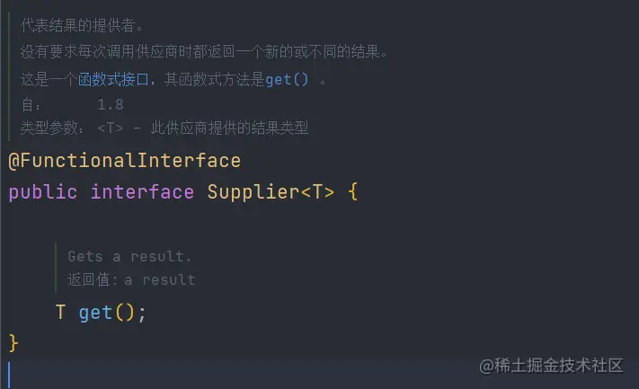
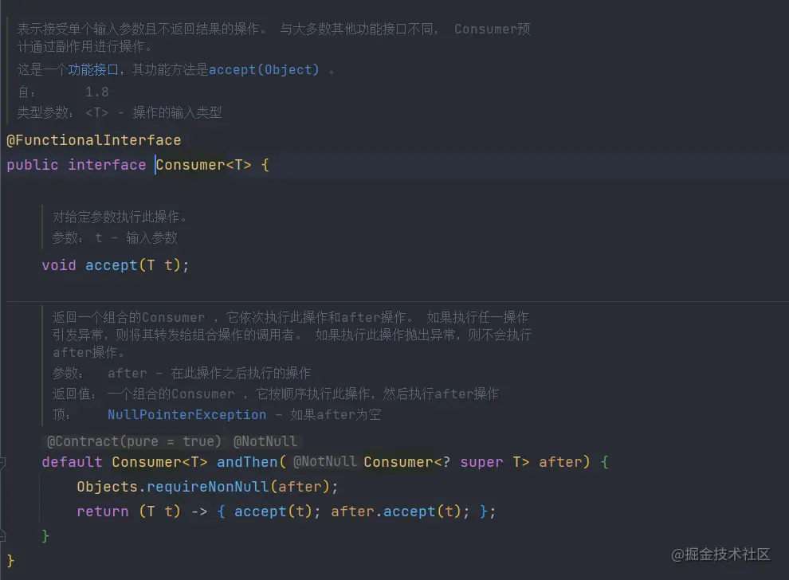
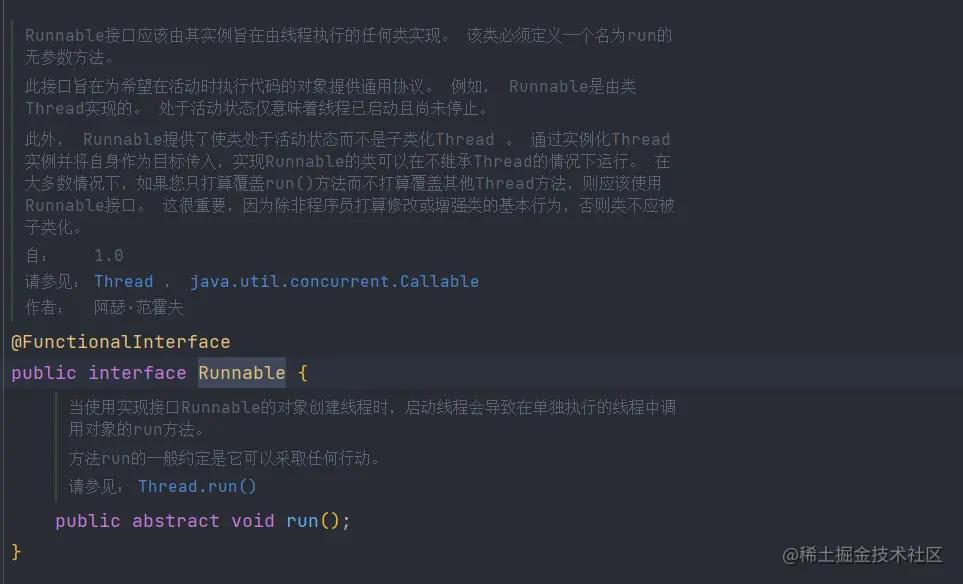
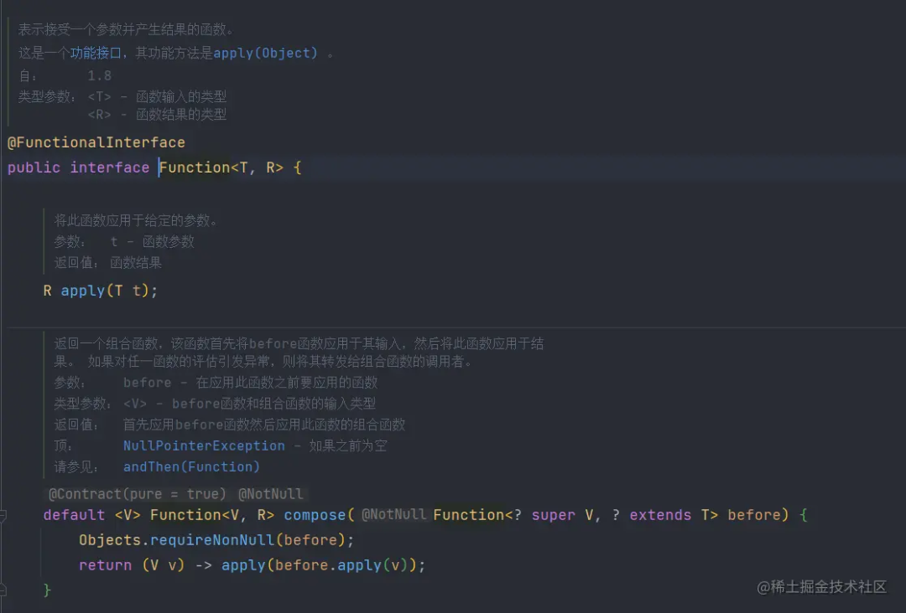
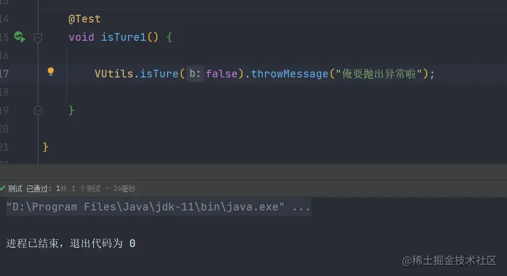
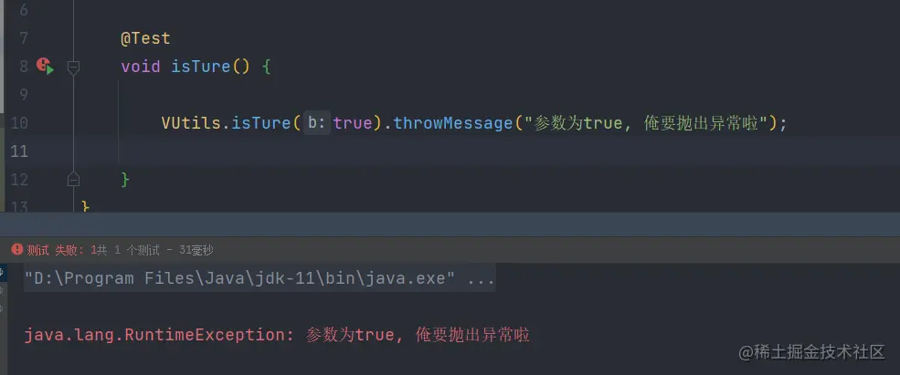
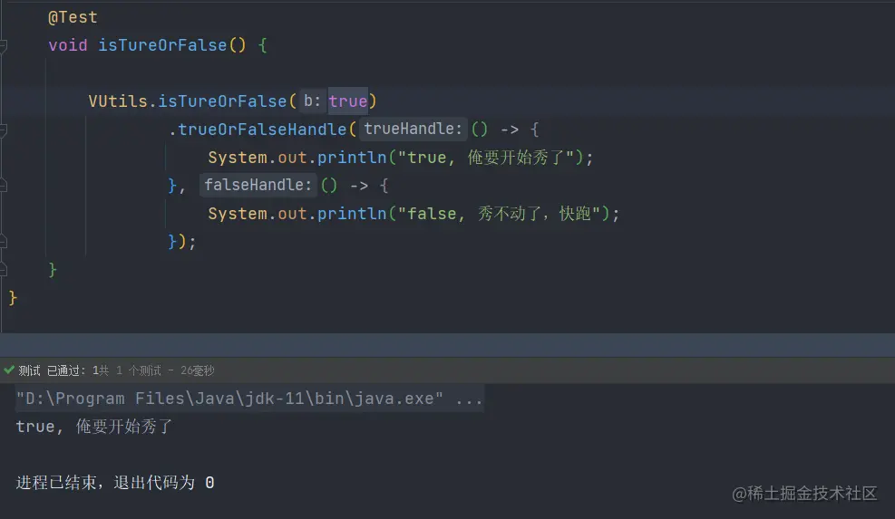
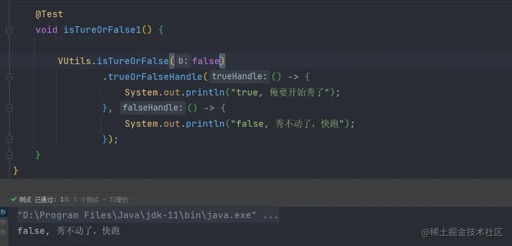
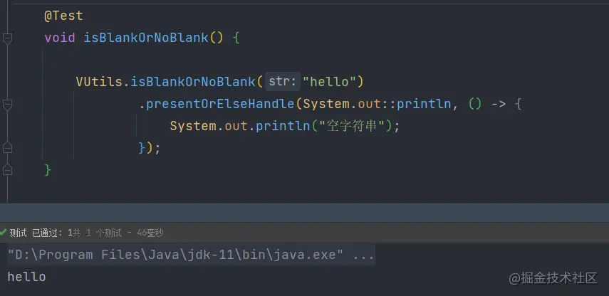
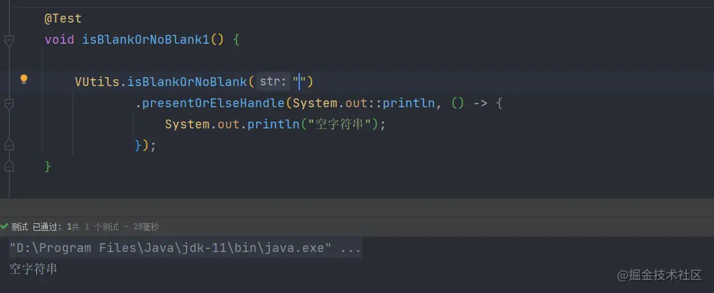

在开发过程中经常会使用`if...else...`进行判断抛出异常、分支处理等操作。这些`if...else...`充斥在代码中严重影响了代码代码的美观，这时我们可以利用Java 8的Function接口来消灭`if...else...`。

```
if (...){
    throw new RuntimeException("出现异常了")；
} 

if (...){
    doSomething();
} else {
    doOther();
}
```


### Function 函数式接口

使用注解`@FunctionalInterface`标识，并且只包含一个抽象方法的接口是函数式接口。函数式接口主要分为Supplier供给型函数、Consumer消费型函数、Runnable无参无返回型函数和Function有参有返回型函数。

> Function可以看作转换型函数

#### Supplier供给型函数

Supplier的表现形式为不接受参数、只返回数据



#### Consumer消费型函数

Consumer消费型函数和Supplier刚好相反。Consumer接收一个参数，没有返回值



#### Runnable无参无返回型函数

Runnable的表现形式为即没有参数也没有返回值



Function函数的表现形式为接收一个参数，并返回一个值。`Supplier`、`Consumer`和`Runnable`可以看作Function的一种特殊表现形式




### 使用小技巧

#### 处理抛出异常的if

**1.定义函数**

定义一个抛出异常的形式的函数式接口, 这个接口只有参数没有返回值是个消费型接口

```
/**
 * 抛异常接口
 **/
@FunctionalInterface
public interface ThrowExceptionFunction {

    /**
     * 抛出异常信息
     *
     * @param message 异常信息
     * @return void
     **/
    void throwMessage(String message);
}
```

**2.编写判断方法**

创建工具类VUtils并创建一个isTure方法，方法的返回值为刚才定义的函数式接口-`ThrowExceptionFunction`。`ThrowExceptionFunction`的接口实现逻辑为当参数b为true时抛出异常

```
/**
 *  如果参数为true抛出异常
 * 
 * @param b 
 * @return com.example.demo.func.ThrowExceptionFunction
 **/
public static ThrowExceptionFunction isTure(boolean b){

    return (errorMessage) -> {
        if (b){
            throw new RuntimeException(errorMessage);
        }
    };
}
```

**3.使用方式**

调用工具类参数参数后，调用函数式接口的`throwMessage`方法传入异常信息。当出入的参数为false时正常执行



当出入的参数为true时抛出异常



#### 处理if分支操作

**1.定义函数式接口**

创建一个名为`BranchHandle`的函数式接口，接口的参数为两个Runnable接口。这两个两个Runnable接口分别代表了为true或false时要进行的操作

```
/**
 * 分支处理接口
 **/
@FunctionalInterface
public interface BranchHandle {

    /**
     * 分支操作
     *
     * @param trueHandle 为true时要进行的操作
     * @param falseHandle 为false时要进行的操作
     * @return void
     **/
    void trueOrFalseHandle(Runnable trueHandle, Runnable falseHandle);

}
```

**2.编写判断方法**

创建一个名为isTureOrFalse的方法，方法的返回值为刚才定义的函数式接口-`BranchHandle`。

```
/**
 * 参数为true或false时，分别进行不同的操作 
 * 
 * @param b 
 * @return com.example.demo.func.BranchHandle     
 **/
public static BranchHandle isTureOrFalse(boolean b){
    
    return (trueHandle, falseHandle) -> {
        if (b){
            trueHandle.run();
        } else {
            falseHandle.run();
        }
    };
}
```

**3.使用方式**

参数为true时，执行trueHandle



参数为false时，执行falseHandle



#### 如果存在值执行消费操作，否则执行基于空的操作

**1.定义函数**

创建一个名为`PresentOrElseHandler`的函数式接口，接口的参数一个为Consumer接口。一个为Runnable,分别代表值不为空时执行消费操作和值为空时执行的其他操作

```
/**
 * 空值与非空值分支处理
 */
public interface PresentOrElseHandler<T extends Object> {

    /**
     * 值不为空时执行消费操作
     * 值为空时执行其他的操作
     * 
     * @param action 值不为空时，执行的消费操作
     * @param emptyAction 值为空时，执行的操作
     * @return void    
     **/
   void presentOrElseHandle(Consumer<? super T> action, Runnable emptyAction);
   
}
```

**2.编写判断方法**

创建一个名为`isBlankOrNoBlank`的方法，方法的返回值为刚才定义的函数式接口-`PresentOrElseHandler`。

```
/**
 * 参数为true或false时，分别进行不同的操作
 *
 * @param b
 * @return com.example.demo.func.BranchHandle
 **/
public static PresentOrElseHandler<?> isBlankOrNoBlank(String str){

    return (consumer, runnable) -> {
        if (str == null || str.length() == 0){
            runnable.run();
        } else {
            consumer.accept(str);
        }
    };
}
```

**3.使用方式**

调用工具类参数参数后，调用函数式接口的`presentOrElseHandle`方法传入一个`Consumer`和`Runnable`

参数不为空时，打印参数



参数不为空时



### 结尾

Function函数式接口是java 8非常重要的特性，利用好Function函数可以极大的简化代码。
